# Discover our Technologies
> "Wireless Made Easy!" - Full workshop experience to learn and touch PIC32MZ W1 family

[Back to Main page](../README.md)

## A la carte

1. [Introduction to PIC32MZ W1](#step1)
1. [Smart MCU](#step2)
1. [Radio Performance](#step3)
1. [High Level of Security](#step4)
1. [Block Diagram](#step5)

## Introduction to PIC32MZ W1

The PIC32MZ W1 Family is a **smart** 32-bit microcontroller which offer [Wi-Fi 4*](https://www.wi-fi.org/discover-wi-fi) **connectivity** and hardware-based **security** accelerator in a single device solution. No need for external MCU, thus it offers the ability to add your own application with generous amount of memory (1MB Flash, 256kB SRAM).

>[Wi-Fi 4*](https://www.wi-fi.org/discover-wi-fi) supports 802.11n technology.

The family is composed of a SoC and Modules:
- **PIC32MZ1025W104 SoC**\
132-pin DQFN 10 x 10 x 0.9 mm\
SoC with 32-bit Embedded MCU with Wi-Fi network Connectivity and Security Accelerator 
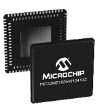
<a href="resources/media/pic32mz1025w104_block_diagram.png" target="_blank">
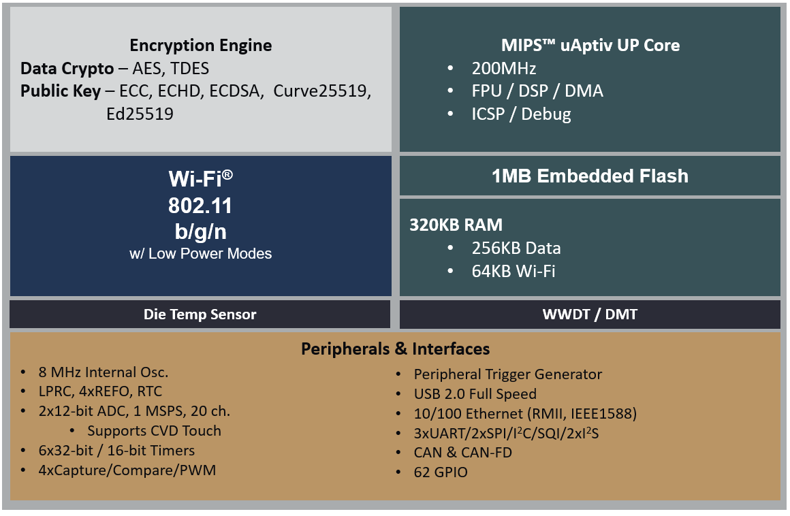</a>

- **WFI32E01 Certified Modules** 
Based on the SoC, the 54-pin SMD 24.5 x 20.5 x 2.5 mm module comes with different flavors 
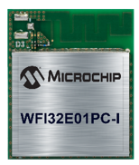
<a href="resources/media/wfi32_block_diagram.png" target="_blank">
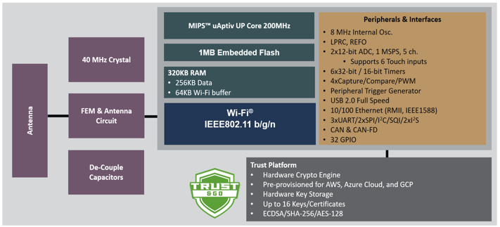</a> 
  
  **WFI32E01PE**, with FEM and PCB antenna integrated

  **WFI32E01PC**, with FEM and PCB antenna integrated and Trust&Go Secure Element on board

  **WFI32E01UE**, with FEM and uFL connector for external antenna

  **WFI32E01UC**, with FEM and uFL connector for external antenna and Trust&Go Secure Element on board

  The modules are compliant to Wi-Fi Alliance (WFA) specification and certified with the following world regulatory agencies: Federal Communications Commission (FCC), Industry Canada (IC) and European Radio Equipment Directive (RED). More certification to come later.

Check out the [datasheet](https://www.microchip.com/wwwproducts/en/WFI32E01PC) for more information.

## Smart MCU

The PIC32MZW1 share the same core and same peripherals as the PIC32MZ2048EF device; part of [PIC32MZ-EF Family](https://www.microchip.com/design-centers/32-bit/pic-32-bit-mcus/pic32mz-ef-family)

The PIC32MZW1 Solution offers a fast 200 MHz and highly efficient microcontroller.
- CoreMark score of 710 ([EEMBC](https://www.eembc.org/)) benchmark for MCU core performance  

A large number of GPIOs is free-to-use (Module: 37 I/Os, SoC: 62 I/Os).

In addition to Wi-Fi connectivity, a rich set of peripherals is available such as: Ethernet MAC (10-100 RMII), CAN/CAN-FD, USB 2.0 (Full-Speed 12Mbps OTG) and CVD Touch.

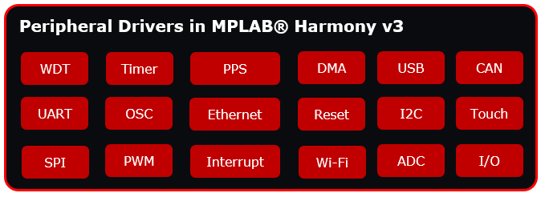

It offers premium analog performance with fast 2Msps sampling frequency, accurate 12-bit and highly linear ADC readings with minimum effect coming from temperature variation.

It is supported with a leading Integrated Development Environment: [MPLAB® X IDE](https://www.microchip.com/mplab/mplab-x-ide) and a fully integrated embedded software development framework: [MPLAB® Harmony 3](https://www.microchip.com/mplab/mplab-harmony).

## Radio performance

The WFI32E01 module incorporates a high quality RF-FEM. This helps provide industry leading radio performance offering end products, using the module, increased range and improved RF performance. This also helps reduce power consumption, improve end user experience and reduce Wi-Fi latency as able to maintain Wi-Fi 4, MCS-7 capability.

Check out the Transmitter Performance Characteristics Section in the [datasheet](https://www.microchip.com/wwwproducts/en/WFI32E01PC) for more information.

## High level of Security

The device embeds an asymmetric crypto engine which provide hardware acceleration to support Public Key cryptography functions, needed during authentication and key negotiation sessions.

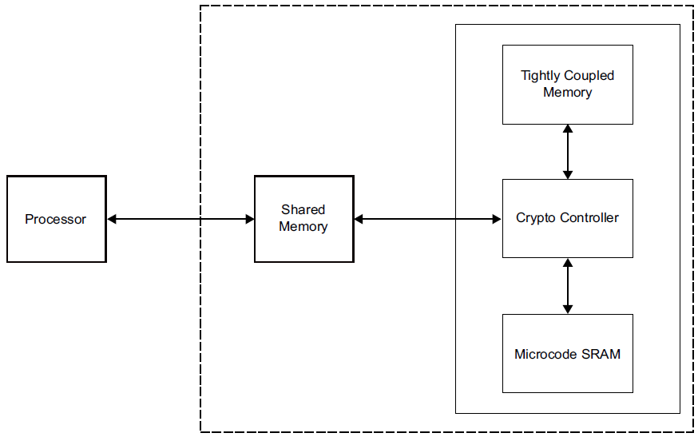

In addition, it comes with a symmetric crypto engine in order to accelerate applications that need cryptographic functions.

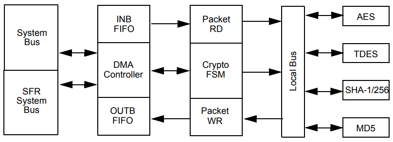

Symmetric [Crypto Engine](https://www.microchip.com/design-centers/embedded-security/technology/hardware-crypto-engine) includes four different cryptographic security engines designed to accelerate the computation of public/private key pair negotiations, message hash authentication and bulk data encryption/decryption. Able to operate in parallel or daisy-chained to execute more sophisticated security methods, the Crypto Engine includes engines for AES, Data Encryption Standard (DES) and Triple DES (TDES), Secure Hash Algorithm (SHA-1 and SHA-256) and Message Digest 5 (MD5). Built into the MCU, the Crypto Engine includes a DMA controller for scatter/gather data fetching and an intelligent state machine to schedule the individual security engines independently of the PIC32MZW1's primary CPU.

Check out the [datasheet](https://www.microchip.com/wwwproducts/en/WFI32E01PC) to get the details of the algorithms supported.

There is no secure key storage mechanism on the SoC, this can be provided using an [ATECC608 Secure Element](https://www.microchip.com/design-centers/security-ics/trust-platform/trust-go). The modules WFI32E01PC and WFI32E01UC come with on-board ATECC608 Secure Element or one can be fitted external to the module. This integrates well with the WolfSSL TLS stack and can be used for applications that mandate secure key storage. The Secure Element integration provides a simple and secure way for provisionning devices to the Cloud. The Secure Element comes pre-provisioned to, and is suitable for, registration with many Cloud vendors including [Amazon AWS IoT Core](https://www.microchip.com/design-centers/security-ics/trust-platform/trust-go/trust-go-aws-iot), [Microsoft Azure IoT](https://www.microchip.com/design-centers/security-ics/trust-platform/trust-go/trust-go-microsoft-azure), and [Google IoT Core](https://www.microchip.com/design-centers/security-ics/trust-platform/trust-go/trust-go-google-iot-core). Secure Elements are afforded many features not normally available on MCU's including advanced key protection mechanisms and tamper protection. A Secure element can also offer a mechanism for secure boot. 

The software library provides support for both AP (Access Point) and Station modes and adding the latest and greatest in Wi-Fi security – [WPA3](https://www.wi-fi.org/discover-wi-fi/security). WPA3 is fully backward compatible with WPA2.

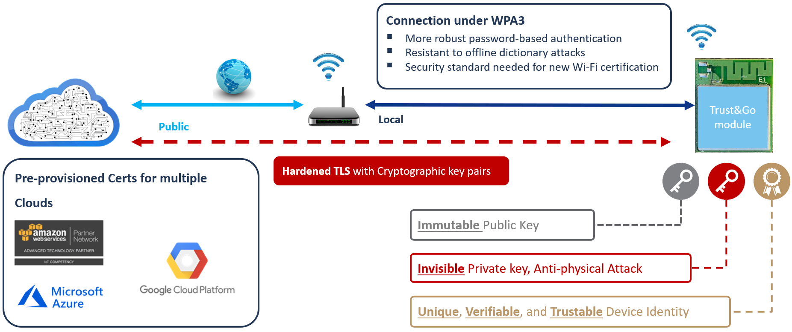

With WPA3 technology, you can choose a simple and easy-to-remember password for your Wi-Fi network without worrying about attackers stealing it by going word by word from a dictionary. As per the Market Requirements Document, WPA3 certification will become mandatory for all new Wi-Fi certifications beginning July 1, 2020. 

 The Harmony 3 connectivity stacks provide TCP/IP support for both IPv4 and IPv6. Plus support for 3rd party TLS plug-ins including the [WolfSSL TLS stack](https://www.wolfssl.com) and Crypto Library. 
 
 Using the plug-ins including [Eclipse Paho MQTT](https://www.eclipse.org/paho/) and [WolfSSL MQTT](https://www.wolfssl.com),  you can create your own local or cloud server using MQTT protocol.
 

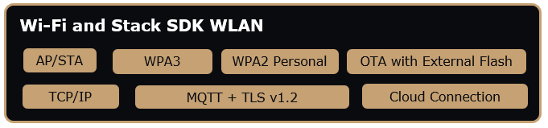

## Block Diagram

### PIC32MZ1025W103132 SoC

Block Diagram for 132-Pin QFN Chip 

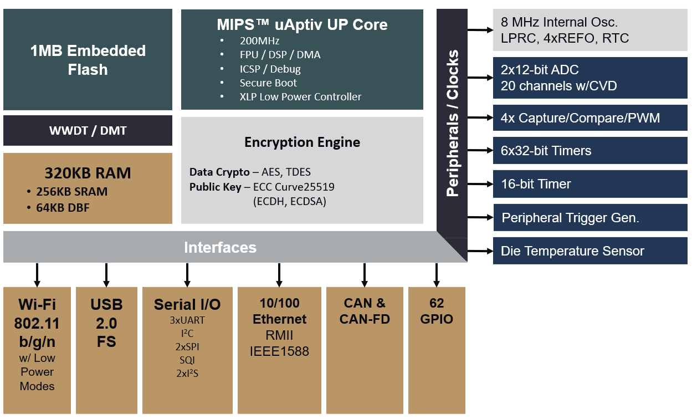

### WFI32E01UE Module

Block Diagram for 54-Pad Module

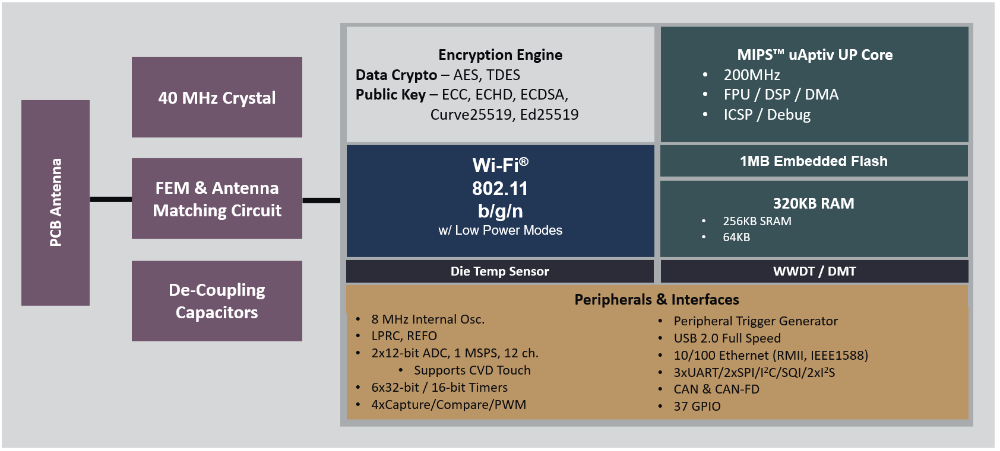

### WFI32E01PC Module

Block Diagram for 54-Pad Trust&Go Module

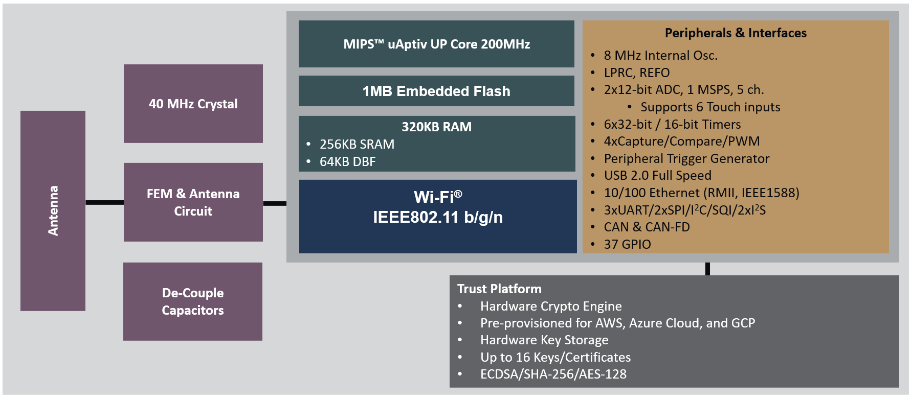

<a href="#top">Back to top</a>

