# Overview of our Solutions
> "Wireless Made Easy!" - Full workshop experience to learn and touch PIC32MZ W1 family

[Back to Main page](../README.md)

## A la carte

1. [Learn about the Curiosity Board](#step1)
1. [MPLAB® Harmony 3](#step2)
1. [Trust&GO Integration](#step3)
1. [Learn about Wireless Software](#step4)
   1. [Features](#step4a)
   1. [Software Architecture](#step4b)
   1. [WLAN Driver](#step4c)
   1. [Wireless Services](#step4d)
   1. [System Code](#step4e)
   


## Learn about the Curiosity Board<a name="step1"></a>

<p align="center">
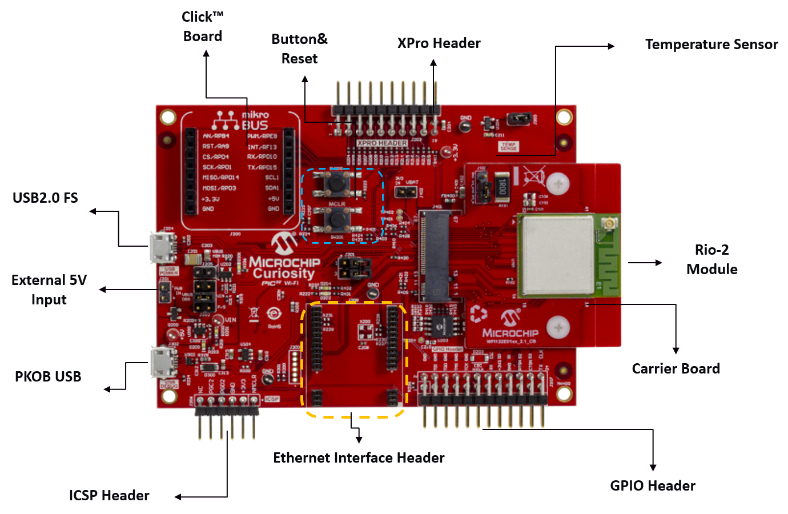
</p>

The [**PIC32WFI32E Curiosity Board**](https://www.microchip.com/DevelopmentTools/ProductDetails/ev12f11a) is a modular development board that supports rapid prototyping using on-chip MCU peripherals.

This board offers integrated programming/debugging features using PICkitTM On- Board (PKOB) debugger, and requires only a micro-USB power cable to power-up and program the board.

For debugging / programming, the platform offers the flexibility either to use the integrated PICkit On Board (PKOB) debugger through the Debug USB interface or either use In-Circuit Serial ProgrammingTM (ICSP) Header for External programmer/debuggers such as [MPLAB® SNAP](https://www.microchip.com/developmenttools/ProductDetails/PartNO/PG164100), [PICkit 4](https://www.microchip.com/Developmenttools/ProductDetails/PG164140), or [MPLAB® ICD4](https://www.microchip.com/Developmenttools/ProductDetails/DV164045). 

<p align="center">
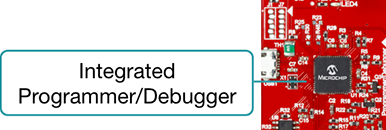 or 
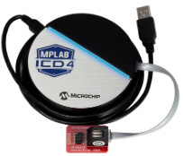
</p>

The PIC32WFI32E Curiosity Board comes with a **WFI32E01PC** module mounted on the carrier board. Thus this module integrates FEM, PCB antenna and Trust&Go Secure Element is on board.

<p align="center">
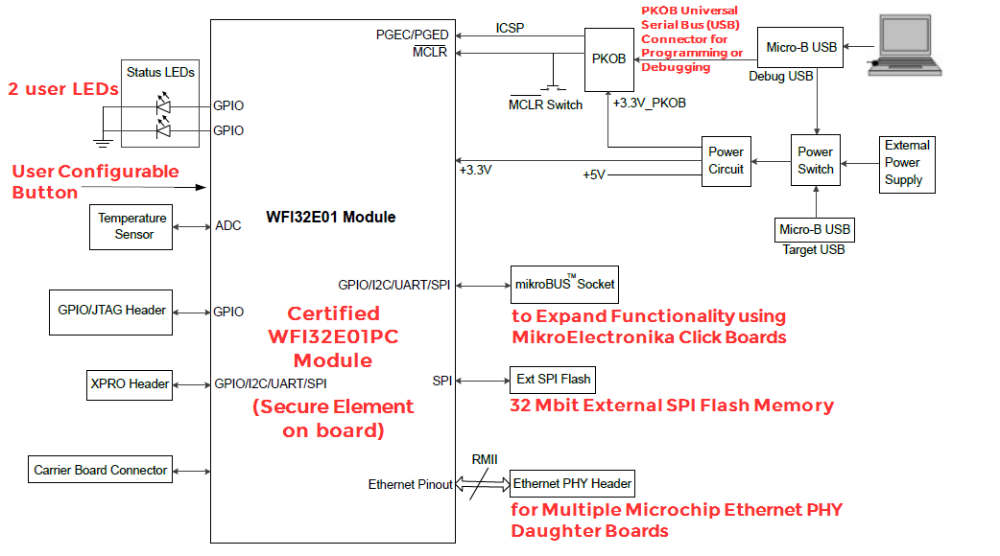
</p>

[Order a PIC32WFI32E Curiosity Board.](https://www.microchipdirect.com/product/EV12F11A)

Check out the [PIC32WFI32E Curiosity Board User Guide](http://www.microchip.com/EV12F11A) for more information.

Check out the [Curiosity Board concept](https://www.microchip.com/promo/curiosity-development-boards).


## MPLAB® Harmony 3<a name="step2"></a>

The PIC32MZW1 Solution is supported with a leading Integrated Development Environment: [MPLAB® X IDE](https://www.microchip.com/mplab/mplab-x-ide), the [XC32 Compiler](https://www.microchip.com/mplab/compilers) and a fully integrated embedded software development framework: [MPLAB® Harmony 3](https://www.microchip.com/mplab/mplab-harmony).
 
<p align="center">

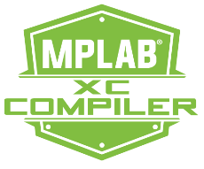

</p>

[MPLAB® Harmony 3](https://www.microchip.com/mplab/mplab-harmony) is an extension of the MPLAB® ecosystem for creating embedded firmware solutions for 32-bit Microchip devices. For better installation and configuration management the software is available through [GitHub](https://github.com/Microchip-MPLAB-Harmony).
<p align="center">
<a href="https://youtu.be/ioYTg-jX7tY" target="_blank">
</a>
</p>

MPLAB Harmony has a layered architecture that consists of several software modules. These modules are portable, compatible to each other and they communicate and exchange data and information with each other.
<p align="center">
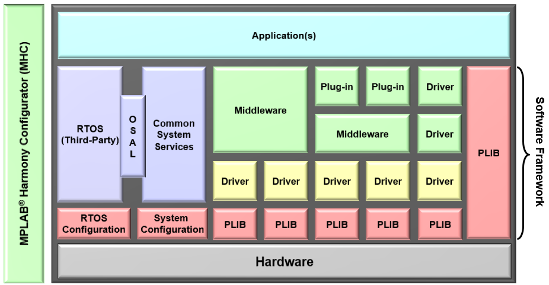
</p>

| Module            | Description                                    |
| ----------------- | ---------------------------------------------- |
| PLIB              | Very low level interface to peripherals        |
| Driver            | Preferred method to access peripherals when creating portable applications|
| System Service    | Used by drivers, middleware and application (Timer, File System, etc.)|
| Middleware        | Implement complex protocols like USB, TCP/IP, GFX, Bluetooth, etc. They use driver and system services|
| MHC               | GUI based tool that provides an intuitive graphical user interface which enhances user experience to easily enable and configure the Harmony Framework components and significantly reducing user development time|
| Third-Party Libraries | RTOS from industry leading RTOS specialists, Graphics stack from Segger and other libraries|
| Plug-in           | Plug-ins for Display manager, clock manager and Graphics composer

MPLAB Harmony is based on state machines that are used to divide a task into smaller sub-tasks that each subtask can be run from start to finish in a reasonable amount of time. This ensures that none of the module is starved too long for CPU time allowing each task to meet its timing requirements.\
The modules interact with each other through API calls and the events percolate from PLIB to driver to middleware and the application. Driver, system services and middleware call each other's interface functions in order to accomplish the task that it needs to. In this way the overall system runs like a larger state machine, consisting of individual, independent but cooperating state machines.
<p align="center">
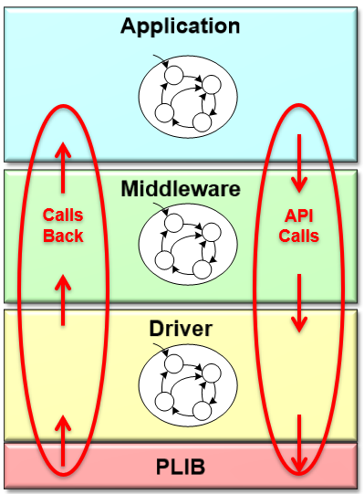
</p>

MPLAB Harmony libraries are design to select a variety of configuration options to tailor them to a specific usage. The basic MPLAB Harmony model of cooperating state machine driven modules, when combined with a little configurability, becomes flexible enough to meet the needs of almost any embedded system.\
Both configurability and flexibility allow selection of bare-metal or supported RTOS, blocking and non-blocking APIs, single and multi-client support, etc.\
This is made possible because the Software Framework factors out the system configuration, framework and the application logic and the configuration.

To getting started with MPLAB® Harmony 3:

- Obtain a development board with a supported Microchip 32-bit microcontroller.
- Install the [XC32 Compiler Suite](https://www.microchip.com/mplab/compilers).
- Install the [MPLAB® X IDE](https://www.microchip.com/mplab/mplab-x-ide).
- From MPLAB® X IDE, install the MPLAB® Harmony 3 Configurator (MHC) plug-in.
- From MHC, download the minimum required packages.\
The MHC provides a convenient downloader for cloning MPLAB® Harmony 3 packages.
- Use the MHC to create, configure, and generate a new project for your selected processor.
- Program, debug, and execute your embedded software.

Check out the [Getting Started Video](https://youtu.be/5nt3D-Cmbus).

<a href="https://youtu.be/5nt3D-Cmbus" target="_blank">
</a>


The following tutorials will guide you through the process of creating, configuring, generating, and developing your first projects.

- [MPLAB® Harmony 3 Quick Docs](https://microchip-mplab-harmony.github.io/quick_docs/)
- [MPLAB® Harmony 3 Configurator](https://github.com/Microchip-MPLAB-Harmony/mhc/wiki)
- [Create your first peripheral library (PLIB)](https://github.com/Microchip-MPLAB-Harmony/csp/wiki/Create-your-first-Microchip-MPLAB%C2%AE-Harmony-3-peripheral-library-project)

Once you have created your first MPLAB Harmony core project, you’re ready to begin exploring MPLAB® Harmony 3 middleware. Refer to the Wiki for the middleware from supported devices page:

- [Explore Harmony 3 Middleware](https://github.com/Microchip-MPLAB-Harmony/Microchip-MPLAB-Harmony.github.io/wiki/device_support)

Now let's have a deeper look on useful Harmony 3 resources for the PIC32MZ W1 solution:

- [Create your first TCP/IP application](https://github.com/Microchip-MPLAB-Harmony/net/wiki/Create-your-first-tcpip-application)
- [Harmony 3 Network and TCP/IP Documentation](https://github.com/Microchip-MPLAB-Harmony/net/wiki)
- [Harmony 3 Wireless solutions and examples applications](https://github.com/Microchip-MPLAB-Harmony/wireless)

## Trust&GO Integration<a name="step3"></a>

The modules WFI32E01PC and WFI32E01UC come with on-board ECC608 Secure Element.
ECC608 employs ultra-secure hardware-based key storage which prevent the physical attack and eliminate potential backdoors linked to software weaknesses.

<p align="center">

</p>

The integration of a Secure Element utilizing Microchip [Trust&GO](https://www.microchip.com/design-centers/security-ics/trust-platform/trust-go) provides a simple and secure method to provision devices with major cloud vendors. The Trust&GO enabled secure element comes pre-provisioned with a locked key, in a tamper protected device, and a certificate ready for registration with your chosen cloud partner.

<p align="center">

</p>

- [AWS IoT Core](https://www.microchip.com/design-centers/security-ics/trust-platform/trust-go/trust-go-aws-iot)
- [Microsoft Azure IoT](https://www.microchip.com/design-centers/security-ics/trust-platform/trust-go/trust-go-microsoft-azure)
- [Google IoT Core](https://www.microchip.com/design-centers/security-ics/trust-platform/trust-go/trust-go-google-iot-core)


Check out the [Trust&Go TLS Datasheet](https://www.microchip.com/wwwproducts/en/ATECC608B-TNGTLS) for more information.

Learn out to use [Trust&Go solutions for PIC32MZ W1](https://microchipsupport.force.com/s/article/Using-Trust-Go--TNG--in-PIC32MZW1-WFI32)

Check out the [Trust&Go Wi-Fi 32-bit MCU for Cloud Authentication video](https://youtu.be/l13cpz0jMUc)

## Learn about Wireless Software<a name="step4"></a>

### Features<a name="step4a"></a>

Now:

* Support MPLAB Harmony 3 Framework
* WLAN subsystem support STA (station) and SoftAP (access point) mode
* Up to 8 stations supported in SoftAP mode
* Wi-Fi Security protocols supported: WPA/WPA2/WPA3 Personal, TLS 1.3 / SSL ([wolfssl 4.5-stable](https://www.wolfssl.com/products/wolfssl/))
* TCP and UDP can support application like HTTP Server, DHCP Client and Server, DNS, FTP, SNMP, SNTP, SMTP, NDP, NBNS, Iperf, reboot
* Support Network layer IPv4 and IPv6
* Support FreeRTOS Operating System or other 3rd party OS that supported in MPLAB Harmony 3, and non-OS environment as well
* Support of Wi-Fi related System Service for easy development
* Support system shell over serial interface UART (CLI)
* Support “Wi-Fi Easy Connect” feature, using web-browser to do network provisioning

<p align="center">
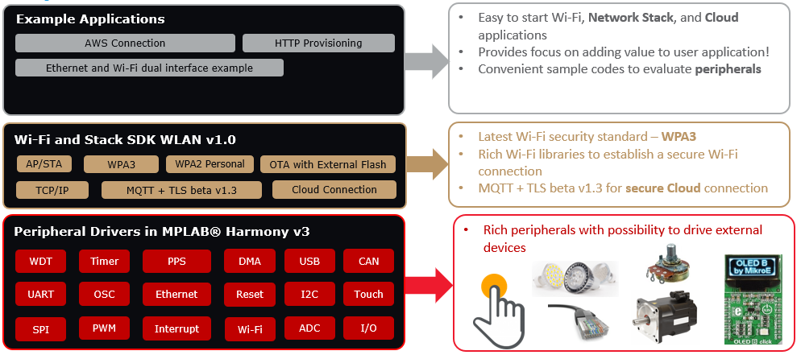
</p>

Later:

* Over the Air upgrade (OTA) features
* WPA Enterprise security
* AP/STA Concurrency
* Wi-Fi/BLE concurrency

### Software Architecture<a name="step4b"></a>

The PIC32MZ W1 SDK is fully integrated into MPLAB Harmony 3 Framework.

<p align="center">
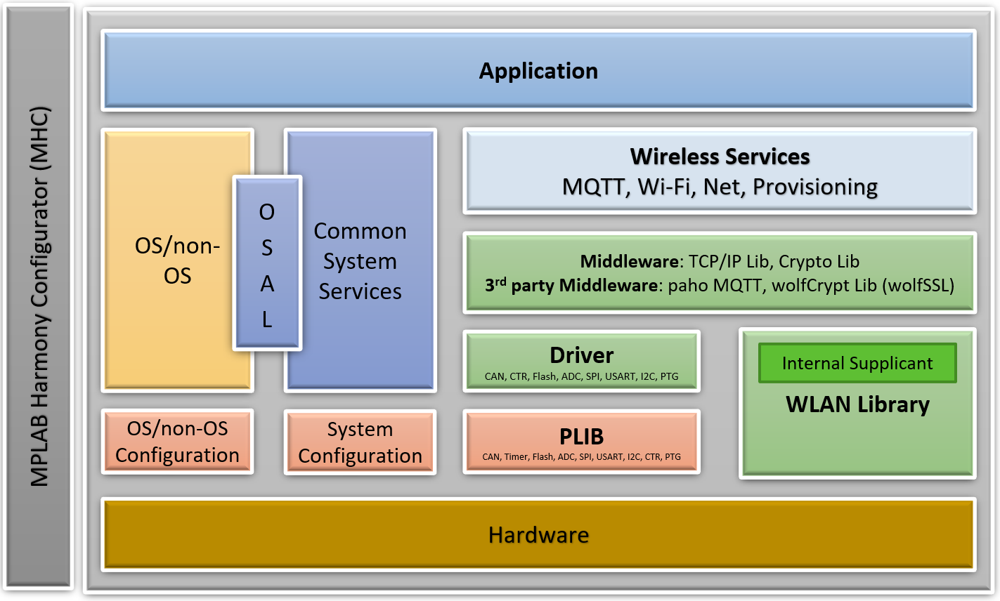
</p>

It support PLIB for PIC32MZ W1's peripherals such as SPI, UART, ADC, CAN, Timer, etc.
And it support OS or Non-OS configuration.

WLAN Library offers Wi-Fi core functionality and has 2 interface, one is data interface and one is configuration interface. Network stacks like TCP/IP, MQTT run on top of WLAN Library.

<p align="center">
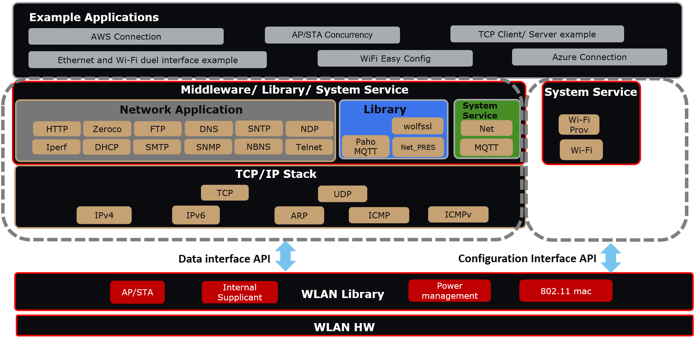
</p>

**For easiness in application development, Wireless System Services and Middleware run on top of WLAN Library.**


### WLAN Driver<a name="step4c"></a>

#### PIC32MZ W1 Wi-Fi Application SW Layers Structure

<p align="center">
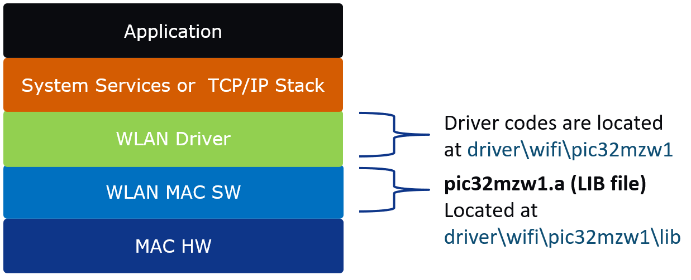
</p>

WLAN driver is acting as the interface layer  between the application, system service, TCP/IP Stack and  WLAN MAC SW, HW.

The WLAN driver code  and API can be found at: `<Harmony project path\driver\wifi\pic32mzw1>`.\
The WLAN MAC SW is release as closed .a library, located at: `<Harmony project path\driver\wifi\pic32mzw1\lib>`

<!-- To remove from here
-->

#### Deeper in WLAN Driver

Going deeper in the WLAN driver, it provides two type of interface – data interface and configuration interface.

<p align="center">
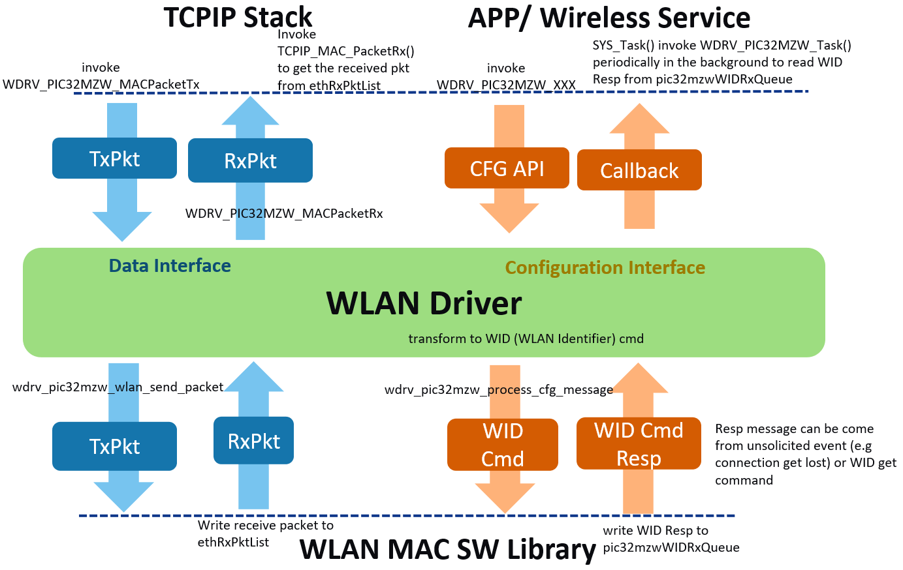
</p>

**Data interface** interacts between the TCP/IP Stack and WLAN MAC, used for transmit and receive network packets.
- When TCP/IP stack have packet to send to the network, it invokes  `WDRV_PIC32MZW_MACPakcetTx` in the driver and the driver calls `wdrv_pic32mzw_wlan_send_packet` to send the packet out.
- When WLAN  MAC receives packets and need to pass the packets up to the TCP/IP stack, it writes the packet to `ethRxPkList` and invokes a function to update the event flag at TCPIP Stack
- TCP/IP stack invoke `WDRV_PIC32MZW_MACPacketRx` to get the packet from `ethRxPkList`.

**Configuration interface** interacts between the application / wireless service and WLAN MAC, used for set/ get configuration like setting as AP mode, getting the RSSI etc.
- Application / Wireless services call WLAN driver API (`WDRV_PIC32MZW_XXX`) to set or get configuration.
- WLAN driver transforms the message to WID (WLAN Identifier) format and send  to WLAN MAC by calling `wdrv_pic32mzw_process_cfg_message` in `WDRV_PIC32MZ_Task`
- When WLAN MAC has event response to the APP/ wireless services, it writes the WID Response message to `pic32mzwWIDRxQueue`. 
- `WDRV_PIC32MZW_Task` is poll to read WID Resp message from `pic32mzwWIDRxQueue`, process in the driver and invoke the callback function to APP/ Wireless services.

#### Folder Structure

Location of the WLAN driver: `<Harmony project path>\driver\wifi\pic32mzw1`

<p align="center">
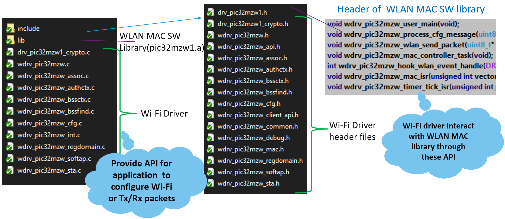
</p>

The file `drv_pic3mzw1.h` includes all the WLAN MAC library API header called by the WLAN driver. It also includes the WLAN driver API header that the WLAN MAC library call. 

> Checking this file can get familiar the interface between the WLAN driver and WLAN MAC library and can help to understand the driver code and architecture.

#### WLAN Driver API

Client interface API are separated into several categories.

| API Category | Description |
| ------------ | ----------- |
| System Interface | Init / Deinit the PIC32MZW1 Wi-Fi module instance or get the driver status |
| Open / Close | Open/Close the driver |
| STA | Connect/Disconnect STA |
| SoftAP | Start/Stop AP mode |
| Authentication Context | Configure the authentication context for Wi-Fi Authentication, used when start AP mode or connect STA |
| BSS Context | Set the BSS context such as SSID and channel for Wi-Fi connection |
| BSS Find | Use for scan Wi-Fi channels |
| Association | Provide information about the current association with a peer-device like RSSI, peer-mac addr |
| Information | Interface provides general information about the device like device MAC address, operating channel |

Some highlighted Configuration API:

| Interface API | Description |
| ------------- | ----------- |
| `WDRV_PIC32MZW_BSSCtxSetSSID` | The SSID string is copied into the BSS context |
| `WDRV_PIC32MZW_BSSCtxSetChannel` | The supplied channel value is copied into the BSS context |
| `WDRV_PIC32MZW_AuthCtxSetPersonal` | The context are configured appropriately for WPA-PSK authentication |
| `WDRV_PIC32MZW_AuthCtxSetOpen` | The context are configured appropriately for Open authentication |
| `WDRV_PIC32MZW_BSSConnect` | Connect PIC32MZW1 to the BSS as an infrastructure station |
| `WDRV_PIC32MZW_BSSDisconnect` | Disconnects from an existing BSS |
| `WDRV_PIC32MZW_APStart` | Creates and starts a Soft-AP instance |
| `WDRV_PIC32MZW_APStop` | Stops an instance of Soft-AP |
| `WDRV_PIC32MZW_AssocRSSIGet` | Retrieve the RSSI of the current association |
| `WDRV_PIC32MZW_AssocPeerAddressGet` | Retrieve the current association peer device network address |
| `WDRV_PIC32MZW_BSSFindFirst` | A scan is requested. An optional callback can be provided to receive notification of the first BSS discovered |
| `WDRV_PIC32MZW_BSSFindNext` | Requested to get next BSS information structure |

Check out the [WLAN Driver API doc](https://microchip-mplab-harmony.github.io/wireless/driver/pic32mzw1/readme.html) for more details.
  

### Wireless Services<a name="step4d"></a>

#### Concept

In typical Wi-Fi Software Application, the developer should interact with complex SW blocks (TCP IP stack initialization, Wi-Fi credential configuration, DHCP Client, DNS, Socket, TLS, Cloud credential configuration, Data exchange, ...).

Thus it may be complicated to develop an application by calling WLAN driver API or TCP IP API directly.

<p align="center">
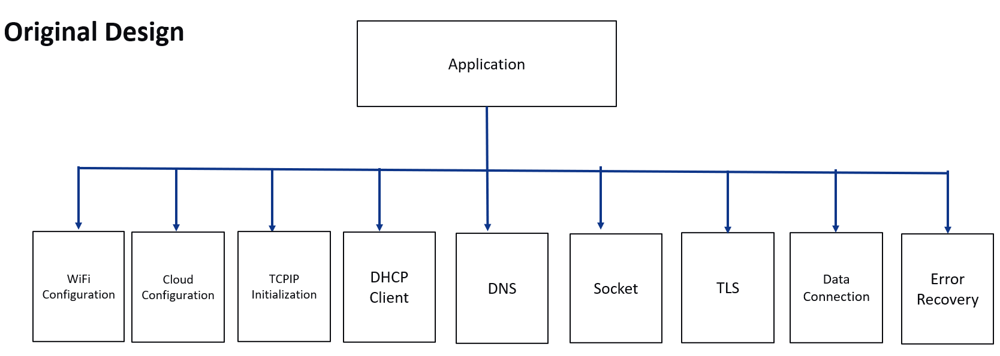
</p>

The Harmony Wireless Software for PIC32MZ W1 device introduces the concept of Wireless Services. \
Wireless Services are modular library code that abstract the WLAN driver, NetPres and TCP/IP Stack.

<p align="center">
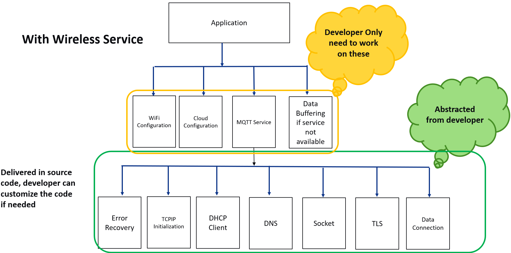
</p>

Wireless Services include:
* Wi-Fi System Service
* Wi-Fi Provisioning System Service
* NET System Service
* MQTT System Service
* APP Debug Service

<p align="center">
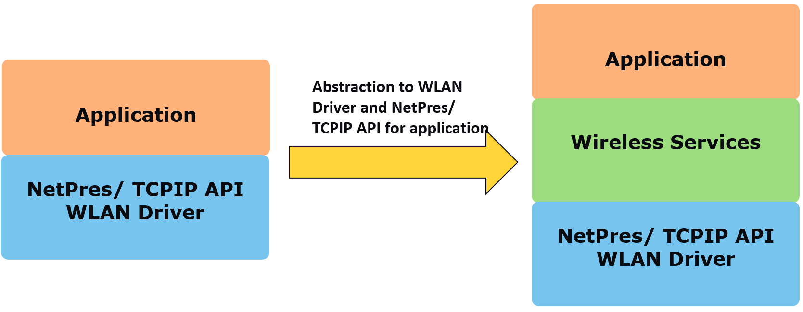
</p>

#### Features

With modular approach, developing a Wi-Fi Application is much easier and provides many benefits.

- Learning curve is reduced
- Developer needs limited non-domain knowledge
   - Limited technology expertise required to get started: Harmony 3 Framework
- Developers sees only what they want to see
- Code to write is reduced
- Development and maintenance time are reduced
- Allow to concentrate effort on the application layer
- OS/non-OS compatible
- Software modules which make commonly use Wi-Fi application available as a service
- Enable reusability of code to easier software development
- Self-Healing
   - If the link (WiFi or Network or MQTT) breaks for any reason, the service will try to reconnect automatically (and all this will be transparent to the application)
- Simple API for the interface between application and service modules

<p align="center">
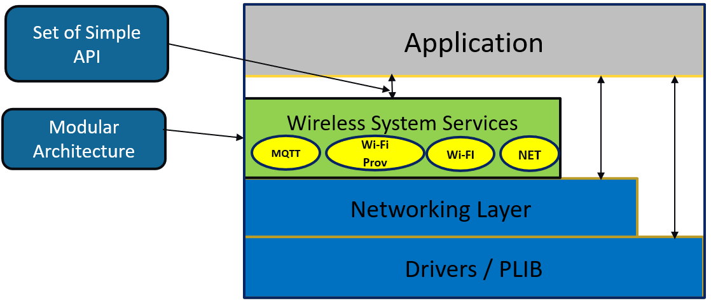
</p>

Wireless Services are configured by the MPLAB Harmony Configurator (MHC).

Support multiple application clients, easy to combine two different applications together.
* Use two instances of the same service (e.g create 2 TCP Client using NET System Service)
* Combine MQTT service and TCP client service examples into a single demo by using NET System Service and MQTT System Service

Several mechanisms are available for Wi-Fi provisioning and configuration:
- Command Line Interface (CLI)
- GUI (MPLAB Harmony Configurator) based
- SoftAP based

> CLI based and GUI based are good for development while SoftAP based is preferred for 	production.

#### Architecture

Every services have unique features but the basic data flow between the Application and the Wireless Services is represented below.

<p align="center">
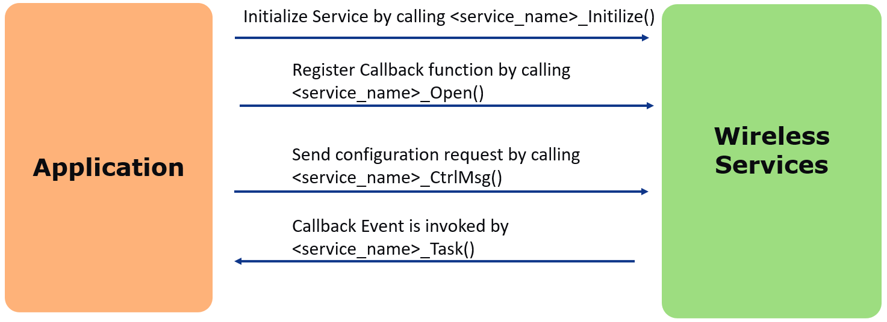
</p>

> NET and MQTT System Services include some other API for data exchange, like below:
>- `SYS_NET_SendMsg()` to send data to the network
>- `SYS_NET_RecvMsg()` to receive data to the network
>- `SYS_MQTT_Publish()` to publish MQTT message to the network

Details information of each service can be found [here](https://microchip-mplab-harmony.github.io/wireless/system/readme.html). This page includes all the service API and the use of each API.

#### Wi-Fi System Service

Wi-Fi System Service provides simple interface to manage Wi-Fi basic connectivity functionalities like:
* Configuration of Station mode (STA)
* Configuration of Soft Access Point mode (AP)
* Scan AP
* Self-Healing: the connection for some reason breaks, the service shall take care of reconnecting the same internally

<p align="center">
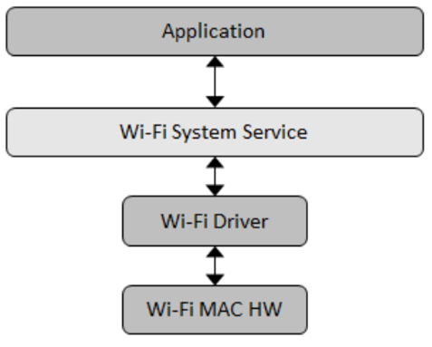
</p>

Wi-Fi System Service is configured via MHC.
* Developer can select the station(STA) or access point (AP) and configure the detail settings.

<p align="center">
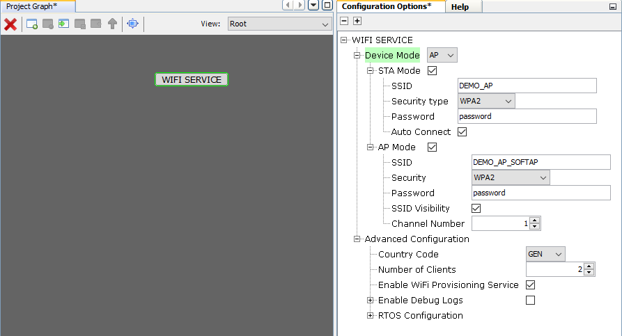
</p>

How the library works ?
- `SYS_Initialize()` invoke `SYS_WIFI_Initialize()` to initialize the Wi-Fi System Service module.
- `SYS_Tasks()` invoke `SYS_WIFI_Tasks()` every a period of time to maintain the Wi-FI System module functionalities.
- Client App 1 register the callback by calling `SYS_WIFI_CtrMsg()` with `SYS_WIFI_REGCALLBACK` event ID.
- Client App 2 register the callback by calling `SYS_WIFI_CtrMsg()` with `SYS_WIFI_REGCALLBACK` event ID.
- Client APP1 send connect request message to Wi-Fi System Service by calling `SYS_WIFI_CtrMsg()` with `SYS_WIFI_CONNECT` event ID.
- Connect/ Disconnect Event is sent from Wi-Fi System Service module to Client APP1 and Client APP 2 through the callback function

<p align="center">
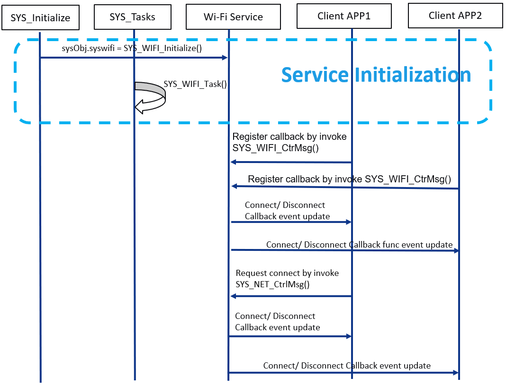
</p>

Check out the [doc](https://microchip-mplab-harmony.github.io/wireless/system/wifi/docs/readme.html) for more details on Wi-Fi System Service.

#### Wi-Fi Provisioning Service

This service provides simple interface to enable Wi-Fi provisioning over several methods which are running in background of the application:
- Command line (CLI)
- TCP socket\
A socket server is activated when initialize the service. Using a laptop or mobile phone as a TCP client to connect to the device's socket server. JSON format data to send to socket server for network provisioning. The mobile APP [Wi-Fi Provisioning](https://play.google.com/store/apps/details?id=com.microchip.wifiapplication) is available from Android Play Store.
- HTTP Pages
- MHC GUI Based

Some provisioning methods are easy for development and one is useful for mass production.

| Provisioning Method | Easy to develop with | Compilation required for providing credentials | Mass production ready |
| ------------------- | -------------------- | --------- | ------------ |
| MHC | Yes | Yes | No |
| CLI | Yes | No | No |
| SoftAP | No | No | Yes |

The developer configures the Wi-Fi Provisioning System Service via MHC.

<p align="center">

</p>

Provisioning over CLI can be done over simple commands:

| Command | Details | Example |
| ------- | ------- | ------- |
| `wifiprovhelp` | Wi-Fi Provision Service help command | `wifiprovhelp` |
| `wifiprov set <bootmode> <save config> <channel> <auto_connect> <authtype> <ssid_name> <psk_name>` | Set Wi-Fi configuration for Station(STA) mode | `wifiprov set 0 1 1 1 1 "DEMO_AP" "password"` |
| `wifiprov set <bootmode> <save config> <channel> <ssid_visibility> <authtype> <ssid_name> <psk_name>` | Set Wi-Fi configuration for Access Point(AP) mode | `wifiprov set 1 1 1 1 1 "DEMO_SOFTAP" "password"` |
| `wifiprov get` | Get Wi-Fi configuration | `wifiprov get` |

How the library works ?
- `SYS_Initialize()` invoke `SYS_WIFI_Initialize()` to initialize the Wi-Fi System Service module.
- `SYS_WIFI_Initialize()` invoke `SYS_WIFIPROV_Initialize()`
- System start listen user command line input  for Wi-Fi provisioning.
- `SYS_WIFI_Tasks()` and `SYS_WIFIPROV_Tasks()` are invoked every a period of time in a while loop to maintain the Wi-FI System module and Wi-Fi Provisioning System Service module functionalities.
- Wi-Fi System Service module invoke `SYS_WIFIProv_CtrMsg()` with `SYS_WIFIPROV_CONNECT` event ID to request Wi-Fi Provisioning System Service to enable provisioning socket server

> **The code of this service run in background to work with Wi-Fi System Service. No development and no configuration are required by the user. This is totally transparent for the developer.**

Check out the [doc](https://microchip-mplab-harmony.github.io/wireless/system/wifiprov/docs/readme.html) for more details.

#### Net Service

This service provides simple interface to manage TCPIP Networking functionalities and supports:
* Client/Server mode for IP Network connectivity
* TCP and UDP Protocol of IP
* TLS for TCP connection
* Self-Healing - if the connection breaks for some reason, the service shall take care of reconnecting the same internally
* Command Line

<p align="center">
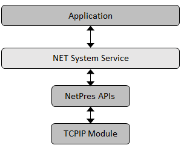
</p>

The developer configures the Net Service via MHC:
- TCP or UDP mode
- Client/Server mode
- Enable/Disable TLS and self-healing
- Input server port and host name/IP address

<p align="center">
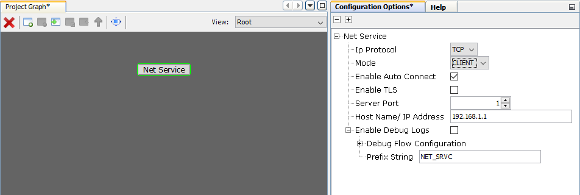
</p>

Net Service supports command line.

| Command | Details | Example |
| ------- | ------- | ------- |
| `sysnethelp` | Net Service help command | `>sysnethelp` |
| `sysnet get info` | Command to get the current information for all the instances of Net Service | `>sysnet get info`<br>Output<br>*****************************************<br>NET Service Instance: 0<br>Status: SYS_NET_STATUS_IDLE<br>Mode: SYS_NET_MODE_CLIENT<br>Socket ID: 0<br>Host:<br>Remote IP: 0.0.0.0<br>Remote Port: 0<br>Local Port: 0<br>hNet: 0 |
| `sysnet open` | Command for reconfiguring an already open instance of Net Service | `>sysnet 0 1 google.com 443 tls_enable 1 auto_reconnect 1` |
| `sysnet send` | Command to send a message on an already open instance of Net Service | `>sysnet send 0 hello` |

How the library works ?

Using Net Service to create a TCP Client to exchange data with a TCP server in the network.

Service initialization:
- `SYS_Initialize()` invoke `SYS_NET_Initialize()` to initialize the Net Service module.
- `SYS_Tasks()` invoke `SYS_NET_Task()` every a period of time in a while loop to maintain the Net Service module functionalities.

> **The code of Net Service initialization is generated by MHC and run in background. No interaction is required by developer.**

Then:
- Application invoke `SYS_NET_Open()` to create the Net Service instance and register the callback function.
- Net Service module create the TCP client and connect to the TCP server. If the connection is success, callback event (`SYS_NET_EVENT_CONNECTED`) is return to Application.
- When Net service receive message from TCP server, it send callback function with `SYS_NET_EVNT_RCVD_DATA` event to Application.
- Application invoke `SYS_NET_RecvMsg()` to get the message from NET Service module.
- Application request Net service module to disconnect TCP socket by invoke `SYS_NET_CtrlMsg()` with `SYS_NET_CTRL_MSG_DISCONNECT` event.
- When socket disconnection get success, Net service send callback event `SYS_NET_EVNT_DISCONNECTED` event to Application.

<p align="center">
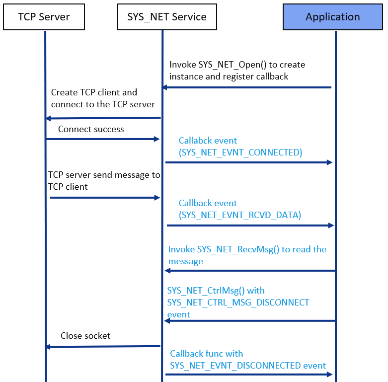
</p>

> Blue highlighted in the above picture are the function call and event related to the application. Developer can only focus on these items. Others are done in background.

Check out the [doc](https://microchip-mplab-harmony.github.io/wireless/system/net/docs/readme.html) for more details.


#### MQTT Service

This service provides simple interface to manage MQTT functionalities. The MQTT Service internally uses the Third Party Paho MQTT software for MQTT support.
It support also:
* MQTT Client
* TLS
* Self-healing
* CLI

<p align="center">
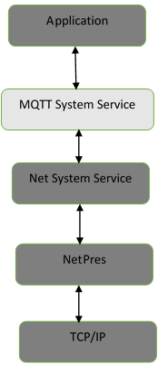
</p>

With MQTT Service, developer does not need to maintain state machine or refresh a timer. Everything is managed automatically by the service itself.

MHC is used to configure the MQTT Service with:
- Broker server configuration
- MQTT Topic which publish or subscrbie
- Enable/Disable TLS and self-healing 

<p align="center">

</p>

MQTT Service supports command line.

| Command | Details | Example |
| ------- | ------- | ------- |
| `sysmqtthelp` | Open the sysmqtt service instance | `>sysmqtthelp` |
| `sysmqtt get info` | Get the list of sysmqtt service instances | `>sysmqtt get info`<br>Output:<br>*****************************************<br>MQTT Service<br>Instance: 0<br>Status: IDLE<br>BrokerName:<br>BrokePort: 0<br>ClientId:<br>
TlsEnabled:0<br>AutoReconnect: 0<br>Username:<br>Password:|
| `sysmqtt open` | Open sysmqtt service instance | `>sysmqtt open 0 mqttbroker <broker_name>` |
| `sysmqtt close` | Close sysmqtt service instance | `>sysmqtt close 0` |
| `sysmqtt send` | Send message on a topic | `>sysmqtt send 0 MCHP/Sample/a 1 1 hello world` |
| `sysmqtt subscribe` | Subscribe to a topic | `sysmqtt subscribe 0 MCHP/Sample/b 1` |
| `sysmqtt unsubscribe` | Unsubscribe from a topic | `sysmqtt unsubscribe 0 MCHP/Sample/b` |

Check out the [doc](https://microchip-mplab-harmony.github.io/wireless/system/mqtt/docs/readme.html) for MQTT sequence diagrams and get more details.

#### MQTT Applications

To highlight the real benefit of using Wireless Services, developer may compare one application without Wireless Services implementation.

Check out the Harmony paho MQTT Client application code using Wireless Services:
- located in `<Harmony folder>/wireless/apps/paho_mqtt_client`
<p align="center">

</p>
The application use the MQTT, NET and Wi-Fi system service. The app code include the initialization code, the service callback function and the application (`publish_periodicMsg(void)` in this example). The code have around only 150 lines, which is much lesser than the application code without using wireless services.
Developer can use minimum code to get started.
<br><br>


Check out the Harmony MQTT application code without Wireless Services:
- located in `<Harmony folder>/net/apps/wolfmqtt_demo`

```
bool APP_MQTT_Init(void)
{
          // initialize the MQTT context used in the application
          …	
}
Void APP_MQTT_Task()
{
switch (mqttCtx->currState)
    {
         case APP_MQTT_STATE_INIT:
	MqttClient_Init()         
	…
         case APP_MQTT_STATE_NET_CONNECT:
	MqttClient_NetConnect()
               …
         case APP_MQTT_STATE_CLIENT_CONNECT:
	MqttClient_Connect()
	…
          case APP_MQTT_STATE_SUBSCRIBE:
    	MqttClient_Subscribe()
	…
          case APP_MQTT_STATE_PUBLISH:
	MqttClient_Publish()
	…
	…
}

```
The application do not use any service library. The app code mainly include the initialization code and a state machine. The state machine include a lot of code for different configuration and handle different condition. 
The code has around 900 lines, which is much more than the application code that using wireless services.

#### APP Debug Service

This service provides an API to manage debug logs at runtime.

Key Features:
* Supports Enabling/ Disabling of logs at runtime
* Supports Enabling/ Disabling of logs based on severity level
* Supports Enabling/ Disabling of logs based on logical flow
* The App Debug System Service provides simple API's to enable/diable system console logs functionalities. Multiple users can request the App Debug system service functionalities simultaneously.

Check out the [doc](https://microchip-mplab-harmony.github.io/wireless/system/appdebug/docs/readme.html) for more details.

### System Code<a name="step4e"></a>

In general, an Harmony PIC32MZ W1 application has 2 parts. 
- The first part is the system initialization.
- The second part is keep running a number of tasks state machine for different features.

This is the initialization flow when software start running.

<p align="center">
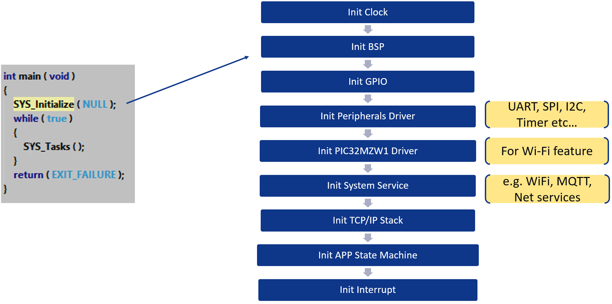
</p>

After system initialization,  it keep looping to run a number of system tasks periodically. The tasks that the project run depend on the application. For Wi-Fi feature, `WDRV_PIC32MZ_Tasks` and `TCPIP_STACK_Task` are the essentials task to maintain Wi-Fi driver and TCPIP stack state machine.

If the project use Wireless Service library (like WiFi System Service, NET System Service etc..), it also need to run the Wireless Service tasks.

<p align="center">
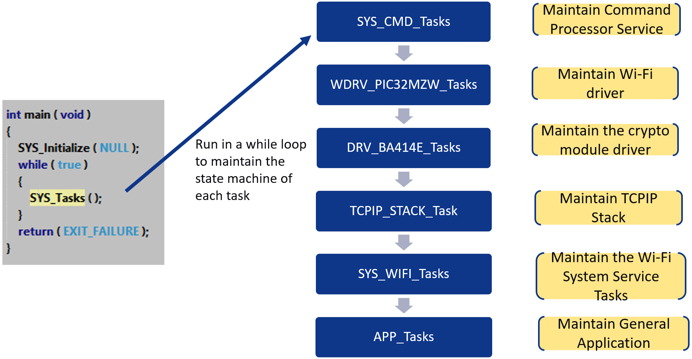
</p>

These are the major tasks. Other task may exist depending on configuration. For FreeRTOS projects, the tasks are created by `xTaskCreate` function. Developer only need to develop the application in the `APP_Tasks`. All the other task are generated by MHC and run in background.


<a href="#top">Back to top</a>

