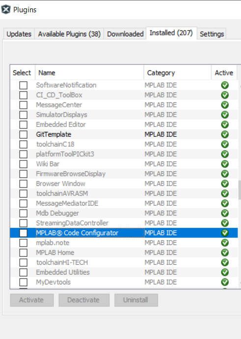
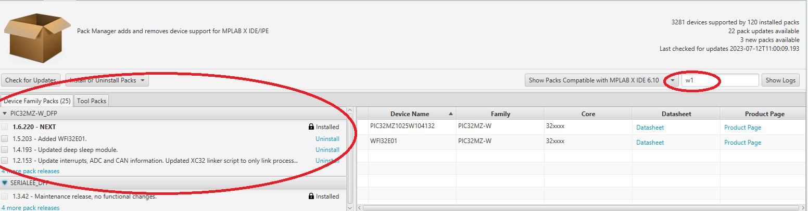

# Setup the tools
> "Wireless Made Easy!" - Full workshop experience to learn and touch PIC32MZ W1 family

[Back to Main page](../README.md)

## A la carte

1. [Material Required](#step1)
1. [Hardware Setup](#step2)
1. [Software Requirements](#step3)
1. [Setup your development environement](#step4)

## Material Required

- [PIC32WFI32E Curiosity Board](http://www.microchip.com/EV12F11A)\
[Order a PIC32WFI32E Curiosity Board](https://www.microchipdirect.com/product/EV12F11A)
- Micro-USB to USB Cables
- USB-UART converter such as FTDI (TTL-232R-3V3) cable or an [ADM00393 MCP2200 USB-UART board](https://www.microchip.com/developmenttools/ProductDetails/ADM00393)
- (optional) Programmer/debugger: [MPLAB® SNAP](https://www.microchip.com/developmenttools/ProductDetails/PartNO/PG164100), [PICkit 4](https://www.microchip.com/Developmenttools/ProductDetails/PG164140), or [MPLAB® ICD4](https://www.microchip.com/Developmenttools/ProductDetails/DV164045)
- (optional) [AC164110 RJ11 to ICSP Adapter](https://www.microchipdirect.com/product/search/all/AC164110) for ICD4

- Wi-Fi Access Point or Mobile Hotspot with Internet access\
(make sure you have the credentials to the Wi-Fi AP with internet access handy)
- Personal Computer

## Hardware Setup

The PIC32WFI32E Curiosity Board has the PKOB debugger on-board. You can either setup the board to use the on-board programmer/debugger or either use an external programmer/debugger tool for faster programming experience.

The table below provide the possible combinations for the jumpers (open/close) and the connectors (Yes: connected, No: not connected).

| Mode of operation | External Power Supply J201 | Power Source Selection Jumpers J202 | Standalone USB Power J204 | USB Host/Device Selection Jumper J205 | ICSP Header J206 | Int/Ext Debugger/Programmer Jumpers J301 |  USB Prog/Debug J302 |
| --- | --- | --- | --- | --- | --- | --- | --- |
| On-board programming/debugger | No | PKOB | No | Open | No | Close | Yes |
| External programming/debugging | Yes | VBUS | No | Open | Yes | Open | No |
| External programming/debugging (tool supplies 3V) | No | Open | No | Open | Yes | Open | No |
| USB Device Standalone power operation/run | No | VBUS | Yes | Open | No | Open | No |
| USB Host powered from external 5V | Yes | PS | No | Close | No | Open | No |
| USB Device powered from USB debug | No | PKOB | No | Close | No | Close | Yes |

### On-board debugger setup

The PKOB debugger enables the user to program/debug through Debug USB (J302) on PIC32WFI32E Curiosity Board.

1. Make sure J202 jumper is connected to PKOB
1. Make sure J301 jumpers are shorted (Pins 1-2 shorted, Pins 3-4 shorted) 
1. Connect the USB Cable between **_USB Debug J302_** and your PC

| J301              | Jumpers Position                               |
| ----------------- | ---------------------------------------------- |
| Pins 1-2          | shorted                                        |
| Pins 3-4          | shorted                                        |

No external debug tool is needed.

### External debugger setup (optional)

MPLAB® ICD 4 In-Circuit Debugger/Programmer is Microchip’s fastest, cost-effective debugging and programming tool for PIC32MZ W1 family.

1. Make sure that J202 jumper is connected to VBUS
1. Make sure J301 jumpers are open (Pins 1-2 open, Pins 3-4 open)
1. To power supply the board , connect the USB Cable between **_USB Power J204_** and your PC
1. Connect the MPLAB® ICD 4 tool between ICSP J206 connector and your PC

| J301              | Jumpers Position                               |
| ----------------- | ---------------------------------------------- |
| Pins 1-2          | open                                           |
| Pins 3-4          | open                                           |

### USB-to-UART converter

To observe the application logs, you can connect a USB-to-UART converter to J207 (GPIO Header) of the Curiosity Board. Application debug logs can be captured from UART1.

> The UART1 pins (Tx and Rx) are marked on the GPIO Header silkscreen.\
Serial port settings: **_115200 8N1_**

#### Setup with FDTI cable

| USB-UART Cable    | GPIO Header J207 of the Curiosity Board        |
| ----------------- | ---------------------------------------------- |
| Tx                | UART1_RX (Pin 13)                              |
| Rx                | UART1_TX (Pin 23)                              |
| Ground            | GND (Pin 17)                                   |

#### Setup with PICKIT Serial

| PICKIT Serial header     | GPIO Header J207 of the Curiosity Board        |
| ----------------- | ---------------------------------------------- |
| Tx (Pin 1)        | UART1_RX (Pin 13)                              |
| Rx (Pin 6)        | UART1_TX (Pin 23)                              |
| Ground (Pin 3)    | GND (Pin 17)                                   |

> Curiosity board J207 pins 13 to 23 are aligned with PICKIT serial header output.\
> If using ADM00393 MCP2200 Breakout module, make sure to change jumper position to 3.3V position

### Temperature sensor

The Microchip [TC1047A temperature sensor](https://www.microchip.com/wwwproducts/en/TC1047A) is on-board and connected to pin AN15/RPA13 of the WFI32E01PC module. 

1. Make sure jumper J209 is shorted to enable temperature sensor

## Software Requirements

- [MPLAB® X IDE](https://www.microchip.com/en-us/tools-resources/develop/mplab-x-ide) v6.10
- [MPLAB® XC32 Compiler](https://www.microchip.com/content/dam/mchp/documents/DEV/ProductDocuments/SoftwareTools/xc32-v3.01-full-install-windows-installer.exe) v3.01 or above
- [MPLAB® Code Configurator](https://www.microchip.com/mplab/mplab-harmony) v5.3.7 or above
- Serial Terminal like TeraTerm

This material has been developped and validated with:

- MPLAB® X IDE v6.10
- MPLAB® XC32 Compiler v3.01
- MPLAB® Code Configurator v5.3.7
- Device Pack PIC32MZ-W_DFP v1.6.220

## Setup your development environement

<!--Check out:

- [MPLAB® Harmony 3 wiki](https://github.com/Microchip-MPLAB-Harmony/Microchip-MPLAB-Harmony.github.io/wiki)
- [How to Set-up the Tools Required to Get Started with MPLAB® Harmony v3](https://youtu.be/5nt3D-Cmbus).

Set up your development environment.
-->

* Download and install [MPLAB® X IDE](https://www.microchip.com/en-us/tools-resources/develop/mplab-x-ide) 
* Download and install [XC32 Compiler](https://www.microchip.com/content/dam/mchp/documents/DEV/ProductDocuments/SoftwareTools/xc32-v3.01-full-install-windows-installer.exe)
* Install the MPLAB® Code Configurator Plugin [(tutorial)](https://onlinedocs.microchip.com/pr/GUID-1F7007B8-9A46-4D03-AEED-650357BA760D-en-US-6/index.html?GUID-2EE03524-41FE-4EBA-8646-6D10AA72F365)
(Make sure MPLAB® Code Configurator is installed under tools -> Pluggins -> Installed).

|     Tools             |     Version                                        | |
| -----------------      | ---------------------------------------------- | ------------------------ |
|   MPLAB® X IDE        |  [v6.10.0](https://www.microchip.com/en-us/tools-resources/develop/mplab-x-ide)      |                              | 
MPLAB® XC32 Compiler     |  [v3.01](https://www.microchip.com/content/dam/mchp/documents/DEV/ProductDocuments/SoftwareTools/xc32-v3.01-full-install-windows-installer.exe) |
MCC       | v5.3.7    |

## Use the following commands to clone and checkout in repositories

| Title               | Version                               |  Details  |
| ----------------- | ---------------------------------------------- |-------------------|
|usb  | [v3.8.1](https://github.com/Microchip-MPLAB-Harmony/usb.git)         |  git clone https://github.com/Microchip-MPLAB-Harmony/usb.git cd usb/ git checkout v3.8.1 |
|csp  | [v3.14.0](https://github.com/Microchip-MPLAB-Harmony/csp.git)         |  git clone https://github.com/Microchip-MPLAB-Harmony/csp.git cd csp/ git checkout v3.14.0 |
|wolfssl  | [v4.7.0](https://github.com/Microchip-MPLAB-Harmony/wolfssl.git)         |  git clone https://github.com/Microchip-MPLAB-Harmony/wolfssl.git cd wolfssl/ git checkout v4.7.0 |
|crypto  | [v3.7.6](https://github.com/Microchip-MPLAB-Harmony/crypto.git)         |  git clone https://github.com/Microchip-MPLAB-Harmony/crypto.git cd crypto/ git checkout v3.7.6 |
|CMSIS-FreeRTOS  | [v10.4.6](https://github.com/Microchip-MPLAB-Harmony/CMSIS-FreeRTOS.git)         |  git clone https://github.com/Microchip-MPLAB-Harmony/CMSIS-FreeRTOS.git cd CMSIS-FreeRTOS/ git checkout v10.4.6 |
|core  | [v3.11.1](https://github.com/Microchip-MPLAB-Harmony/core.git)         |  git clone https://github.com/Microchip-MPLAB-Harmony/core.git cd core/ git checkout v3.11.1 |
|wireless_wifi  | [v3.8.0](https://github.com/Microchip-MPLAB-Harmony/wireless_wifi.git)         |  git clone https://github.com/Microchip-MPLAB-Harmony/wireless_wifi.git cd wireless_wifi/ git checkout v3.8.0 |
|touch  | [v3.12.1](https://github.com/Microchip-MPLAB-Harmony/touch.git)         |  git clone https://github.com/Microchip-MPLAB-Harmony/touch.git cd touch/ git checkout v3.12.1 |
|dev_packs  | [v3.17.0]( https://github.com/Microchip-MPLAB-Harmony/dev_packs.git)         |  git clone  https://github.com/Microchip-MPLAB-Harmony/dev_packs.git cd dev_packs/ git checkout v3.17.0 |
|wireless_system_pic32mzw1_wfi32e01  | [v3.7.0](https://github.com/Microchip-MPLAB-Harmony/wireless_system_pic32mzw1_wfi32e01.git)         |  git clone https://github.com/Microchip-MPLAB-Harmony/wireless_system_pic32mzw1_wfi32e01.git cd wireless_system_pic32mzw1_wfi32e01/ git checkout v3.7.0 |
|net  | [v3.8.0]( https://github.com/Microchip-MPLAB-Harmony/net.git)         |  git clone  https://github.com/Microchip-MPLAB-Harmony/net.git cd net/ git checkout v3.8.0 |
|bsp  | [v3.16.0](https://github.com/Microchip-MPLAB-Harmony/bsp.git)         |  git clone https://github.com/Microchip-MPLAB-Harmony/bsp.git cd bsp/ git checkout v3.16.0 |
|littlefs  | [v2.4.0](https://github.com/MicrochipTech/littlefs.git)         |  git clone https://github.com/MicrochipTech/littlefs.git cd littlefs/ git checkout v2.4.0 |
|cryptoauthlib  | [20211006](https://github.com/MicrochipTech/cryptoauthlib.git)         |  git clone https://github.com/MicrochipTech/cryptoauthlib.git cd cryptoauthlib/ git checkout 20211006 |
|paho.mqtt.embedded-c  | [v1.2.3](https://github.com/MicrochipTech/paho.mqtt.embedded-c.git)         |  https://github.com/MicrochipTech/paho.mqtt.embedded-c.git cd paho.mqtt.embedded-c/ git checkout v1.2.3 |
|csp_apps_pic32mz_w1  | [v3.4.0](https://github.com/Microchip-MPLAB-Harmony/csp_apps_pic32mz_w1.git)         |  git clone https://github.com/Microchip-MPLAB-Harmony/csp_apps_pic32mz_w1.git cd csp_apps_pic32mz_w1/ git checkout v3.4.0 |

> PIC32MZ W1 Device support comes automatically with latest MPLAB X IDE, check out from MPLAB Pack Manager.

* Open MPLAB Pack Manager from Tools -> Packs

* Type "w1" in Show Packs Compatible text box

> You are now ready to use the MPLAB® Harmony Framework to start your first application with PIC32MZ W1 device.

<a href="#top">Back to top</a>

