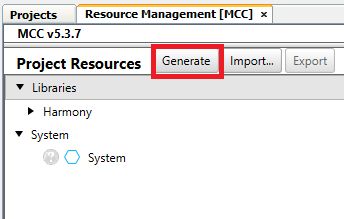

# Out-of-box experience
> "Wireless Made Easy!" - Full workshop experience to learn and touch PIC32MZ W1 family

[Back to Main page](../README.md)

**Watch the video and Unbox the new WFI32E01 Curiosity evaluation board to see how to connect to the cloud securely. Then interact with features on the board with Amazon Alexa.**

<p align="center">
<a href="https://youtu.be/QzlssnBK0HY" target="_blank">
</a>
</p>

## A la carte

1. [Introduction](#step1)
1. [Resources](#step2)
1. [System architecture](#step3)
1. [Run the demo](#step4)
1. [Customize the demo](#step5)
1. [Smart Garage door demo](#step6)

## Introduction<a name="step1"></a>

The [PIC32WFI32E Curiosity Board](http://www.microchip.com/EV12F11A) comes with a Out-of-box demo application already programmed onto the PIC32MZ W1 device.

The demo has a web app and voice based interaction mode.

<p align="center">

</p>

In the web-app based interaction mode, you will be able to visualize the data telemetry from the Curiosity board and interact with the Curiosity board using a web-browser based application. 

In the voice control based interaction mode, you will be able to control the on-board user LED with voice commands using Amazon Alexa®.

All you will need is a board, a micro-USB cable, and a 2.4 GHz Wi-Fi connection.
Follow this 30-second demo to set up Wi-Fi connection and start viewing live data...


## Resources<a name="step2"></a>

- [Out-of-box Demo Application Firmware Image](https://github.com/MicrochipTech/PIC32MZW1_Curiosity_OOB/tree/master/src/prebuilt)
- [Out-of-box Demo Landing Page](https://github.com/MicrochipTech/PIC32MZW1_Curiosity_OOB) with detailled instructions and Harmony 3 project source code

## System architecture<a name="step3"></a>

- File System media is hosted on external SPI Flash
- File system is exposed to Host PC over USB Mass Storage Device
- Trust&Go device certificate is used for tamper proof security and pre-provisioned for use with all major cloud vendors
- The demo exposes the on-chip binary certificates through a “native filesystem” for easy access
- Each device gets a cryptographically verifiable identity

<p align="center">

</p>

## Run the demo<a name="step4"></a>

With zero coding, follow the operations to get your device connected on the Internet.

<p align="center">

</p>

**Setup board**

- Connect J202 jumper to VBUS-VIN.
- Remove J301 jumpers.

**Plug In**

- Connect USB power connector (J204) of your board to your Windows, Mac, or Linux PC through a micro USB cable. Your PC will recognize the board as a removable storage drive.

<p align="center">

</p>

**Link Up**

The new drive contains several files.

- Click on `clickme.html` to open your uniquely configured AWS cloud portal in a browser.
<p align="center">

</p>

- Scroll-down, enter your wireless network information on the page.
<p align="center">

</p>

- Click Download Configuration to download the Wi-Fi® configuration file `WIFI.CFG` and save the file in a dedicated folder on your hard drive (e.g. c:\pic32mzw1).

- Drag and drop the new file `WIFI.CFG` to the root of the new drive and replace the existing file. Make sure the file is named exactly `WIFI.CFG` and the copy process is completed.

- Reboot the board by pressing MCLR button.

- Your board will automatically connect to the network.

<p align="center">

</p>

> Check out the [FAQ](https://github.com/MicrochipTech/PIC32MZW1_Curiosity_OOB/blob/master/faq.md) in you are having trouble to connect.


**Dive In**

Once your board is connected, you'll immediately be able to dive into your temperature data through Microchip’s AWS cloud sandbox.

<p align="center">

</p>

- On top of the temperature graph, copy the unique Thing Name in the clipboard.

> The Thing Name is also part of the web-app link: `https://pic-iot.com/pic32mzw1/aws/<ThingName>`

- Click  button

- To control the on-board LED from the cloud, select "Implement a Cloud-Controlled Actuator" 
<p align="center">

</p>

- Click  button

- Select an LED state
- Click on "Send to Device" to trigger a cloud message to control the on-board Green LED.

<p align="center">

</p>

> Microchip’s sandbox is for demonstration purposes. Learn [here](https://github.com/MicrochipTech/PIC32MZW1_Curiosity_OOB#connecting-to-your-cloud-instance) how to connect the demo to your own AWS cloud instance.


**Use your voice**

- Go back to the content of the new drive mounted

<p align="center">

</p>

- Click on `voice.html` 
- Simply create an account to Microchip front-end web page then log-in
- Register your device:
   - your unique Thing Name previously copied to clipboard
   - a friendly name such as "pic32 light"
<p align="center">

</p>

- After claiming your new device, it will appear on the left window

<p align="center">

</p>

- Install and open the Amazon Alexa® app on your smartphone/tablet
- Enable the [Microchip IoT Skill](https://www.amazon.com/gp/product/B08B5THZH5)
- Type the same user and password you have used to create an account within Microchip Cloud over `voice.html`
- The app will discover your device and add it within your device list
- Control the board through Amazon Alexa® by using the friendly name
   - E.g. Alexa, turn on "pic32 light"
   - E.g. Alexa, turn off "pic32 light"


## Customize the demo<a name="step5"></a>

**[Clone/download](https://github.com/MicrochipTech/PIC32MZW1_Curiosity_OOB) the latest source code of the demo**

**Add Button Status**

The user switch (SW1) will be used to simulate another sensor.

- Go to the main web-app page: `https://iot.microchip.com//pic32mzw1/aws/<ThingName>`
- In "What's next?" section, select "Add more sensor data"
<p align="center">

</p>

- Click  button
- The web app will be expose the step-by-step instructions
- Using MPLAB X IDE:
  - open/modify the project accordingly
  - compile and program the code on your board

- Link up again your device to the cloud
- Observe the button status on the web-app

<p align="center">

</p>

**Add your own sensor**

Good practice to use MCC to change any configuration settings of components or services.
<br>

For the purpose of this demo, let's hack the demo by adding the Light Sensor from [IO1 Xplained Pro Extension Kit](https://www.microchip.com/DevelopmentTools/ProductDetails/ATIO1-XPRO) and connect this board to Xpro header (J203) of the WFI32 Curiosity Board.

<p align="center">

</p>

That will perform the following connection:

| IO1 XPRO Extension Header | WFI32 Curiosity Board XPRO Header |
| ------------------------- | --------------------------------- |
| Pin 2 - GND | Pin 2 - GND |
| Pin 3 - LIGHTSENSOR OUT | Pin 3 - TMS/**AN6**/CVD6/CVDR6/CVDT1/RPB6 |
| Pin 20 - VCC | Pin 20 - VCC |
<br>

<p align="center">

</p>

The IO1 XPRO contains the light sensor [TEMT6000](https://www.vishay.com/docs/81579/temt6000.pdf) from Vishay. The light sensor is a single-ended analog output. When light is being blocked, the pull-up resistor will pull the signal voltage to 3.3V. When light is absorbed by the phototransistor, that will cause a current flow and pulling the signal voltage down to 0.0 V.

<p align="center">

</p>

- Open the [latest code](https://github.com/MicrochipTech/PIC32MZW1_Curiosity_OOB) of the OoB demo project

- The demo project has been written with certain versions of Harmony 3 components. The version of the Harmony 3 components used in this project are listed in the file `harmony-manifest-success.yml` located in the folder [Link](https://github.com/MicrochipTech/PIC32MZW1_Curiosity_OOB/blob/master/src/firmware/src/config/pic32mz_w1_curiosity/harmony-manifest-success.yml).


- Open **MCC**

- Select **ADCHS** from the Active Components list
- Open **ADCHS Easy View** from **Project Grpaph -> plugins -> ADCHS Configuration**
- Select **ADC7 Enabled**
- Click **Channel Selection**
<p align="center">

</p>

- Enable **AN6**, trigger source as **General Purpose Timer3** with Input Scan and Interrupt  and **close** the window.
<p align="center">

</p>

- Increase the ADC acquistion time by:
   - Changing ADC Clock Divider to **64** to obtain TAD = 640 ns
   - Changing ADC Sample Count to **20** 
   - Both changes will result to lower acquisition rate

> The ADCHS block of the PIC32MZW1 can operates very fast. However in the current hardware, there are no external buffer circuit in order to reduce the impedance between the sensors and the ADC inputs. Thus acquisition time must be just long enough to charge the sample capacitor and conversion time must be long enough for sucessive approximation to complete while being as short as possible to prevent charge leakage loss.\
For more info, checkout: [datasheet](https://ww1.microchip.com/downloads/en/DeviceDoc/PIC32MZ1025W104-MCU-and-WFI32E01-Module-with-Wi-Fi-and-Hardware-based-Security-Accelerator-Data-Sheet-DS70005425A.pdf), [12-bit SAR ADC Reference Manual](https://ww1.microchip.com/downloads/en/DeviceDoc/PIC32_Family_Reference_Manual_12-bit_High-Speed_SAR_ADC.pdf), or [this article](https://www.embeddedrelated.com/showarticle/110.php) for insights.

<p align="center">

</p>

- Click **Generate Code** and make sure to select **USER_RECENT** as Merge Strategy
<p align="center">

</p>

- Apply the requested modifications by selecting **Replace All** for all the popup windows then close the windows
<p align="center">

</p>

- Files to modify in order to adapt the demo:
   - `app_control.c`
   - `app_control.h`
   - `mqtt_app.c`
   - `mqtt_app.h`

- Open header file `app_control.h`
- Modify the existing `APP_CTRL_ADC_DATA` structure by adding three new variables related to light sensor (`lightReady`, `lightCount` and `light`):
```
    typedef struct {
        bool dataReady;
        uint16_t adcCount;
        float temp;
        bool lightReady ;
        uint16_t lightCount ;
        float light ;
    } APP_CTRL_ADC_DATA;
```

- Open source file `app_control.c`
- In `APP_CONTROL_Initialize()`, reset the values of the new items `lightCount` and `lux`:
```
    /*init ADC data*/
    app_controlData.adcData.dataReady = false;
    app_controlData.adcData.adcCount = 0;
    app_controlData.adcData.temp = 0;
    app_controlData.adcData.lightReady = false ;
    app_controlData.adcData.lightCount = 0 ;
    app_controlData.adcData.light = 0 ;
```
- Modify the `ADC_ResultHandler()` as below to the handle and get the ADC results of CH6 and CH15.
```
void ADC_ResultHandler(ADCHS_CHANNEL_NUM channel, uintptr_t context) {
    switch(channel)
    {
        case ADCHS_CH15:
            app_controlData.adcData.adcCount = ADCHS_ChannelResultGet(ADCHS_CH15);
            app_controlData.adcData.dataReady = true;            
            break ;
        case ADCHS_CH6:
            app_controlData.adcData.lightCount = ADCHS_ChannelResultGet(ADCHS_CH6) ;
            app_controlData.adcData.lightReady = true ;
            break ;
        default:
            break ;
    }
}
```

- Scroll-down in `app_control.c`
- In `APP_CONTROL_Tasks()` function, register the callback functions to be called at the end of conversion on CH15 and CH6 in `APP_CONTROL_STATE_INIT` switch case.
```
void APP_CONTROL_Tasks(void) {
    WDT_Clear();
    switch (app_controlData.state) {
        case APP_CONTROL_STATE_INIT:
        {
            // Registers the ADC callback function for channel CH15 and CH6
            ADCHS_CallbackRegister(ADCHS_CH15, ADC_ResultHandler, (uintptr_t)NULL);
            ADCHS_CallbackRegister(ADCHS_CH6, ADC_ResultHandler, (uintptr_t)NULL);
            
            TMR3_Start(); /*TMR3 is used for ADC trigger*/

            RTCC_CallbackRegister(RTCC_Callback, (uintptr_t) NULL);
            setup_rtcc();
            indicator_on();
            app_controlData.state = APP_CONTROL_STATE_MONITOR_CONNECTION;
            break;
        }
```

- Continue scrolling-down in `APP_CONTROL_Tasks()` function and modify the switch-case `APP_CONTROL_STATE_ADC_READ` as below. Just add the portion of code related to light sensor below the temperature sensor section.
```
       case APP_CONTROL_STATE_ADC_READ:
       {
            /*Average over APP_CTRL_ADC_AVG_COUNT ADC samples*/
            // Temperature sensor
            static uint32_t adcCountAccumulate = 0;
            static uint16_t adcAccumulateNum = 0;
            if (app_controlData.adcData.dataReady) {
                if (adcAccumulateNum <= APP_CTRL_ADC_AVG_COUNT) {
                    adcCountAccumulate += app_controlData.adcData.adcCount;
                    adcAccumulateNum++;
                } else {
                    adcCountAccumulate = adcCountAccumulate / APP_CTRL_ADC_AVG_COUNT;
                    float input_voltage = (float) adcCountAccumulate * APP_CTRL_ADC_VREF / APP_CTRL_ADC_MAX_COUNT;
                    float temp = ((input_voltage - .7) / .1)*10;
                    app_controlData.adcData.temp = temp;
                    /*For the next averaging cycle*/
                    adcAccumulateNum = 0;
                    adcCountAccumulate = 0;                    
                    //SYS_CONSOLE_PRINT("Temp=%0.1f\r\n",app_controlData.adcData.temp);
                }
                app_controlData.adcData.dataReady = false;
            }
            // Light sensor
            static uint32_t lightCountAccumulate = 0 ;            
            static uint16_t lightAccumulateNum = 0 ;            
            if (app_controlData.adcData.lightReady) {
                if (lightAccumulateNum <= APP_CTRL_ADC_AVG_COUNT) {
                    lightCountAccumulate += app_controlData.adcData.lightCount ;
                    lightAccumulateNum++ ;
                } else {
                    lightCountAccumulate = lightCountAccumulate / APP_CTRL_ADC_AVG_COUNT ;
                    app_controlData.adcData.light = 100 - (lightCountAccumulate * 100 / APP_CTRL_ADC_MAX_COUNT) ;
                    /*For the next averaging cycle*/
                    lightAccumulateNum = 0 ;
                    lightCountAccumulate = 0 ;
                    //SYS_CONSOLE_PRINT("Light=%0.1f\r\n",app_controlData.adcData.light);
                }
                app_controlData.adcData.lightReady = false ;
            }
            app_controlData.state = APP_CONTROL_STATE_RTCC_READ;
            break;
        }
```

- Open header file `mqtt_app.h` add a new JSON template called `MQTT_APP_TELEMETRY_MSG_GRAD2_TEMPLATE`  and include light sensor value along with existing temperature and switch status
```
#define MQTT_APP_TELEMETRY_MSG_GRAD2_TEMPLATE "{\"Temperature (C)\": %d,\"switch\":%d,\"light\":%d}"
```

- Open source file `mqtt_app.c` and search for `publishMessage()` function
- Comment out the existing telemetry message lines and add the new graduation step: `sprintf(message, MQTT_APP_TELEMETRY_MSG_GRAD2_TEMPLATE, (int) app_controlData.adcData.temp,app_controlData.switchData.switchStatus, (int) app_controlData.adcData.light);`

```
        if (!mqtt_appData.shadowUpdate) { /*if a shadow update is requested, do it in this round*/
            snprintf(pubTopic, SYS_MQTT_TOPIC_NAME_MAX_LEN, "%s/sensors", app_controlData.mqttCtrl.clientId);
            //sprintf(message, MQTT_APP_TELEMETRY_MSG_TEMPLATE, (int) app_controlData.adcData.temp);
            /*Graduation step to include an additional sensor data. Comment out the above line and uncomment the one below.*/
            //sprintf(message, MQTT_APP_TELEMETRY_MSG_GRAD_TEMPLATE, (int) app_controlData.adcData.temp,app_controlData.switchData.switchStatus);
            sprintf(message, MQTT_APP_TELEMETRY_MSG_GRAD2_TEMPLATE, (int) app_controlData.adcData.temp,app_controlData.switchData.switchStatus, (int) app_controlData.adcData.light);
        } 
```

- **Clean and Build project**
- **Run project**
- Perform the steps detailled above to [Run the demo](#step3)

With the above modifications, you should be able to observe the temperature sensor value (ADCHS_CH15), the status of the user switch (SW1) and the light sensor (ADCHS_CH6) on the front-end web page.

<p align="center">

</p>
