# Explore and Try
> "Wireless Made Easy!" - Full workshop experience to learn and touch PIC32MZ W1 family

[Back to Main page](../README.md)

## A la carte

1. [Collection of code examples](#step1)
1. [Evaluation flow](#step2)
1. [Prerequisites](#step3)
1. [TCP Client Application example](#step4)
1. [Lab 0 - Wi-Fi feature evaluation with CLI](#step5)
1. [Lab 1 - Use MPLAB X IDE to compile and flash the project](#step6)
1. [Lab 2 - Configure the Wi-Fi network using MHC](#step7)
1. [Lab 3 - Enable Wi-Fi Provisioning with HTML webpage](#step8)
1. [Lab 4 - Enable Wi-Fi Provisioning with Mobile Application](#step9)
1. [Lab 5 - Merging TCP Client example application and Paho MQTT Client example application](#step10)
1. [Lab 6 - Enable WLAN MAC Debug Log](#step11)

## Collection of code examples<a name="step1"></a>

PIC32MZ W1 device is supported with many Application code examples within MPLAB® Harmony 3 Content Manager.

* Open MPLAB® X IDE
* Launch MPLAB® Harmony 3 Content Manager from **Tools -> Embedded** [(tutorial](https://microchip-mplab-harmony.github.io/contentmanager/doc/readme.html) for more details)
* Make sure to use the Framework Path you have previously synced and click button "Next"
<p align="center">
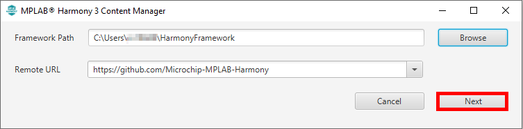
</p>

* Select the "Application Browser"

<p align="center">
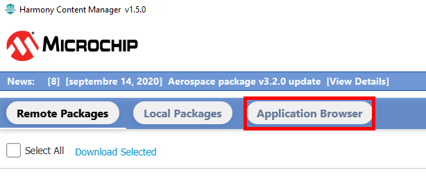
</p>

- Use the filter `w1` to easily find the `PIC32MZ1025W104132` Target Device

<p align="center">
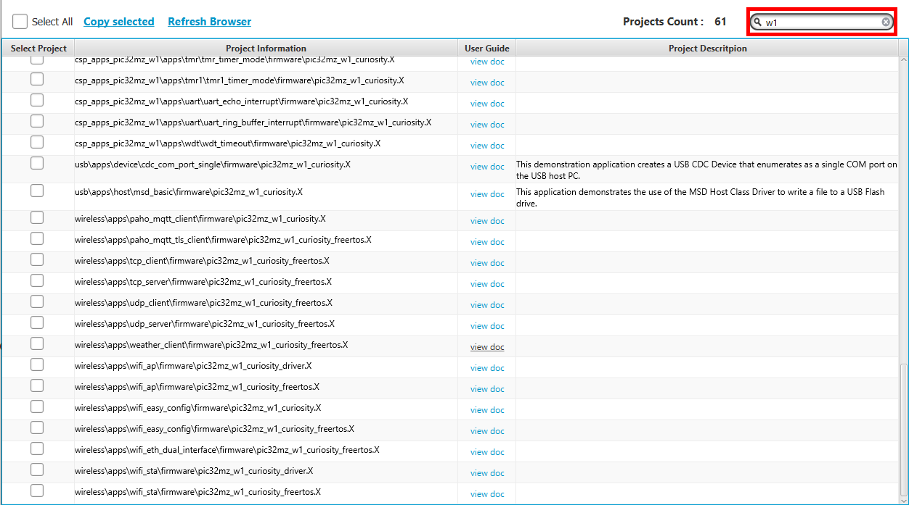
</p>

- Observe the applications highlighted.\
The following applications are provided to demonstrate the PIC32MZ W1 peripherals like CAN, ADC, SPI, I2C, UART, WDT, etc.\
And wireless sample applications cover Wi-Fi, TCP, UDP, MQTT, etc.

Notice that all those code examples are also part of your `<HarmonyFramework>` folder.\
For e.g. Sample codes related to Wireless are located in `<HarmonyFramework folder>/wireless/apps`.

So you have the choice either to use code example copied from the Application Browser or directly from your `<HarmonyFramework folder>`.

The common way is to pick code example from Application Browser to not modifiy the original project.

Check out the [SW User Guide](https://www.microchip.com/PIC32MZW1) to get more details on the code examples.


## Evaluation flow<a name="step2"></a>

From the TCP Client example, you will evaluate the PIC32MZ W1 solution along several labs.

From beginner to intermediate level:

| Lab | Device configuration | Harmony code base | Compiler / Linker | Comments |
| --- | -------------------- | ----------------- | ----------------- | -------- |
| Lab 0 - Wi-Fi feature evaluation with CLI | CLI | No | No | Fastest path for evaluation (especially for non Harmony users) |
| Lab 1 - Use MPLAB X IDE to compile and flash the project | CLI | Yes | Yes | 
| Lab 2 - Configure the Wi-Fi network using MHC | MHC | Yes | Yes | Easy way of evaluation, as a graphical front-end via MHC is available for configuration |
| Lab 3 - Enable Wi-Fi Provisioning with HTML webpage | Soft AP | Yes | Yes | SoftAP is recommended for Mass production |
| Lab 4 - Enable Wi-Fi Provisioning with Mobile Application | Soft AP | Yes | Yes | SoftAP is recommended for Mass production |

> CLI is not recommended for Mass production. As a best practice, it is recommended to disable CLI thru MHC for production firmware image.

Advanced labs:
* Lab 5 - Merging TCP Client example application and Paho MQTT Client example application
* Lab 6 - Enable WLAN MAC Debug Log


## Prerequisites<a name="step3"></a>

- MPLAB X IDE is installed
- TeraTerm Serial Terminal installed, setup 115200 8N1, disable local echo
- Download and install [Packet Sender](https://packetsender.com/)

- Use an external debugger such as MPLAB ICD 4, MPLAB PICkit 4 or MPLAB Snap for the best programming and debugging experience. Refer to [Setup the Tools](../03_setup/README.md#top) section
- Plug USB cable to **USB DEBUG J204** connector on PIC32WFI32E Curiosity board to connect computer and the board

- USB-UART cable is required
- To capture console log, connect a USB-to-UART converter to J207 (GPIO Header) of the curiosity board. Refer to [Setup the Tools](../03_setup/README.md#top) section.
- [CLI documentation](https://microchip-mplab-harmony.github.io/wireless/system/wifiprov/docs/usage.html)

- Using Application Browser:
  - Filter for **'w1'** applications
  - Copy both projects: Paho MQTT Client and TCP Client to your `<HarmonyProjects>` path in order to not modify the original projects located in `<HarmonyFramework>` folder
<p align="center">
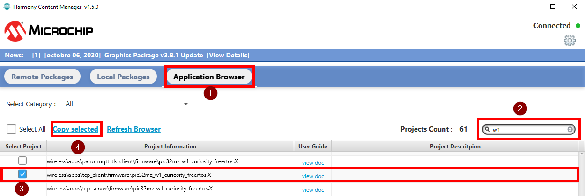
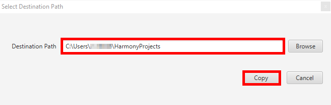
</p>

- TCP/IP basic knowledge, refer to the video [Microchip Masters Introduction to TCP/IP communication](https://www.youtube.com/watch?v=xlRq6pwcINY)

## TCP Client Application example<a name="step4"></a>

This application demonstrates how a user can use a TLS TCP client to connect to a TCP server. The default application will try to establish a TLS connection with www.google.com and post a HTTP GET command to get the google.com Html page.

<p align="center">

</p>

Currently Net Service is configured to run a TCP Client in Secured mode to connect to www.google.com on the https port (443).

## Lab 0 - Wi-Fi feature evaluation with CLI<a name="step5"></a>

### Purpose

Learn to use MPLAB X IPE to flash the image to the Curiosity board and use command line interface (CLI) to evaluate  PIC32MZ W1 Wi-Fi features.

User can input command in Curiosity Board console to configure the network, create TCP/UDP connection, send TCP/UDP data etc.

This lab provides the fastest path for evaluation (especially for non Harmony users). 

### Instructions

1. Launch **MPLAB X IPE**
<p align="center">

</p>

2. Ensure select Device as **PIC32MZ1025W104132**, and select your Hardware programming tool.\
Click **Connect**

<p align="center">
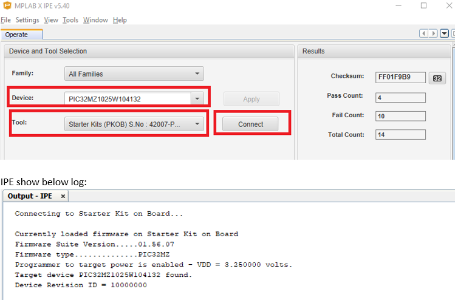
</p>

3. Download the pre-built image `pic32mz_w1_curiosity_freertos.X.production.hex` available under: [resources/pre-built_image](resources/pre-built_image)

4. Click **Browse** to select the hex image file `pic32mz_w1_curiosity_freertos.X.production.hex`. This is the image of the TCP client example project

<p align="center">
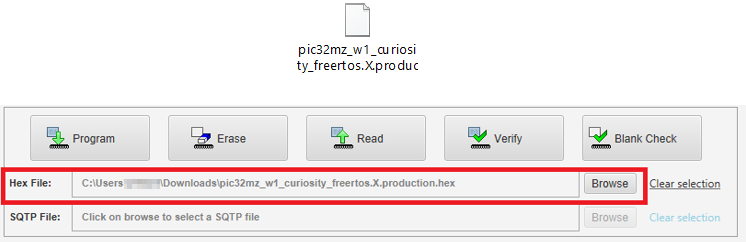
</p>

5. Click **Program**

6. MPLAB X IPE log shows **Programming/Verify complete**
<p align="center">
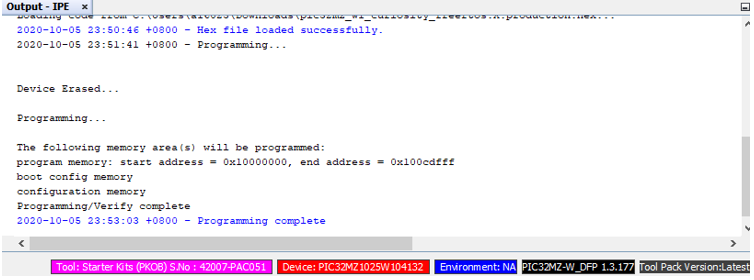
</p>

7. Reboot the Curiosity board

8. Observe application logs on the console 
<p align="center">
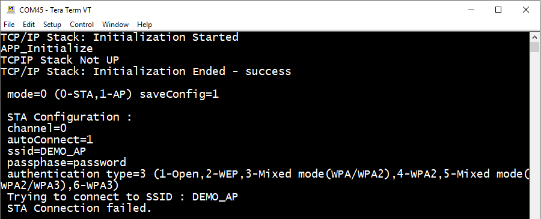
</p>

9. Use CLI command to connect the device to your target Access Point (AP) using the command `wifiprov set 0 1 "GEN" 0 1 3 <SSID> <password>`\
E.g. `wifiprov set 0 1 "GEN" 0 1 3 "mchp_demo" "mchp5678"`\
Once the board connect to AP, the TCP Client application connect to goggle.com and post a HTTP GET command to get the google.com Html page
<p align="center">
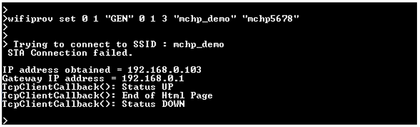
</p>

10. User can also use `sysnet` command to create TCP/UDP connection and send or receive TCP/UDP data. Details are shown in next section (Lab1).

## Lab 1 - Use MPLAB X IDE to compile and flash the project<a name="step6"></a>

### Purpose

Learn to use MPLAB X IDE to compile and flash the project firmware to the Curiosity board. 

User can use CLI to configure the board to connect target AP and create TCP/UDP connection, send or receive TCP/ UDP data.

This lab let the user get familiar with MPLAB X IDE, compiler and CLI commands.

### Instructions

1. Launch **MPLAB X IDE**

2. Open TCP Client project you copied from the Application Browser to your `<HarmonyProjects>` folder. Refer to the [Prerequisites](#step3) section.

3. Select Hardware Tool, Device Family Pack (DFP) and compiler from the **Project Properties** window
<p align="center">
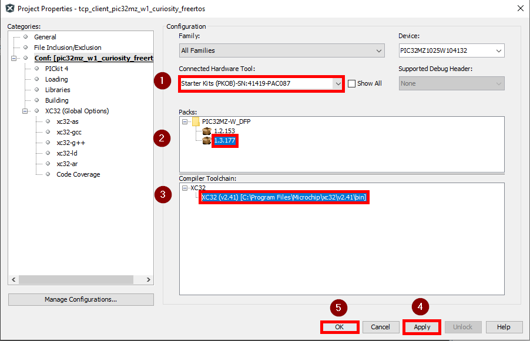
</p>

4. Click **Run Main Project** button , program is start compiled and download to the curiosity board
<p align="center">

</p>

5. After program is downloaded to the board, below logs are printed on the console
<p align="center">

</p>

6. Use CLI command to connect the device to your target Access Point (AP) using the command `wifiprov set 0 1 "GEN" 0 1 3 <SSID> <password>`\
E.g. `wifiprov set 0 1 "GEN" 0 1 3 "mchp_demo" "mchp5678"`\
Once the board connect to AP, the TCP Client application connect to goggle.com and post a HTTP GET command to get the google.com Html page
<p align="center">

</p>

7. To test the TCP connection using CLI, you need to connect your computer to the same network as your board

8. You need to use Packet Sender to act as a TCP server. Refer to the [Prerequisites](#step3) section to download the software tool.

9. Launch Packet Sender.\
Select **File -> Settings**.\
Enable TCP Server by tick the box as below picture. Click OK.
<p align="center">
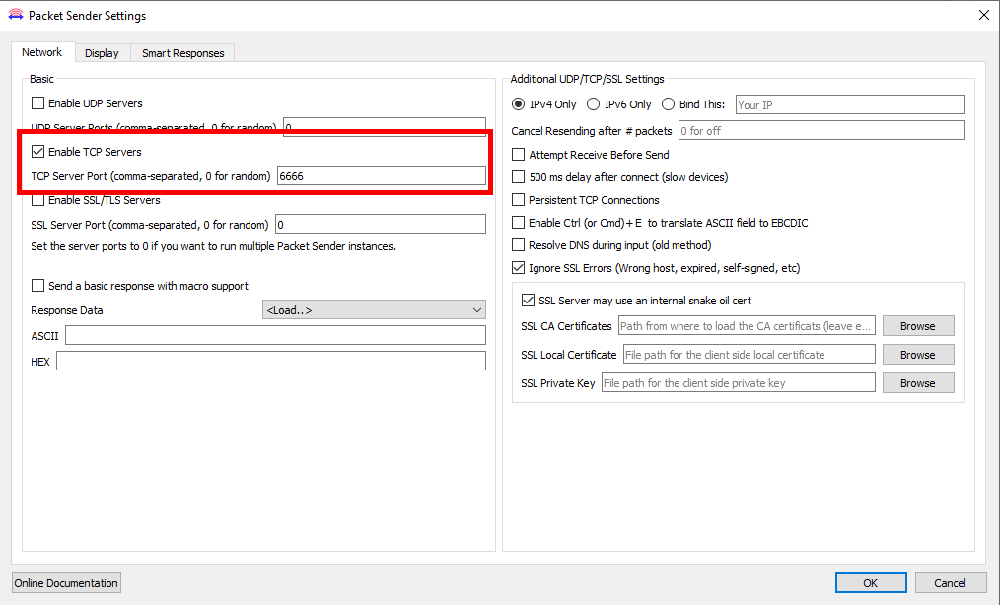
</p>

10. Ensure the GUI show the TCP server with **port 6666** enabled and **Persistent TCP** is checked to maintain the connection open after each packet received
<p align="center">
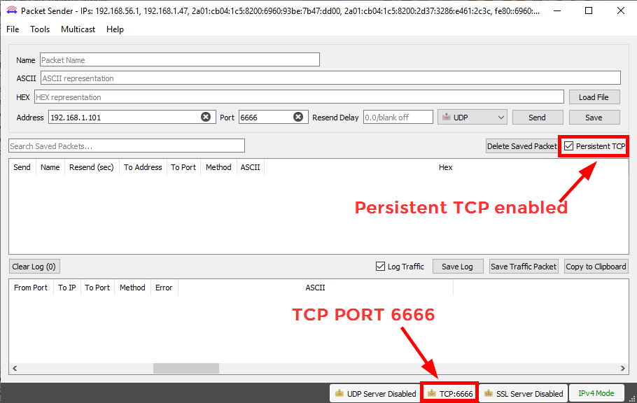
</p>

11. Power on the curiosity board

12. From the console, type `sysnethelp` command
<p align="center">
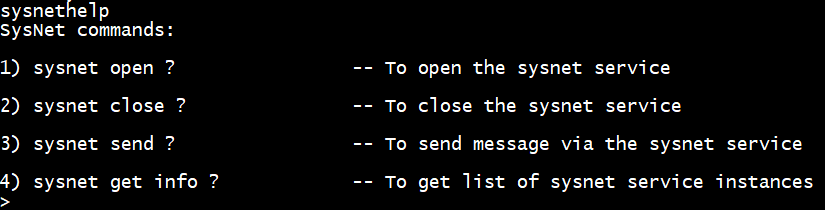
</p>

13. Type below command to close the existing instance of Net System Service\
`sysnet close 0`

14. Type below command to create a TCP tunnel to the TCP server that running by Packet Sender\
`sysnet open 0 1 <SERVER_IP_ADDR> 6666 auto_reconnect 0`\
Note: `<SERVER_IP_ADDR>` is the IP address of you computer\
You can retrieve the IP address of your computer using `ipconfig` in Windows Command Prompt\
e.g. `sysnet open 0 1 192.168.1.47 6666 auto_reconnect 0`\
Console log print "Status UP" if success
<p align="center">
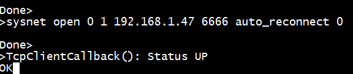
</p>

15. Once connect success, the application send HTTP GET message. This is because the implementation of the TCP Client example project. Packet Sender TCP server receives the message.

<p align="center">
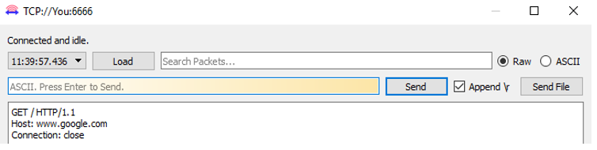
</p>

16. Type `sysnet get info` command to get the net service instance.\
From the output, you can observe that the NET Service Instance that is under testing is 0 and the status is CONNECTED.
<p align="center">
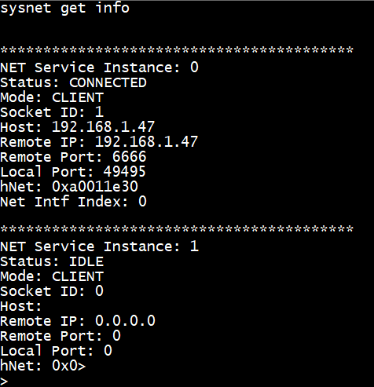
</p>

> Make sure to not close the window opened by Packet Sender otherwise the connection will be lost.

17. Type `sysnet send 0 hello` to send “hello” message to TCP server.\ 
<p align="center">
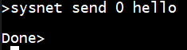
</p>

18. Packet Sender TCP server receives the “hello” message and print out the wording
<p align="center">
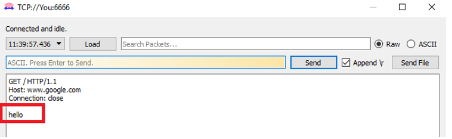
</p>

19. You can also send message from the Packet Sender to PIC32MZ W1 for test, but the application code did not print out the data when it receive data from Packet Sender Server. You can modify the application code in `TcpClientCallback()` under the event `case SYS_NET_EVNT_RCVD_DATA` with the following :

```
case SYS_NET_EVNT_RCVD_DATA:
{
   char networkBuffer[256];
   memset(networkBuffer, 0, sizeof (networkBuffer));
   SYS_NET_RecvMsg(g_tcpSrvcHandle, (uint8_t*) networkBuffer, sizeof (networkBuffer));
   // Google has stopped obeying the 'connection close' command.  So this is a cheap way to see if we got to the 
   // end of the html page.
   if (strstr(networkBuffer, "</html>") != 0) {
      SYS_CONSOLE_PRINT("TcpClientCallback(): End of Html Page\r\n");
   }
   
   // added to print the 10 first element
   uint8_t i ;
   for (i = 0; i < 10; i++) {
      SYS_CONSOLE_PRINT("%c", networkBuffer[i]) ;
   }
   break;
}
```
And enable a simple TCP chat application.
<p align="center">

</p>

## Lab 2 - Configure the Wi-Fi network using MHC<a name="step7"></a>

### Purpose

Learn to use MHC to configure Wi-Fi credentials of the Wi-Fi System Service to connect the board to the target AP.

### Instructions

1.	Launch **MPLAP X IDE**

2. Open TCP Client project you copied from the Application Browser to your `<HarmonyProjects>` folder. Refer to the [Prerequisites](#step3) section.

3.	Run MHC by selecting **Tools -> Embedded -> MPLAB Harmony 3 Configurator**

<p align="center">
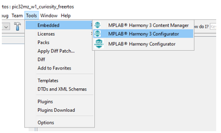
</p>

4. Ensure the Harmony 3 Framework Path is correct, click **Launch**

<p align="center">
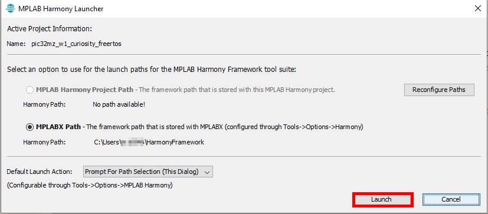
</p>

5. Below screen may be showed if example project package version is different from the local package version and they are not compatible. Click **Continue**

<p align="center">
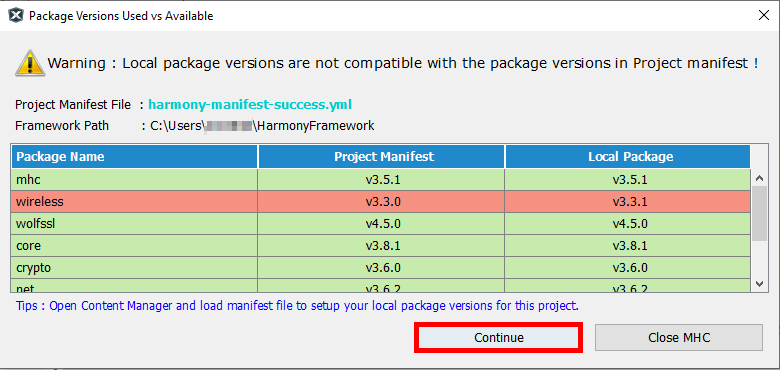
</p>

6.	Click **Launch**  in below screen

<p align="center">
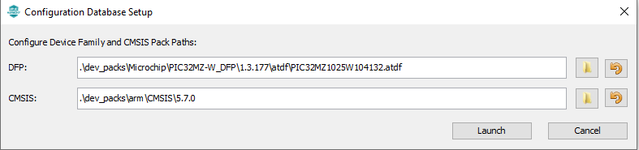
</p>

7. Open default saved state file

<p align="center">
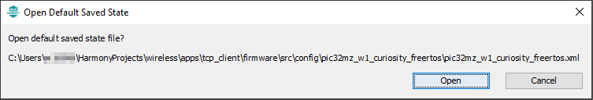
</p>


8. The project graph looks like below

<p align="center">
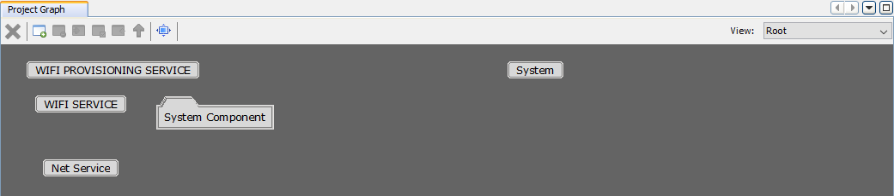
</p>


9.	Select **WIFI SERVICE**, Change the STA Mode SSID and Password in order to connect to your own AP

<p align="center">
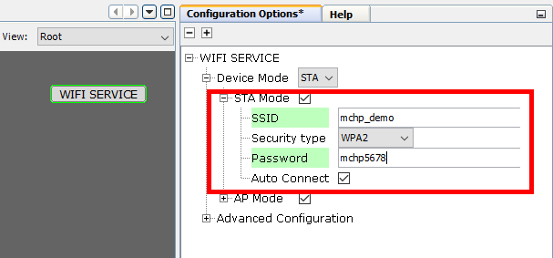
</p>

10. Click **Generate Code** icon

<p align="center">

</p>

11. Save the modified configuration

<p align="center">
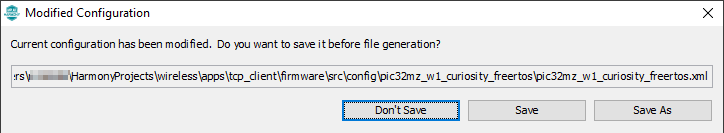
</p>

12. Select **Merge Strategy** as **USER_ALL**, click **Generate**

<p align="center">
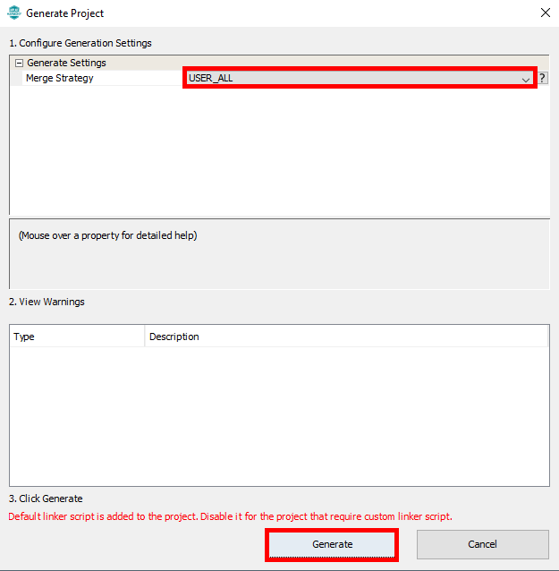
</p>

13. Code is generated

<p align="center">
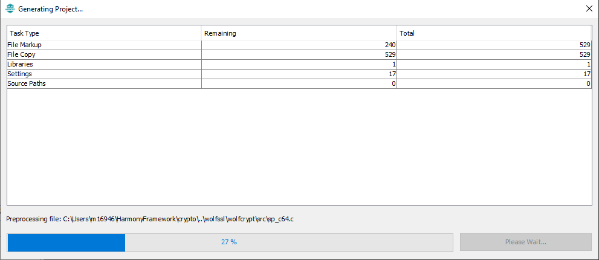
</p>

14. Select Hardware Tool, Device Family Pack (DFP) and compiler from the **Project Properties** window

15. Click **Run Main Project** button , program is start compiled and download to the curiosity board
<p align="center">

</p>

16. After program is downloaded to the board and start running, below console log is printed. The log show that the board able to connect to the target AP, get the IP from the DHCP server, send a HTTP Get command to google.com, and receive the html Page content

<p align="center">
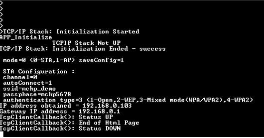
</p>

## Lab 3 - Enable Wi-Fi Provisioning with HTML webpage<a name="step8"></a>

### Purpose

Learn to use MHC to set the board to AP mode and add HTML webpage Wi-Fi provisioning feature. User can use computer as Wi-Fi station to connect to the board and perform Wi-Fi provisioning through HTML webpage at the end of this Lab.

This is useful for the products which is production ready. End user can provision the network using HTML webpage.

### Instructions

1. Launch **MPLAB X IDE**

2. Open TCP Client project you copied from the Application Browser to your `<HarmonyProjects>` folder. Refer to the [Prerequisites](#step3) section.

3. Run MHC by selecting **Tools -> Embedded -> MPLAB Harmony 3 Configurator**

<p align="center">

</p>

4. From the project graph, select **WIFI SERVICE** component, set Device Mode to **AP** 

<p align="center">
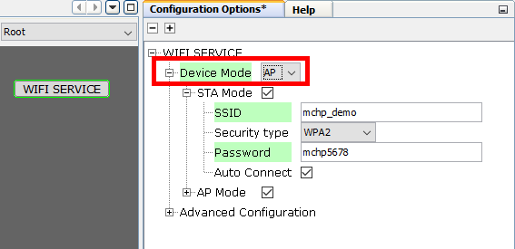
</p>

5. From the project graph, select **WIFI PROVISIONING SERVICE** and enable **HTTP** as below

<p align="center">
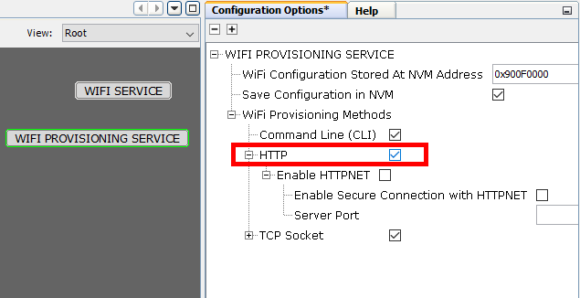
</p>

6. FILE SYSTEM (sys_fs), MEMORY (drv_memory) are auto activated. Click **Yes** for all auto-activation and auto-connection

<p align="center">
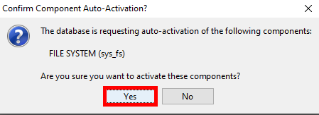
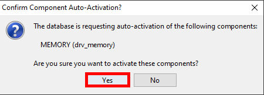
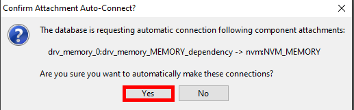
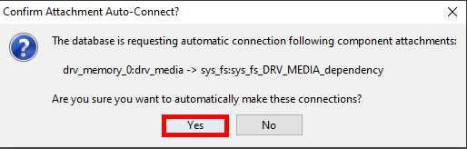
</p>

7. Click **Generate Code** icon

<p align="center">

</p>

8. Save the modified configuration

<p align="center">

</p>

9. Select **Merge Strategy** as **USER_ALL**, click **Generate**

<p align="center">

</p>

10. Select Hardware Tool, Device Family Pack (DFP) and compiler from the **Project Properties** window

11. Click **Run Main Project** button , program is start compiled and download to the curiosity board
<p align="center">

</p>

12. After program is downloaded to the board and start run, below APP console log is printed. The Log show the PIC32MZ W1 is set as AP mode with IP address 192.168.1.1

<p align="center">
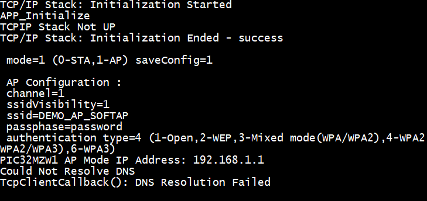
</p>

13. Use computer to connect to PIC32MZW1 AP.\
The AP SSID is **DEMO_AP_SOFTAP**\
The AP pass is **password**

14. On the computer, use a browser to open http://192.168.1.1, below webpage is shown.

<p align="center">
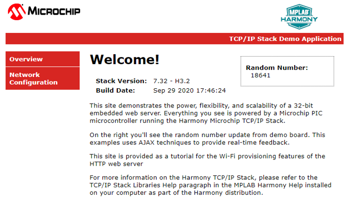
</p>

15. Select **Network Configuration** on the webpage.\
Change the Device mode to **STA**.\
Input your AP credentials.\
Click **Apply Wi-Fi Configuration**

<p align="center">
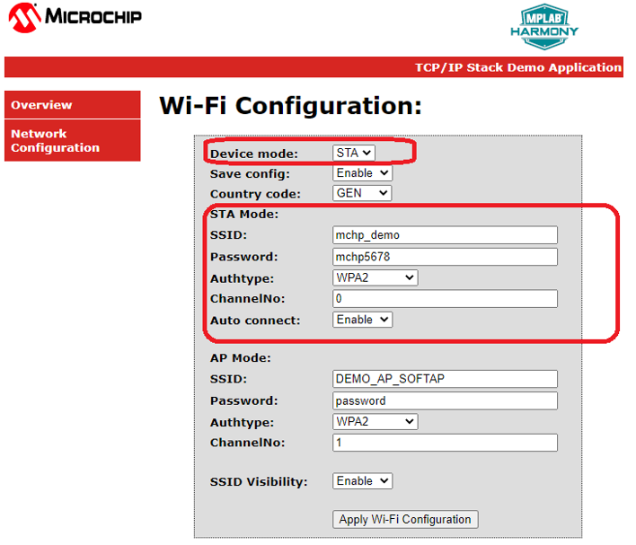
</p>

16. When PIC32MZ W1 receives the information. It reboots and the device change from AP mode to STA mode and connect to the target AP. Below console log is printed.

<p align="center">
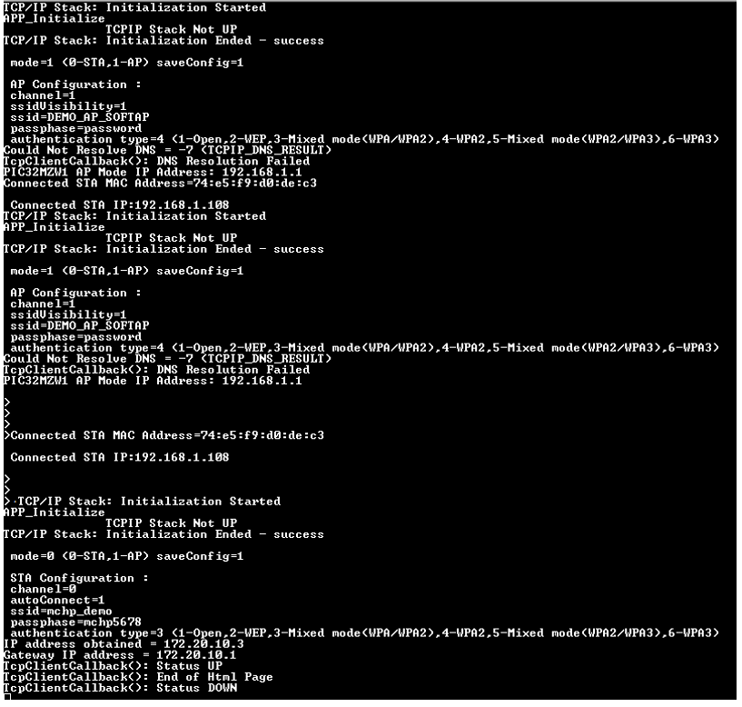
</p>

## Lab 4 -  Enable Wi-Fi Provisioning with Mobile Application<a name="step9"></a>

### Purpose

Learn to use MHC to set the board to AP mode and add HTML webpage Wi-Fi provisioning feature. User can use computer as Wi-Fi station to connect to the board and perform Wi-Fi provisioning through HTML webpage at the end of this Lab.

This is useful for the products which is production ready. End user can provision the network using HTML webpage.

### Instructions

Follow below steps to provisioning the device using mobile application:

Download and install the mobile application “Wi-Fi Provisioning” from Android play store.
Start PIC32MZW1 device in AP mode (Configure Wi-Fi Service “Device Mode” as “AP”).
Using mobile Wi-Fi setting, make a Wi-Fi connection to PIC32MZW1 AP Mode.

1. Download install the Android mobile application [Wi-Fi Provisioning](https://play.google.com/store/apps/details?id=com.microchip.wifiapplication) from Android play store

2. Start PIC32MZ W1 device in AP mode (Configure Wi-Fi Service **Device Mode** as **AP**)

3. Using mobile Wi-Fi setting, make a Wi-Fi connector to PIC32MZ W1 AP mode (Default SSID: DEMO_AP_SOFTAP)

<p align="center">
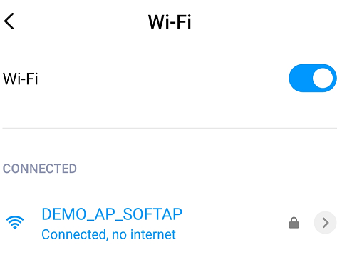
</p>

4. On the mobile device, open the **Wi-Fi Provisioning** application

5. Enter PIC32MZ W1 IP address as Server IP in the mobile application
6. Enter the Wi-Fi provisioning System Service configured port number (6666 by default) then press **CONNECT**

<p align="center">
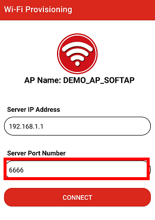
</p>

7. SCAN near by HOMEAP and select the desired HOMEAP
8. Enter the password of the HOMEAP and press **SEND**\
**OR** select **Add New Network** to manually add provisioning information

<p align="center">
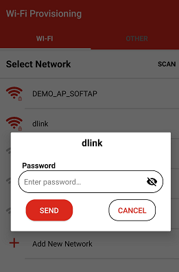
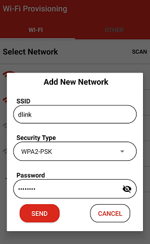
</p>

9. After provisioning, the device reboot and connect to HOMEAP

Checkout the [Wi-Fi provisioning System Service Usage](https://microchip-mplab-harmony.github.io/wireless/system/wifiprov/docs/usage.html#wi-fi-provisioning-with-mobile-application) documentation for more details.


## Lab 5 - Merging TCP Client example application and Paho MQTT Client example application<a name="step10"></a>

### Purpose

Learn to merge TCP Client example application and Paho MQTT Client example application. In real-life scenario, an application has very often several complex tasks to execute. Here, you will start from Paho MQTT application and merge the functionalities of the TCP Client application to result into a single application.

### Instructions

1. Open Paho MQTT example project you copied from the Application Browser to your `<HarmonyProjects>` folder. Refer to the [Prerequisites](#step3) section.

2. Run MHC by selecting **Tools -> Embedded -> MPLAB Harmony 3 Configurator**

3. Select **Net Service** component from **Root** view in Project graph
4. Configure below settings, these are the settings of the TCP Client example project
<p align="center">
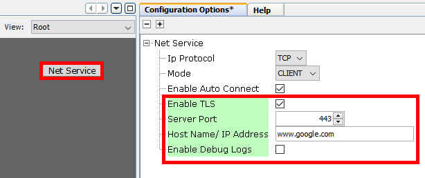
</p>

5. After enabling **TLS**, below messages are prompt and require to activate **wolfSSL** library, **SNTP** component and connect **wolfSSL** with **wolfcyptLib**.\
Reply **Yes** for all these settings.
<p align="center">


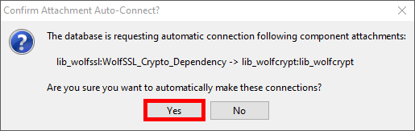
</p>

6. Select **WIFI Service** component and configure the STA SSID and password to connect the device to the target Home Router
<p align="center">

</p>

7. Select **wolfCrypt Library** component from **System Component** view in Project graph. Select **Single Thread** as **Threading Support** option
<p align="center">

</p>

8. Click **Generate Code** icon
<p align="center">

</p>

8. Save the modified configuration
<p align="center">

</p>

9. Select **Merge Strategy** as **USER_ALL**, click **Generate**

<p align="center">

</p>

10. Now, it is time to merge the TCP Client example application code to the Paho MQTT Client application.\
You will copy the TCP Client example application code from `<HarmonyProjects>/wireless/apps/tcp_client/firmware/src/app_pic32mzw1.c` to Paho MQTT Client application code in `<HarmonyProjects>/wireless/apps/paho_mqtt_client/firmware/src/app.c`<br><br>
The details steps are given in the next steps.
   
11. Copy the files `<HarmonyProjects>/wireless/apps/tcp_client/firmware/src/app_pic32mzw1.c` and `app_pic32mzw1.h` to Paho MQTT Client project source folder `<HarmonyProjects>/wireless/apps/paho_mqtt_client/firmware/src`.
<p align="center">
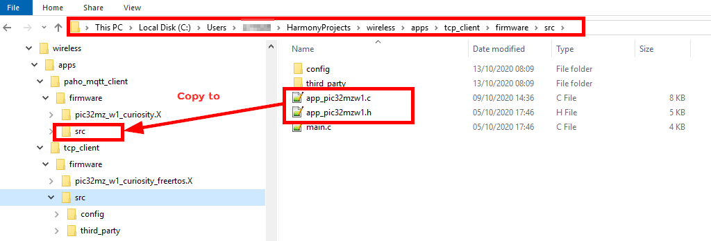
</p>
    
12. Rename both files to `app_tcp_client.c` and `app_tcp_client.h`
<p align="center">
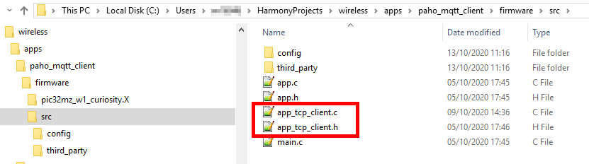
</p>

13. Add the files to the open project. Right click in **Source Files** folder in the project panel and select **Add Existing Item**
<p align="center">
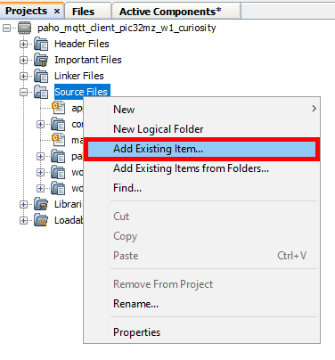
</p>

14. Select `app_tcp_client.c` and add the file in the Source folder of the project
<p align="center">
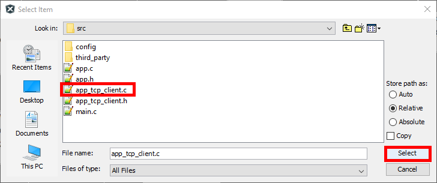
</p>

15. Right click in **Header Files** folder in the project panel and select **Add Existing Item**
<p align="center">
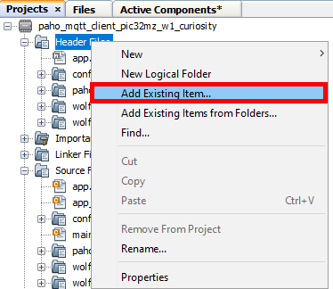
</p>

16. Select `app_tcp_client.h` and add the file in the Header folder of the project
<p align="center">
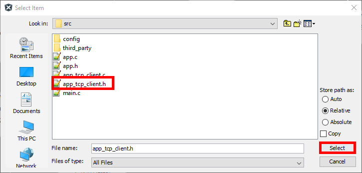
</p>

17. Open header file `app_tcp_client.h` and rename the functions below for easy recognition

| Original Function name | New Function name |
| ---------------------- | ----------------- |
| `void APP_PIC32MZW1_Initialize ( void )` ->  | `void APP_TCP_Client_Initialize ( void )` |
| `void APP_PIC32MZW1_Tasks ( void )` | `void APP_TCP_Client_Tasks ( void )` |

18. Open source file `app_tcp_client.c` and rename the same two functions as above

19. Add a call to `APP_TCP_Client_Initialize()` below `APP_Initialize()` in function `SYS_Initialize()` located at `<HarmonyProjects>/wireless/apps/paho_mqtt_client/firmware/src/config/pic32mz_w1_curiosity/initialization.c`
<p align="center">
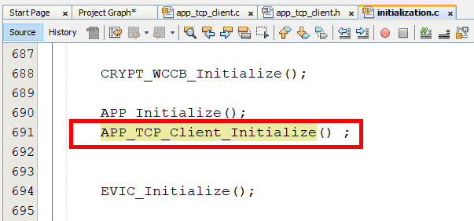
</p>

20. Add `APP_TCP_Client_Tasks()` below `APP_Tasks()` in function `SYS_Tasks()` located at `<HarmonyProjects>/wireless/apps/paho_mqtt_client/firmware/src/config/pic32mz_w1_curiosity/tasks.c`
<p align="center">
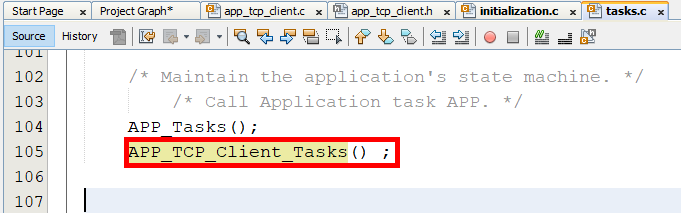
</p>

21. Include header `app_tcp_client.h` in `<HarmonyProjects>/wireless/apps/paho_mqtt_client/firmware/src/config/pic32mz_w1_curiosity/definitions.h`
<p align="center">
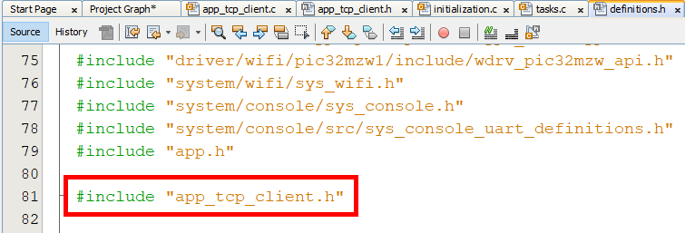
</p>

22. Select Hardware Tool, Device Family Pack (DFP) and compiler from the **Project Properties** window

23. Click **Run Main Project** button , program is start compiled and download to the curiosity board
<p align="center">

</p>

24. After program is downloaded to the board and start running, below console log is printed. The log show that the board is able to connect to the target AP, get the IP from the DHCP server, send a HTTP Get command to google.com, and receive the html Page content. Also it connects to test.mosquitto.org MQTT Broker, subscribe to MQTT topic `MCHP/Sample/b` and publish message periodically to topic `MCHP/Sample/a`
<p align="center">
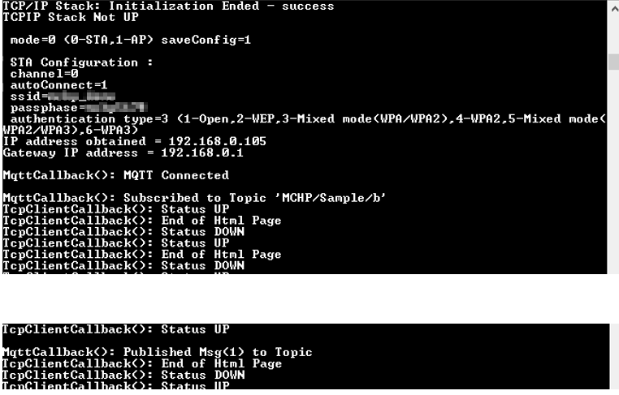
</p>

25. To test the MQTT application, you can download and install [MQTT.fx](https://mqttfx.jensd.de/index.php/download)\
Launch MQTT.fx and apply the following configuration:
- Host: **test.mosquitto.org**
- Port: **1883**
- Subscribe to: **MCHP/Sample/a**
- Publish to: **MCHP/Sample/b**

<p align="center">
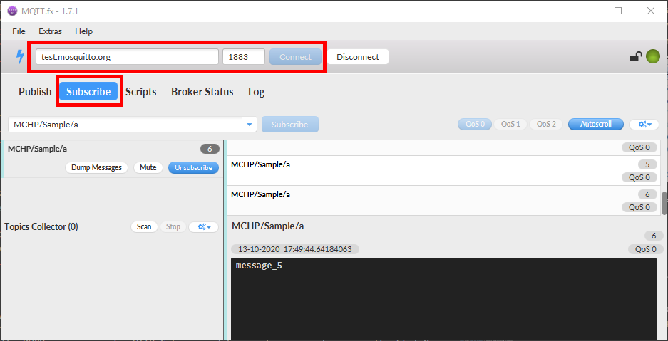
</p>

## Lab 6 - Enable WLAN MAC Debug Log<a name="step11"></a>

### Purpose

Learn to use MHC to configure the pin and STDIO module to print WLAN MAC debug log at UART2. WLAN MAC debug log is useful when do the WLAN debugging.

### Instructions

1. To observe the WLAN Debug logs, you can connect a USB-to-UART converter to J207 (GPIO Header) of the Curiosity Board. WLAN debug logs can be captured from UART2.\
The UART2 pins (Tx and Rx) are marked on the GPIO Header silkscreen.\
Serial port settings: **_115200 8N1_**

| USB-UART Cable    | GPIO Header J207 of the Curiosity Board        |
| ----------------- | ---------------------------------------------- |
| Tx                | UART2_RX (Pin 3)                               |
| Rx                | UART1_TX (Pin 5)                               |
| Ground            | GND (Pin 2)                                    |

2.	Launch the MHC
3.	Add **STDIO Component** from the Available Components list.
<p align="center">
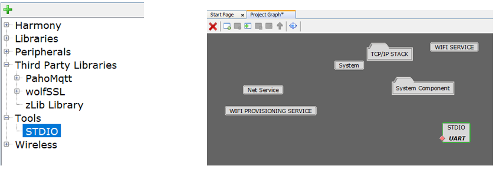
</p>

4. Right click **UART** on **STDIO** component (red diamond), select **UART2**. Use the default settings of UART2.
<p align="center">
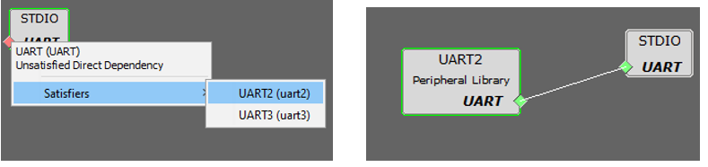
</p>

5. Select **MHC -> Tools -> Pin Configuration**
<p align="center">
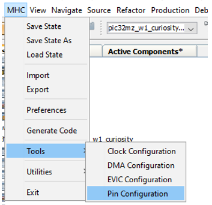
</p>

6. In **Pin Setting** Tab, set **A56** pin to **U2RX** and **A57** pin to **U2TX**
<p align="center">
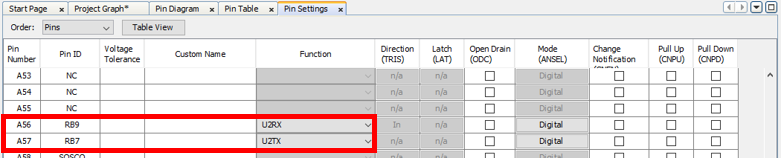
</p>

7. Click **Generate Code** icon

<p align="center">

</p>

8. Save the modified configuration

<p align="center">

</p>

9. Select **Merge Strategy** as **USER_ALL**, click **Generate**

<p align="center">

</p>

10. Select Hardware Tool, Device Family Pack (DFP) and compiler from the **Project Properties** window

11. Click **Run Main Project** button , program is start compiled and download to the curiosity board
<p align="center">

</p>

12. After program is downloaded to the board start running, below WLAN console logs are printed from UART2.
<p align="center">
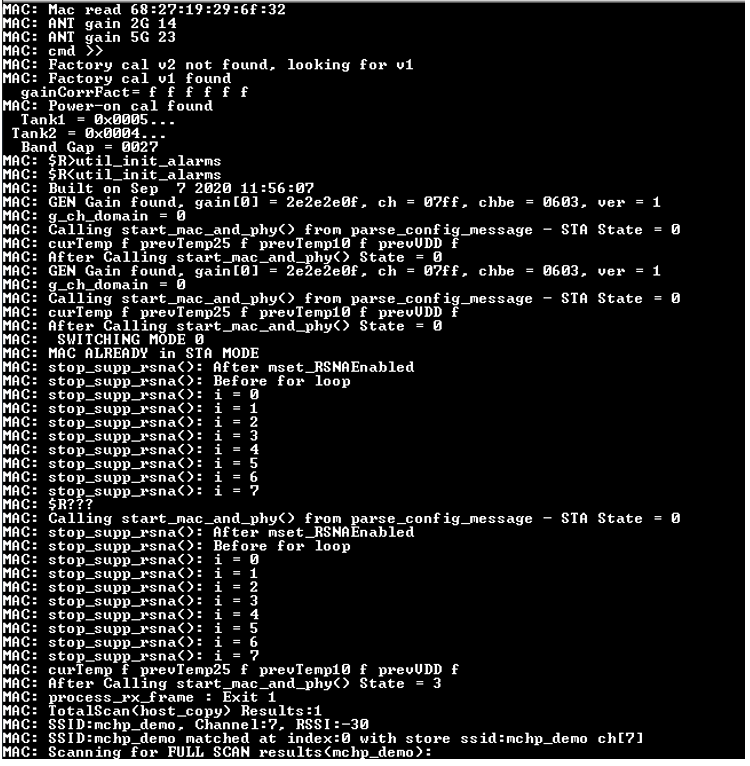
</p>


<a href="#top">Back to top</a>