# Develop a Secured Smart Home Application from scratch
> "Wireless Made Easy!" - Full workshop experience to learn and touch PIC32MZ W1 family

[Back to Main page](../README.md)

## A la carte

1. [Overview](#step1)
1. [Create a PIC32MZ W1 project from scratch](#step2)
1. [Add MQTT Service Component](#step3)
1. [Configure Wi-Fi Service Component](#step4)
1. [Configure Wi-Fi Provisioning Service Component](#step5)
1. [Configure Net Service Component](#step6)
1. [Configure MQTT Service Component](#step7)
1. [Configure FreeRTOS Component](#step8)
1. [Configure Application Threads](#step9)
1. [Add Timer Component](#step10)
1. [Configure Timer Component](#step11)
1. [Add ADC Component](#step12)
1. [Configure ADC Component](#step13)
1. [Generate Code](#step14)
1. [Explore the RTOS-based implementation](#step15)
1. [Add Application Code to the project](#step16)
1. [Build, Program and Observe the Outputs](#step17)
1. [Provision the device](#step18)
1. [Interact with the application](#step19)
1. [Enhance security by configuring TLS for secure connection](#step20)

## Overview<a name="step1"></a>

In this tutorial, you will make a simple Smart Home device based on PIC32WFI32E Curiosity Board connected to an MQTT Broker. The object will be monitored and controlled remotely thru a laptop or a mobile device.

<p align="center">
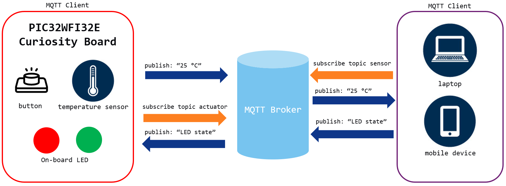
</p>

Using MPLAB® Harmony Framework, you will add all the components to:
* provision and connect the device to Internet thru your Wi-Fi personal router
* establish an MQTT connection to a Broker on the Cloud
* monitor the on-board button state
* collect the on-board temperature sensor
* publish periodically the data to the MQTT broker
* control the on-board LEDs from another MQTT client - there are 2 LEDs which can be controlled, one green and one red
<!-- * add a LCD display for local monitoring -->

## Create a PIC32MZ W1 project from scratch<a name="step2"></a>

The step-by-step instructions have been developped with MPLAB Harmony configured in Native Netbeans mode from **Tools -> Options -> Plugins -> Harmony**
<p align="center">

</p>

- Let's create a new project for the PIC32MZ W1 device with **File -> New Project**
<p align="center">
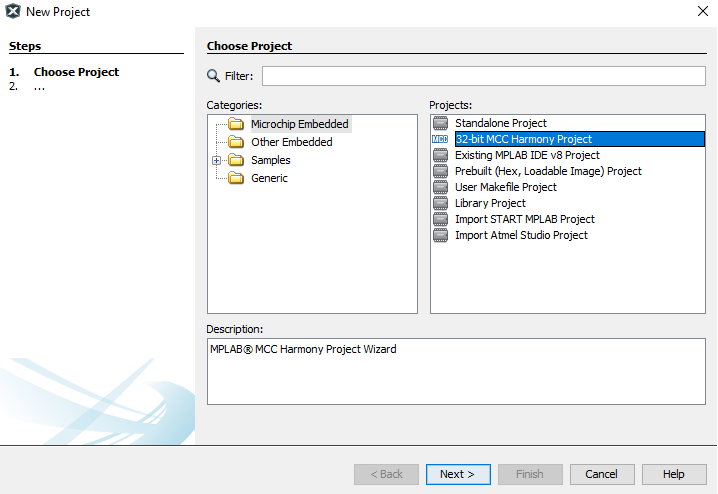
</p>

- Select **32-bit MPLAB Harmony 3 Project**
- Click **Next >**
<p align="center">
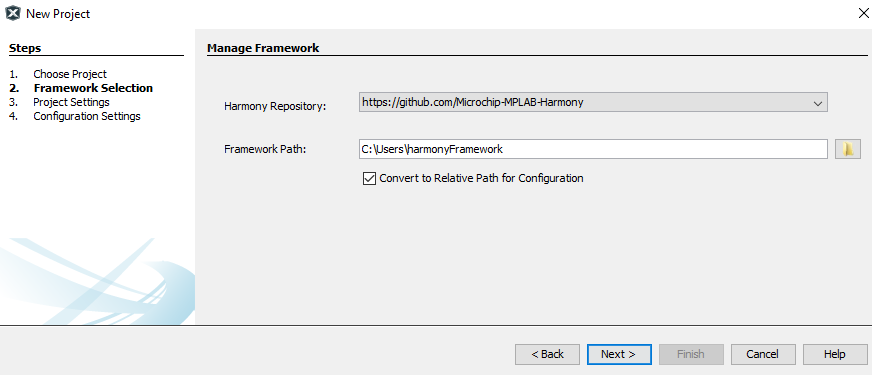
</p>

- Make sure the Framework Path is correct
- Click **Next >**
<p align="center">
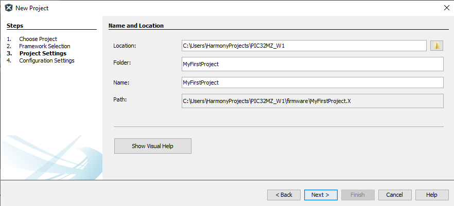
</p>

- Select your project location and provide the name that will be used for the MPLAB® X IDE's ".X" folder
- Click **Next >**
<p align="center">
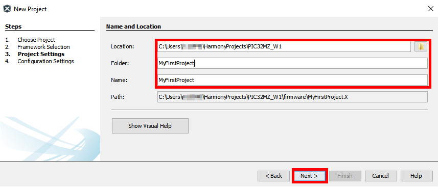
</p>

- Use the filter **w1** to easily find the **PIC32MZ1025W104132** Target Device
- Click **Finish**
<p align="center">

</p>

- Review the packages that will be used by the project
- Click Launch to continue to the **MPLAB® Harmony Configurator (MHC)**
<p align="center">

</p>

<p align="center">
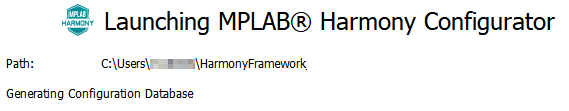
</p>

> If MHC doesn't appear in the top menu bar then MPLAB® Harmony Configurator (MHC) can be launched under **Tools -> Embedded -> MPLAB® Harmony Configurator.**\
Check out the [MHC wiki](https://github.com/Microchip-MPLAB-Harmony/mhc/wiki) for more details.

<p align="center">
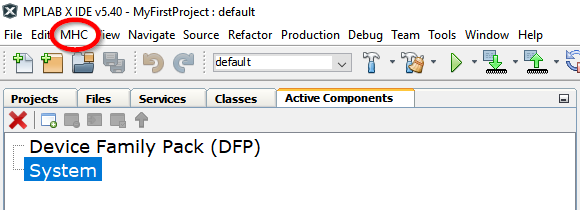
</p>

* MHC will present different parts such as :

  * Available Components
  * Active Components
  * Project Graph
  * Configuration Options
  * Console Window

  Here, the available components contains:

  * _**Board Support Packages (BSPs)**_: includes default or board specific BSP like PIC32MZ W1 Curiosty Board
  * _**Harmony Core**_: includes Harmony Core Services, Drivers, Harmony network layers and System Services
  * _**Libraries**_: middleware developed by Microchip (e.g. Crypto, TCP/IP, USB, ...)
  * _**Peripherals (PLIB)**_: includes peripherals like ADC, TIMER, UART, ...
  * _**Third-Party Libraries**_: lists the supported Third-Party software’s (e.g. pahoMQTT, FreeRTOS, wolfSSL, ...)
  * _**Tools**_: lists the supported tools like Standard Input/Output (STDIO) which uses UART peripheral
  * _**Wireless**_: includes WLAN drivers and Wireless Services

<p align="center">
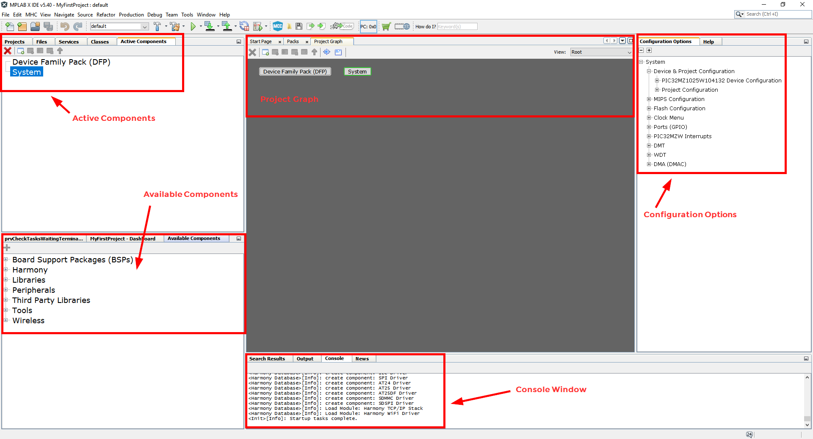
</p>

> By default and for this tutorial, MHC is running in native mode and share the same window with MPLAB® X IDE. If running MHC in standalone mode is required, you can simply change the settings under: **Tools -> Options -> Plugins -> Window Manager**

<!--
<p align="center">
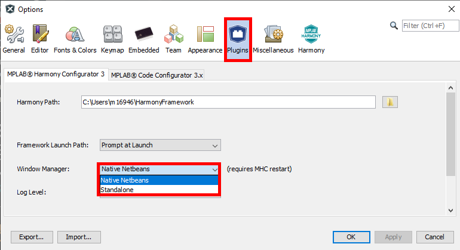
</p>
-->

- From the Available Components window, expand the **Board Support Packages (BSPs)**
<p align="center">

</p>

- Double click on the **PIC32MZ W1 Curiosity BSP** to add the component to Active Components window.\
The Project Graph looks like below:

<p align="center">
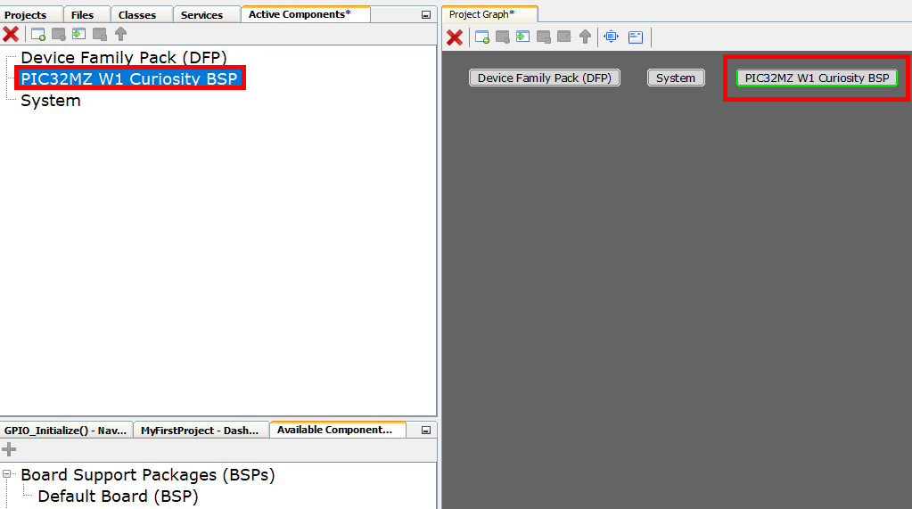
</p>

> The BSP component contains code and configuration items to support the PIC32MZ W1 Curiosity hardware. 

- To check the settings of the IOs which come with the BSP, select **MHC -> Tools -> Pin Configuration**

<p align="center">
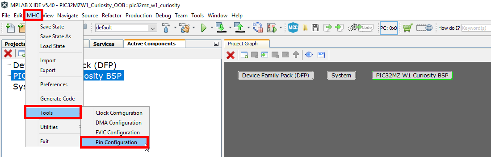
</p>

- Open the tab **Pin Settings** and scroll-down to observe the configuration of the pins **RK1, RK3 and RA10**

<p align="center">

</p>

- Make sure both LED pins are set as Digital Output
- And verify that SWITCH1 is set as Digital Input


> BSP provides custom name for pins that allows to use simple macro functions such as:
> - LED_RED_On() or LED_RED_Off()
> - LED_GREEN_On() or LED_GREEN_Off()
> - if (SWITCH1_Get() == SWITCH1_STATE_PRESSED)
> - ...

- Click **Generate Code**
<p align="center">

</p>

- Save the MHC Configuration File
- Select _**USER_ALL**_ for the merge strategy\
(Check out the [wiki](https://github.com/Microchip-MPLAB-Harmony/mhc/wiki#generating-code) for more details)
- Generate the code
<p align="center">
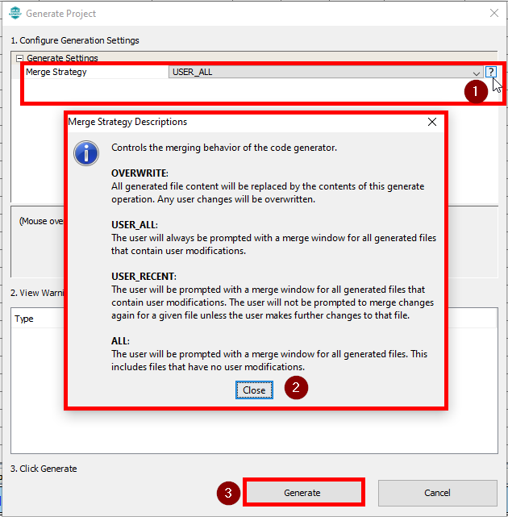
</p>

- Click the **Projects** tab to observe the project structure and the generated code

<p align="center">

</p>

The following table provides the Header and Source files generated:

| Generated File    | Description                                    |
| ----------------- | ---------------------------------------------- |
| bsp/bsp.h         | Provides Board Support Package                 |
| definitions.h     | Provides all library headers and definitions needed for the application |                              |
| peripheral (libs) | Supports peripherals used by the project       |
| exceptions.c      | Implements all exception handlers              |
| initialization.c  | Initialize all libraries and applications      |
| interrupts.c      | Provides the interrupt vector table            |
| startup.c         | Startup code for the application               |
| main.c            | Application Main source file                   |

- Open the file `bsp/bsp.h` to observe the macro functions provided with the BSP
   - to control the LEDs (D202, D204)
   - to get the state of the switch (SW1)
<p align="center">

</p>

> You are now ready to develop your first Harmony application with PIC32WFI32E Curiosity Board.\
The next step would be to add the components to the Project Graph and configure the components based on the application needs.

## Add MQTT Service Component<a name="step3"></a>

MQTT Service is used by the application to connect to a MQTT Broker (locally or over the Cloud). It allows publishing of messages on topics and it also allows the application to subscribe to topics in order to receive messages.

MQTT Service library provides an entry point for the application. 

- From the Available Components window, add the MQTT Service component located into **Harmony/Harmony Networking** to the Active Components list
<p align="center">
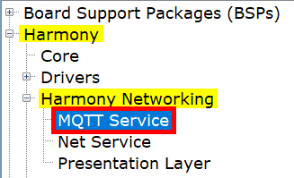
</p>

- Several popup window will come and ask to activate or deactivate components
- Make sure to reply **Yes** to activate the components and link the dependencies
(17 Click to reply **Yes**)
<p align="center">
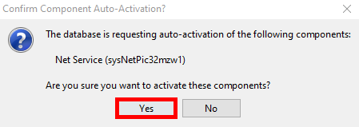
</p>

- Make sure to reply **No** when prompt is asking to deactivate NETCONFIG component (1 Click to reply **No**)
<p align="center">
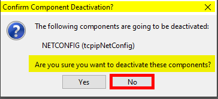
</p>

- Make sure to reply **Yes** to activate the rest of the components required
<p align="center">
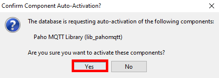
</p>

- Then, reply **Yes** to automatically make the connections between the components
<p align="center">

</p>

> MQTT Service is an Harmony Networking layer which include components such as:\
_Net Service, Wi-Fi Service, NVM, Core Timer, UART1, Cryptographic, wolfCrypt Library, Time, Core, **FreeRTOS**, Console, Command, Debug, PIC32MZW1, Netconfig, TCPIP Core, BA414E, TCP/IP Application Layer Configuration, Netconfig, IPv4, ARP, UDP, ICMPv4, Wi-Fi Provisioning Service, Presentation Layer, Paho MQTT Library,..._

> Notice that FreeRTOS component has been added and the Application is configured for FreeRTOS support.

> The MQTT protocol is based on TCP/IP. Both the client and the broker need to have a TCP/IP stack.

<p align="center">
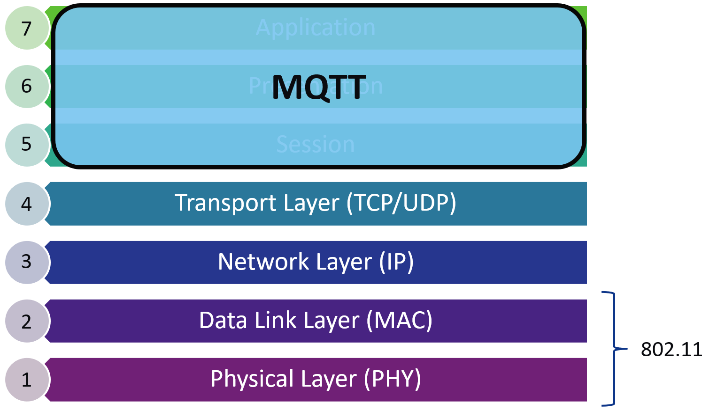
</p>

- This step also creates a hierarchy of groups in the **Project Graph:**\
_Root, Application Layer, Basic Configuration, Driver Layer, Network Layer, System Component, TCP/IP Stack, Transport Layer_
- Verify the hierarchy through **View** option\
Drop down the list and check out the different layers\
_**Root**_ is the default group

<p align="center">
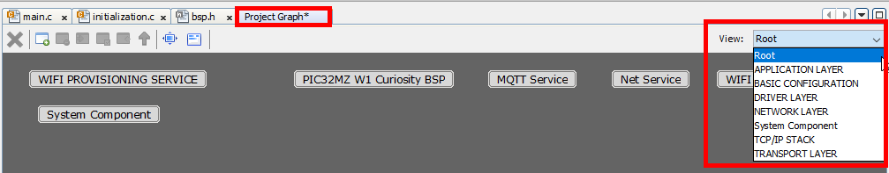
</p>

Next steps will be to configure the services automatically included with the MQTT Service.


## Configure Wi-Fi Service Component<a name="step4"></a>

For the purpose of this application, we want the device to first start as an Access Point (AP) and be ready for Wi-Fi provisioning. This is the process of configuring desired Wi-Fi SSID and related security credentials into the device.

The PIC32MZ W1 device starts as an Access Point and any WLAN device can connect to it as a station and provide credentials of the target router to connect to.
PIC32MZ W1 restarts in station mode and try to connect to the target router with the credentials provided.

- In Project Graph and from the Root view, select **WIFI SERVICE** component
<p align="center">
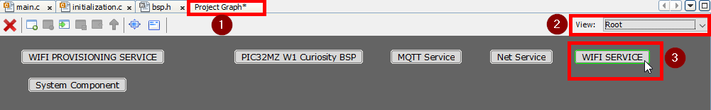
</p>

- In Configuration Options window, select **Device Mode = AP**
- **Make sure STA Mode And AP Mode are both checked**
- (optional) Change the default SSID and Password of the AP Mode
- Note carrefully the SSID and Password in AP Mode. You will need later to provision the device.
<p align="center">

</p>

> The WFI32 module is pre-certified for use in several geographic regions and complies to major regulatory guidelines and norms. Refer to the [product page](http://www.microchip.com/wwwproducts/en/WFI32E01PC) to get the latest information.\
MHC provides the capability to select the regulatory domain to be used in the application firmware under the Advanced Configuration menu.\
The supported region codes are:
> - GEN: Worldwide configuration that is the least common factor of IEEE, FCC and CE configurations. This can be used without violating any of the major regulatory guidelines. This is the region selected by default.
> - USA: North American regulatory limits.
> - EMEA: European regulatory limits.

> Because GEN comply with all regulatories (hence worst case). That means channel 13 cannot be enabled since it is not legal in countries like USA.

## Configure Wi-Fi Provisioning Service Component<a name="step5"></a>

- From the Root view, select **WIFI PROVISIONING SERVICE**
<p align="center">

</p>

In Configuration Options window: 
- **Make sure Save Configuration in NVM is checked.**
- Make sure **CLI and TCP Socket** are checked
- Check **HTTP Pages**
- Keep HTTPNET disabled (HTTP NET is Harmony 3 module which implements a HTTP server with dynamic variables support and encrypted connections)

<p align="center">

</p>

 - Reply **Yes** for all prompts to activate the required components and link the dependencies
<p align="center">
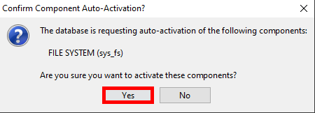
</p>

> - Wi-Fi Provisioning using command line method is highly configurable for trial purpose. However, CLI method is not recommended in production release due to security concerns.
> - With TCP socket method, a socket server is activated when the device boots. A laptop or mobile phone acting as a TCP client to connect to the device’s socket server. Wi-Fi provisioning service default TCP server port is 6666.
> - Using HTTP method, PIC32MZW1 is operating in Access Point (AP) mode. A laptop or mobile phone to open a browser and enter the PIC32MZW1 AP IP address (example: http://192.168.1.1/).

## Configure Net Service Component<a name="step6"></a>

- Select **Net Service** from Active Components list
- Make sure settings are like below:
<p align="center">
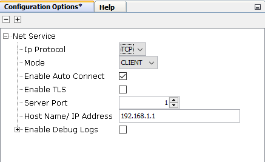
</p>

## Configure MQTT Service Component<a name="step7"></a>

This step is requested to configure the device to connect to MQTT Broker and publishes and subscribes to data on topics.

- From the Root view, select **MQTT Service**
<p align="center">
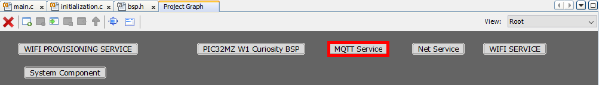
</p>

- In Configuration Options window, expand **Basic Configuration**
   - Use broker name: **test.mosquitto.org**
   - Server port: 1883 (unsecured)
   - Disable TLS (non secured)
   - (optional) Populate _**Client Id**_ with unique value

<p align="center">
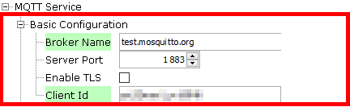
</p>

> The _**Client Id**_ identifies each MQTT client that connects to an MQTT Broker. The broker uses the _**Client Id**_ to identify the client and the current state of the client. Therefore, this ID should be unique per client and broker. This could be interesting for debugging purpose. If MQTT _**Client Id**_ is left empty, the Id will be generated randomly by the library.


- Expand **Advanced Configuration** > **Extra Credentials**
   - Keep the settings by default
   - No username and password are required
<p align="center">

</p>

> MQTT Service supports a user name and password for client authentication and authorization. However, if this information isn’t encrypted or hashed (either by implementation or TLS), the password is sent in plain text. We highly recommend the use of user names and passwords together with a secure transport. 
You will see later how to authenticate the client with a TLS certificate.

To share information between MQTT clients over MQTT broker, you need to provide MQTT topics which is nothing more than a form of addressing. The MQTT connection is always between one client and the broker. Clients never connect to each other directly.

<p align="center">
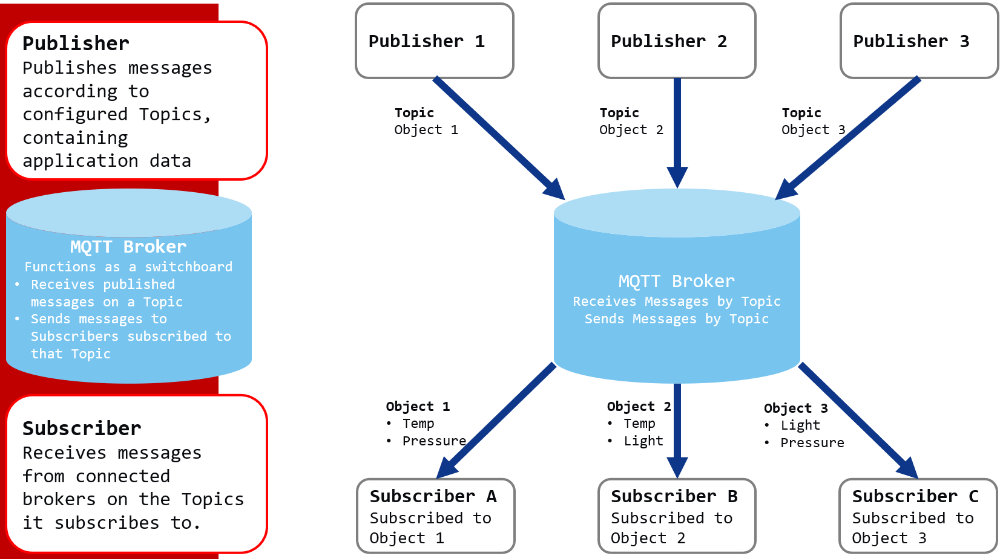
</p>

More info [here](https://mqtt.org/) about MQTT.

- First, the client (PIC32MZ W1) sends a `CONNECT message` to the broker to initiate a connection
- The broker responds with a `CONNACK message` and a status code.
- Once the connection is established, the broker keeps it open until the client sends a disconnect command or the connection breaks.

<p align="center">
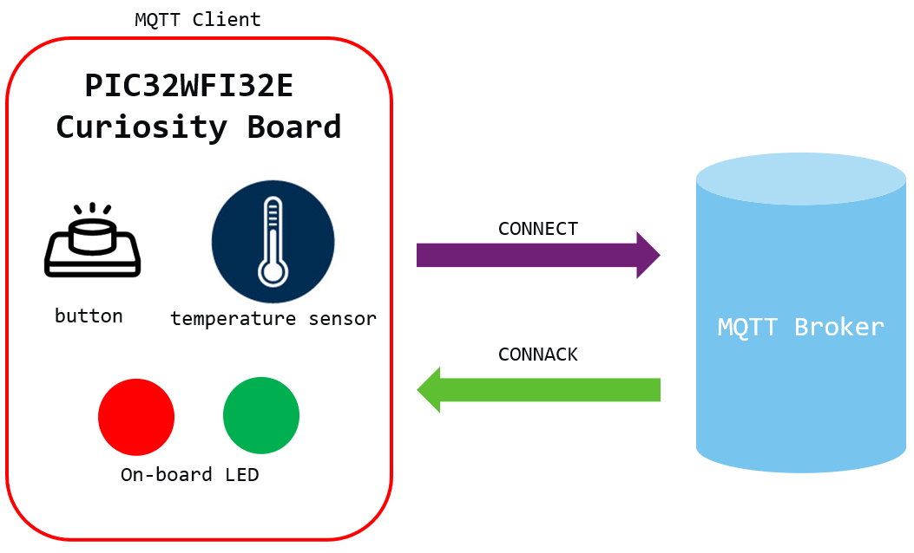
</p>

The client (PIC32MZ W1) should subscribe to a topic to receive the command messages that another client sends for changing the state of the actuator (PIC32MZW1's on-board LED).

The client (PIC32MZ W1) should publish sensor data to Broker over another topic. Thus, another client will be able to monitor the data.

<p align="center">

</p>

- Expand **Subscribe Topic** 
   - Check **Subscribe Topic**
   - Fill the Topic Name box with: **pic32mz_w1/actuator**
   - QOS: at least once (1)
<p align="center">

</p>

- Expand **Publish Topic**
   - Check **Publish Topic**
   - Fill the Topic Name box with: **pic32mz_w1/sensor**
   - QOS: at least once (1)
<p align="center">

</p>

> QoS (Quality of Service) contains 3 levels for the messages emitted:
> - _**QoS 0**_ guarantees that the message is delivered _**at most once**_, or it is not delivered at all. The sender does not care about the message after broadcasting (fire and forget).
> - _**QoS 1**_ guarantees that the message is always delivered _**at least once**_. If the sender does not receive an acknowledgement, the message can be sent multiple times.
> - _**QoS 2**_ guarantees that the message is always delivered _**exactly once**_ and no messages are lost. This is ensured by a two-step confirmation with additional messages.

<p align="center">
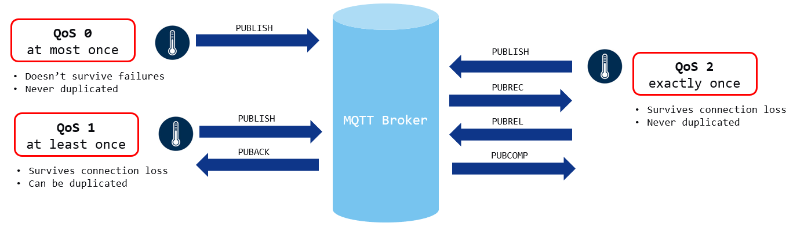
</p>

## Configure FreeRTOS Component<a name="step8"></a>

From the Active Components window:

- Select **FreeRTOS** in System Component
- In the configuration option window, you are exposed to the default configuration which is good enough as a starting point
- Keep the RTOS parameters by default

MHC allows the configuration of various parameters of FreeRTOS such as:
- Preemptive or Co operative scheduler type
- Tick mode, tick rate
- Heap mode (Heap_1, Heap_2, Heap_3, ..)
- etc..

<p align="center">
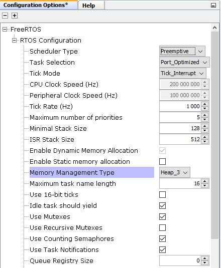
</p>

> Check out the details of the FreeRTOS configuration options on [freertos.org page](
http://www.freertos.org/a00110.html).


The different components part of the project are also configured by MHC to run with FreeRTOS. 

These configuration parameters include the stack size for each thread, priority of the thread and the task delay. Setting the task delay allows a thread to be put into a blocked state, thereby allowing other threads in the system to run.

- Check out the **RTOS Configuration** for the components below (generally located at the bottom of the Configuration Options window):

<p align="left">

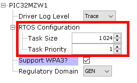


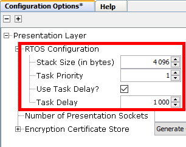
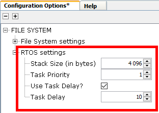
</p>

## Configure Application Threads<a name="step9"></a>

To benefit the multitasking, thanks to the FreeRTOS task scheduler, and simplify the development of the application, let's divide the application functionality into two threads.

- From the Active Components window, select **Core** in System Component
<p align="left">
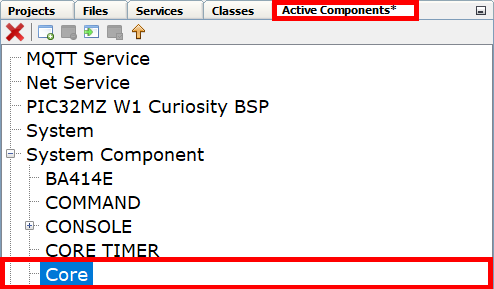
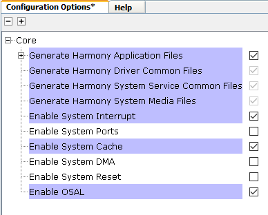
</p>

- Expand **Generate Harmony Application Files**
- Expand **Application Configuration**
- Change the **Number of Applications** to **2**
<p align="center">

</p>

In **Application 0 Configuration**
- Change the **Application Name** to **app_sensor**\
This will create an RTOS thread called `_APP_SENSOR_Tasks`.
- Expand **RTOS Configuration** to configure Stack Size, Task Priority and Task Delay.
- Check **Use Task Delay** and keep default value (50ms)
<p align="center">
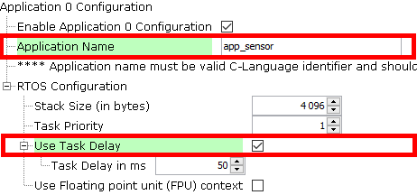
</p>

> It is a better practice to configure task delay to keep the system operating optimally. Without delay, other lower priority tasks will not run. If all tasks are at the same priority, all will run in a round robin and it is not optimal.

In **Application 1 Configuration**
- Change the **Application Name** to **app_mqtt**\
This will create an RTOS thread called `_APP_MQTT_Tasks`.
- Expand **RTOS Configuration** to configure Stack Size, Task Priority and Task Delay.
- Check **Use Task Delay** and keep default value (50ms)
<p align="center">

</p>

<!-- <p align="center">
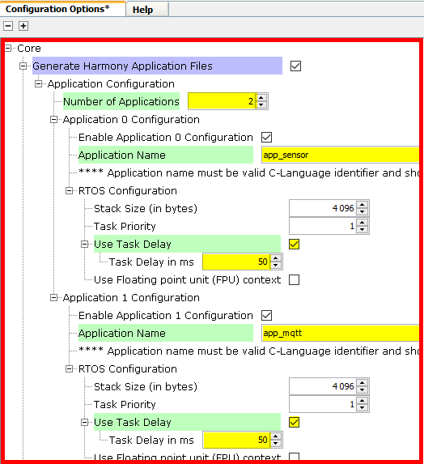
</p>
-->

> It is not mandatory to configure the Task Delay parameter for the RTOS thread. 
The Task Delay is only needed to yield the CPU to another thread. 
If the RTOS thread is designed so that it does not wait on the resources or events, and always uses the resource sharing and inter-task communication methods provided by the RTOS, such as semaphores, mutex, queues etc., the thread will be put in a blocked state until such resources or events are available. 
This then enables the scheduler to run other threads that are ready to run, and hence does not require using Task Delay to explicitly yield the CPU to other threads in the system.

> Running each library from an individual thread allows the user to better prioritize the tasks of different libraries. However, each thread takes resources and has the task-switching overhead, using CPU bandwidth. Therefore, it often makes sense to combine several simple libraries into a common thread while leaving major
libraries, such as USB, TCP/IP, etc., in their own thread.

> Determining the stack size required by a RTOS thread is important to ensure system stability. However, it is not easy to determine the stack requirements of a
RTOS thread. This depends on several factors, such as the number of local variables used, number of nested function calls, space required to save the thread context, and stack required by the nested interrupts if a dedicated interrupt stack is not used. Some RTOS-specific tools provide several ways to detect stack overflow at run-time or determine the worst case stack used by the individual threads. Therefore, it is generally a good practice to allocate a fairly large stack for each thread in the beginning and then adjust the stack size based on the stack usage
analysis.

## Add Timer Component<a name="step10"></a>

Add a Timer to trigger periodically the measurement of the on-board temperature sensor.

<p align="center">

</p>

- From the Project Graph window, select **Root** to make sure the next components will be presented in the Root view.

- From the Available Components window, add the **TMR3** component located in **Peripherals/TMR**
<p align="center">
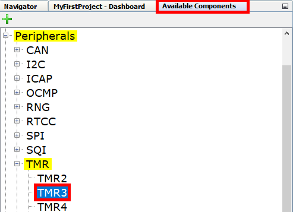
</p>

## Configure Timer Component<a name="step11"></a>

- Select **TMR3** from the Active Components list or directly from the Project Graph
- In the Configuration window, make the following settings:
  - Set the highest prescaler value (**1:256**)
  - Set the highest period value in millisecond (**168**)
  - Make sure to obtain Period register = **65 534**
<p align="center">
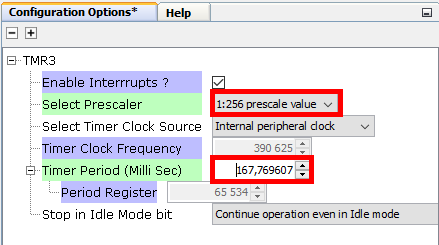
</p>

## Add ADC Component<a name="step12"></a>

Add the ADC Peripheral Library to monitor the on-board temperature sensor.

- From the Available Components window, add the **ADCHS** component located into **Peripherals/ADCHS**
<p align="center">
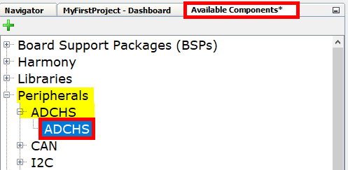
</p>

## Configure ADC Component<a name="step13"></a>

- Configure the ADC Component from **MHC -> Tools** and select **ADCHS Configuration**
<p align="center">
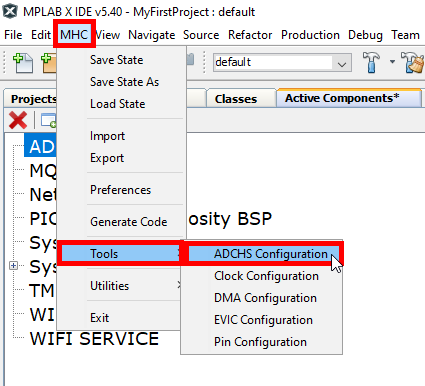
</p>

- Select **ADCHS Easy View** tab to display another way to configure the component instead of using the Configurations Options window
<p align="center">

</p>

> The on-board temperature sensor device is connected to pin AN15/RPA13 of the WFI32E01PC module.\
According to the [PIC32MZ W1 datasheet](https://www.microchip.com/pic32mzw1), the 12-bit HS SAR ADC has one dedicated ADC module (ADC1) and one shared ADC module (ADC2). AN15 can be internally connected to the shared ADC module. In MHC, the shared ADC module is called ADC7.

- In ADCHS Easy View, select **ADC7 Disabled** tab and check **Channel Enable**
<p align="center">

</p>

- Observe the settings are also changing in Configuration Options window
<p align="center">

</p>

- Set the shared ADC Resolution to **12-bits**
<p align="center">
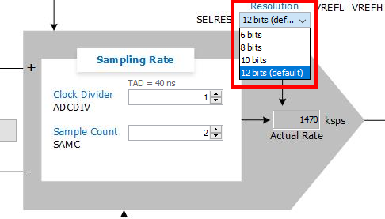
</p>

- Select the **General Purpose Timer 3** as trigger source
<p align="center">

</p>

- To configure the analog input AN15, open the **Channel Selection**
<p align="center">
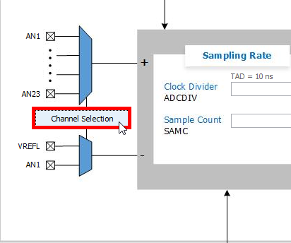
</p>

- Scroll-down and **Enable AN15 with Input Scan and Interrupt capabilities**
<p align="center">

</p>

- Close the Channel Configuration ADC window

- Select **System Clock (Tcy)** as the Clock Source
<p align="left">


</p>

- Verify on the Configuration Options window you get the same settings as below:
<p align="center">
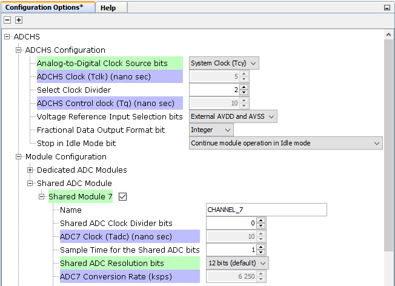

</p>

## Generate Code<a name="step14"></a>

Once Harmony components are added to the Project Graph using MHC, it is time to generate the source files based on the configurations.

- **Generate the code** from MHC menu
<p align="center">
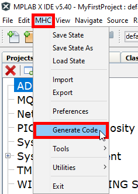
</p>

- Click **Save As** button
<p align="center">
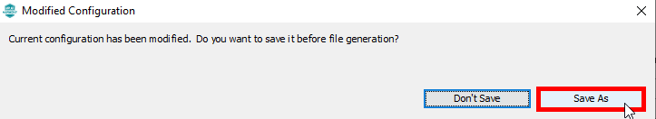
</p>

- Click the **Save** button to save the generated configuration
<p align="center">
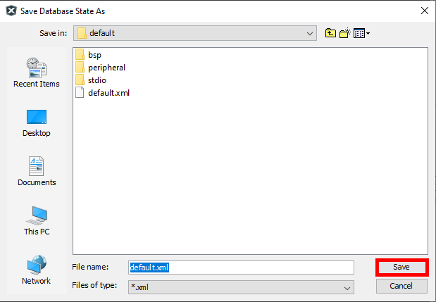
</p>

- Select **Merge Strategy = USER_ALL**
- Generate Project
<p align="center">
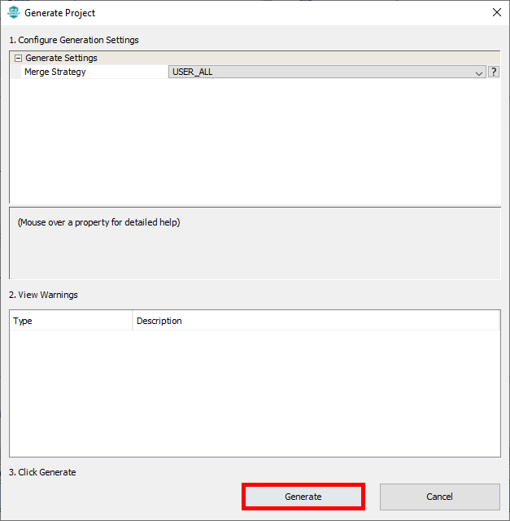
</p>

- As the code is generated, MPLAB® Harmony Configurator (MHC) displays the progress.

<!--<p align="center">
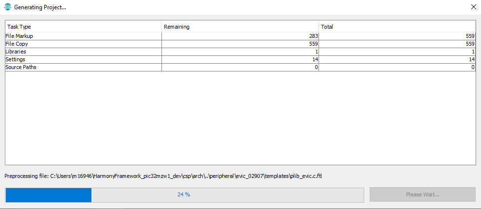
</p>-->
	
- When done, navigate to the **Projects** tab to view the project tree structure
<p align="center">

</p>

MHC will include all the MPLAB Harmony library files and generate the code based on the MHC selections. The generated code would add files and folders to your Harmony project as shown.

- Examine the generated code

  - `config/default/configuration.h` contains the definition based on the MHC selections
  - `config/default/FreeRTOSConfig.h` contains the FreeRTOS configuration
  - `config/default/initialization.c` initializes the application and the Harmony libraries (PLIB, Driver, Middleware)
  - `config/default/tasks.c` runs the harmony libraries and the application tasks

MHC also generates the template main file (``main.c``) and the application thread files(``app_sensor.c`` and ``app_mqtt.c``) for sensor and MQTT communication threads.

> **The application files are only generated once, when the project is initially created. These are starter files where you are intended to do most of your development.** Other files (like the system configuration files) are under control of the MHC. You can occasionally need to modify these files; however, you need not worry about losing your changes if you regenerate the project files. The MHC will open a diff tool when it detects that you have modified a file and allow you to choose which changes you want to keep and which ones you want to update.

- (optional) Build the code by clicking on the **Clean and Build** button and verify that the project builds successfully. 
<p align="center">
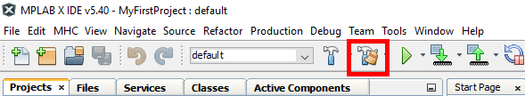
</p>

At this point, you are ready to start implementing your application code.

## Explore the RTOS-based implementation<a name="step15"></a>

The project is using FreeRTOS library to create application threads and intercommunicate between application threads.

In an RTOS environment, instead of running all the tasks from a big super loop, each individual task run in a dedicated loop. This allows the individual task to be assigned a priority, and therefore, provides for a better responsiveness by assigning a high priority to tasks that are time-critical (hard real-time) in nature.
Usually, the driver task routines may still be run from an interrupt context. Interrupts usually support the best real-time response latency and hardware usually provides mechanisms for setting interrupt priorities.
<p align="center">
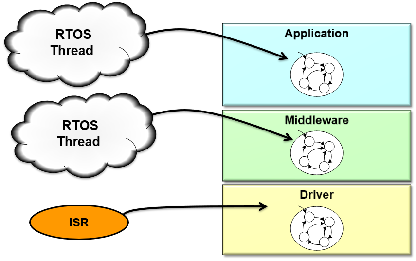
</p>

Tasks running in an RTOS environment uses the signaling and resources sharing constructs like semaphores, mutex and queues provided by the RTOS. These allows the scheduler to put the tasks in a blocked state until such resources or signals are available and allows the tasks that are ready to run on the CPU. This results in effective utilization of the CPU bandwidth. When no tasks are ready to run, the scheduler runs the idle task which then allows the system to be put into a low power modes.

A periodic hardware timer interrupt (system tick) invokes scheduler which determines next task to run.\
The FreeRTOS scheduler would:
- switches between tasks
- switches context to next ready task based on scheduler configuration

MHC allows combining MPLAB Harmony library tasks under the common RTOS thread (`_SYS_Tasks`) that runs the MPLAB Harmony System modules. 

When MHC generates the code, the MPLAB Harmony System task (`SYS_Tasks`) routine contains the RTOS specific thread creation code (in `tasks.c`).

The `xTaskCreate` function creates a task by allocating RAM memory. It's parameters allows to set the name, stack depth, priority of the task, and also to retrieve task identifier and pointer to RAM function where the task code is implemented. After its creation, a task is ready to be executed. The `xTaskCreate` function call should be done prior to the scheduler call.
<p align="center">
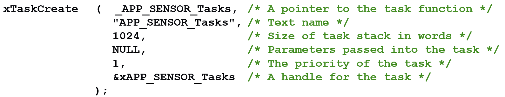
</p>

> The RAM can be automatically dynamically allocated from the RTOS heap within the RTOS Configuration. Creating RTOS objects dynamically has the benefit of greater simplicity, and the potential to minimise the application's maximum RAM usage.

The System task routine then calls the RTOS scheduler, thereafter all RTOS threads will be managed by the scheduler and the ``SYS_Tasks`` function will not return. 
MHC also generates the individual daemon threads that will run the
MPLAB Harmony libraries and the application tasks (`_APP_SENSOR_Tasks` and `_APP_MQTT_Tasks`).

<p align="center">
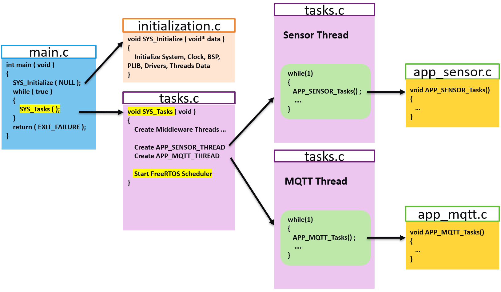
</p>

The `main.c` file calls the `SYS_Tasks()` routine, which create the sensor and MQTT threads and makes a call to FreeRTOS API `vTaskStartScheduler()` to start the scheduler.
 
<p align="center">
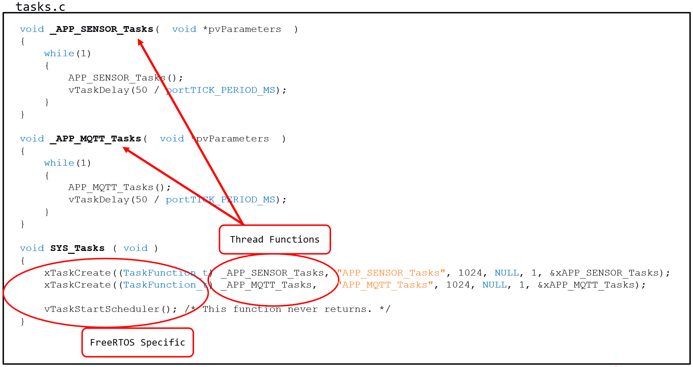
</p>

> Observe that each application task runs in its individual RTOS thread.


## Add Application Code to the project<a name="step16"></a>

Now, you have the MPLAB® Harmony components configured for MQTT and RTOS based application and you are ready to begin developing your application logic of two independent Application Tasks.

- `_APP_SENSOR_Tasks` - thread to read and display temperature periodically
- `_APP_MQTT_Tasks` - thread to manage the communication flow with the MQTT Broker by:
   - pusblishing data to temperature topic
   - subscribing to actuator topic and control the on-board LEDs

The application is already developed and is available in the files:
* `app_sensor.c`,
* `app_sensor.h`,
* `app_mqtt.c`,
* `app_mqtt.h`

They are available under: [resources/dev_files](resources/dev_files)

The application files `app_sensor.c` and `app_mqtt.c` contain the application logic. They also contain placeholders that you will populate with the necessary code in the next step.

**Go to the [resources/dev_files](resources/dev_files) folder and copy the pre-developed files**:

* `app_sensor.c`,
* `app_sensor.h`,
* `app_mqtt.c`,
* `app_mqtt.h`

**Paste and replace (over-write) the files of your project available at `<Your project folder>/PIC32MZ_W1/firmware/src` with the copied files.**

> In the application source files, the code for the application threads is already developed. In the following steps, you will add the missing code snippets for each thread.\
> Compiling the code from here will indicate compilation errors.

### Sensor Application Thread

`_APP_SENSOR_Tasks` - This thread will have the responsability to:
- Initialize
  - Register callback function for ADCHS end of conversion interrupt
  - Start the Timer 3 for ADC triggering
- Monitor SW1 button state
  - Filter the debounce
  - Count the button press
  - Share Button state resource to the `_APP_MQTT_Tasks` thread
- Read ADC
  - Accumulate values
  - Convert value to temperature
  - Share Temperature resource to the `_APP_MQTT_Tasks` thread
<br><br>

Open `app_sensor.h`\
The application states enumeration called `APP_SENSOR_STATES` determine the behavior of the application at various time.

```
typedef enum
{
    /* Application's state machine's initial state. */
    APP_SENSOR_STATE_INIT=0,
    APP_SENSOR_STATE_MONITOR_SWITCH,
    APP_SENSOR_STATE_READ_ADC
} APP_SENSOR_STATES;
```
<p align="center">
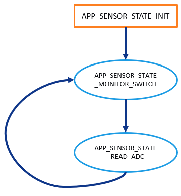
</p>

The state variables that belong to the application thread are managed in a data structure called `APP_SENSOR_DATA`.
```
typedef struct
{
    /* The application's current state */
    APP_SENSOR_STATES state;
    bool adcReady;          // Flag to inform when conversion is done
    uint16_t adcCount;      // Result of the AD conversion
    float temp;             // Temperature value
    bool switchStatus;      // SWITCH1_STATE_PRESSED or SWITCH1_STATE_RELEASED
    uint16_t switchCnt;     // button press counter
} APP_SENSOR_DATA;
extern APP_SENSOR_DATA app_sensorData; 
```

Open `app_sensor.c` and add application code referring to the comments in the screenshots as shown in the following steps.

Go to the implementation of `void APP_SENSOR_Tasks ( void )` function.

In `APP_SENSOR_STATE_INIT` state:

1. Register a callback function (`ADC_ResultHandler`) for ADCHS end of conversion interrupt of channel 15. This means the application do not have to poll continuously. \
You may refer to PLIB doc file `help_harmony_csp.chm` located in `<HarmonyFramework folder>/csp/doc`\

<details><summary>solution</summary>

```
ADCHS_CallbackRegister(ADCHS_CH15, ADC_ResultHandler, (uintptr_t) NULL);
```
</details>
<br>

2. Start the TMR3 for ADC trigger

<details><summary>solution</summary>

```
TMR3_Start();
```
</details>
<br>

3. Create a queue (`queueHandle`) by using [`xQueueCreate`](https://www.freertos.org/a00116.html) API with a length of `float`. The queue is used to communicate temperature data (`app_sensorData.temp`) acquired from thread `_APP_SENSOR_Tasks` to thread `_APP_MQTT_Tasks`.
> The queue is similar to a sized FIFO buffer. Basically it is FIFO, but it is also possible to overwrite data in the first buffer.

<details><summary>solution</summary>

```
queueHandle = xQueueCreate(1, sizeof(float));
if (queueHandle == NULL)
{
 /* Handle error condition. Not sufficient memory to create Queue */
}
```
</details>
<br>

4. Move the application thread to the next state (`APP_SENSOR_STATE_MONITOR_SWITCH`) 

<details><summary>solution</summary>

```
app_sensorData.state = APP_SENSOR_STATE_MONITOR_SWITCH;
```
</details>
<br>

In `APP_SENSOR_STATE_MONITOR_SWITCH` state:

Here, the portion of the application code is responsible to monitor the state of the SW1 button and count the button press. On a long press, the counter is automatically resetting to 0.

The button status is passed to the other thread over a global variable (`app_sensorData.switchStatus`) to keep it simple. Best practice is the use of queue like above for the temperature value exchange. Here, the button status value is written by a single thread (`APP_SENSOR_Tasks`) and the value is slow moving which reduces the chances of error. 

1. Move the application thread to the next state 

<details><summary>solution</summary>

```
app_sensorData.state = APP_SENSOR_STATE_READ_ADC;
```
</details>
<br>


In `APP_SENSOR_STATE_READ_ADC` state:

When AD conversion is ready (thanks to the `ADC_ResultHandler` callback function), the application accumulates several ADC conversions and performs the average of the `APP_SENSOR_ADC_AVG_COUNT` read (`#define APP_SENSOR_ADC_AVG_COUNT 32`).

According to [TC1047 Temperature-to-voltage converter](http://ww1.microchip.com/downloads/en/devicedoc/21498d.pdf), the averaged ADC result is then converted to temperature in Degree Celisus.

The temperature data is stored in variable `app_sensorData.temp`.

1. Post the temperature data to the queue (`queueHandle`) using [`xQueueSend`](https://www.freertos.org/a00117.html) API. Make sure to not block if the queue is already full.

<details><summary>solution</summary>

```
xQueueSend(queueHandle, &app_sensorData.temp, (TickType_t) 0);
```
</details>
<br>

2. Move the application thread to the next state (`APP_SENSOR_STATE_MONITOR_SWITCH`) 

<details><summary>solution</summary>

```
app_sensorData.state = APP_SENSOR_STATE_MONITOR_SWITCH;
```
</details>
<br>
<br>

<!--

Application Using Callback
In the Non-Blocking method, instead of status polling, the callback mechanism can also be used to check the transfer
status. Follow these steps to use the callback mechanism:
• Register a callback function to the PLIB using a dedicated API given by the PLIB.
• Define the function which is registered.
• Make the transfer request.
• Do other application tasks. Whenever a transfer completes, the registered callback function which is defined, will
be called by the PLIB.
Because callbacks are called from the interrupt context, the following guidelines must be followed while defining the
callback functions in the application:
• Must be treated like an ISR
• Must be short
• Must not call application functions that are not interrupt safe
• Use volatile keywords for the variables which are accessed both inside of callback function and outside of
callback function
The code example using a callback mechanism is not shown as MPLAB Harmony v2 PLIBs did not have this feature,
hence nothing to compare. The user can refer to the PLIB demonstrations in the csp/apps folder in the csp
repository for many PLIB callback examples

Callback: Callback can be registered using a dedicated API which can
be called once the transfer completes

-->

### MQTT Application Thread

`_APP_MQTT_Tasks` - This thread will have the responsability to:
- Start the application in AP or STA mode
- Allow provisioning while in AP mode
- Connect to MQTT broker configured thru MHC
- Publish the shared temperature resource from `_APP_SENSOR_Tasks` to the topic pre-configured within MHC (`pic32mz_w1_sensor`)
- Subscribe to the topic `pic32mz_w1/actuator` (done by MHC)
- Parse the MQTT message received and control the on-board LEDs accordingly  
<br>

Open `app_mqtt.h`\
The application states enumeration called `APP_MQTT_STATES` determine the behavior of the application at various time.

```
typedef enum
{
    /* Application's state machine's initial state. */
    APP_MQTT_STATE_INIT=0,
    APP_MQTT_STATE_MODE_AP,
    APP_MQTT_STATE_MODE_STA,
    APP_MQTT_STATE_SERVICE_TASKS
} APP_MQTT_STATES;
```
<p align="center">
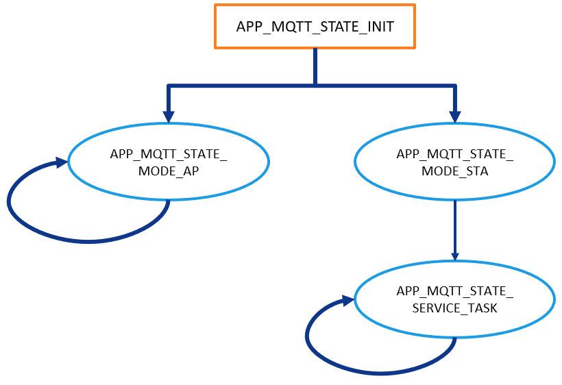
</p>

The state variables that belong to the application thread are managed in a data structure called `APP_MQTT_DATA`.
```
typedef struct
{
    /* The application's current state */
    APP_MQTT_STATES state;
    SYS_MODULE_OBJ sysMqttHandle;   // Handle of the MQTT object
    bool pubFlag;                   // Publish flag
    bool connected;                 // MQTT connection status
    bool pubQueued;                 // MQTT service does not queue messages
    uint32_t pubMsgCnt;             // Publish message counter
} APP_MQTT_DATA;
```

Open `app_mqtt.c` and add application code referring to the comments in the screenshots as shown in the following steps.

Go to the implementation of `void APP_MQTT_Tasks ( void )` function.

In `APP_MQTT_STATE_INIT` state:

To determine if the application is starting in AP mode or in STA mode, the Wi-Fi Service initialization must be complete.

> The initialization of the Wi-Fi Service occurs in the `main` when the API `SYS_Initialize()` (defined in `initialization.c`) is called.

The API `SYS_WIFI_CtrlMsg(sysObj.syswifi, SYS_WIFI_GETCONFIG, &g_wifiConfig, sizeof(g_wifiConfig))` is polled until Wi-Fi Service get initialized.

Check out the [Wi-Fi System Service Interface](https://microchip-mplab-harmony.github.io/wireless/system/wifi/docs/interface.html#sys_wifi_ctrlmsg-1) for more details.
<br><br>

In `APP_MQTT_STATE_MODE_AP` state:

The application runs in AP mode and stays in this state while Wi-Fi provisioning is not complete.

Wi-Fi provisioning can be done thru CLI, TCP Server or HTTP page.

When provisioning is done, the application restarts and run in STA mode after passing to `APP_MQTT_STATE_INIT` state.
<br><br>

In `APP_MQTT_STATE_MODE_STA` state:

Assuming the device is correctly connected to the Wi-Fi network and got an IP Address.

1. Connect to configured MQTT Broker using the API [`SYS_MQTT_Connect()`](https://microchip-mplab-harmony.github.io/wireless/system/mqtt/docs/interface.html#sys_mqtt_connect). Use the handle `app_mqttData.sysMqttHandle` as the return value of the API and use `MqttCallback` as the callback function to be called in case of MQTT event.

<details><summary>solution</summary>

```
app_mqttData.sysMqttHandle = SYS_MQTT_Connect(NULL, MqttCallback, NULL); 
```
</details>
<br>

2. Register a periodic callback with the Timer System Service for every 10000 milliseconds.

<details><summary>solution</summary>

```
SYS_TIME_HANDLE handle = SYS_TIME_CallbackRegisterMS(PubTimerCallback, (uintptr_t) 0, 10000, SYS_TIME_PERIODIC) ;
if (handle == SYS_TIME_HANDLE_INVALID)
{
   SYS_CONSOLE_PRINT("[app_mqtt] Failed creating a timer for publish \r\n");
}
```
</details>
<br>

3. Move the application thread to the next state 

<details><summary>solution</summary>

```
app_mqttData.state = APP_STATE_SERVICE_TASKS;
```
</details>
<br><br>

In `APP_STATE_SERVICE_TASKS` state:

The callback function `PubTimerCallback` informs the application when it is time to publish a message to the Broker with the help of the function `Publish_PeriodicMsg()`.

1. Maintain the MQTT Service state machine by calling the [`SYS_MQTT_Task()`](https://microchip-mplab-harmony.github.io/wireless/system/mqtt/docs/interface.html#sys_mqtt_task) API. This function ensures that the MQTT service is able to execute its state machine to process any messages and invoke the user callback for any events. Use the handle `app_mqttData.sysMqttHandle` as parameter.

<details><summary>solution</summary>

```
SYS_MQTT_Task(app_mqttData.sysMqttHandle);
```
</details>
<br><br>

Go to `void Publish_PeriodicMsg(void)` function.

Assuming MQTT is connected and service ready to publish.

The application allocates a `char` array called `message[32]` to contain the message to publish. And the config related to the topic `sMqttTopicCfg` to publish is declared.

```
char message[32] = {0};
SYS_MQTT_PublishTopicCfg sMqttTopicCfg;
```

All the parameters other than the message itself are initialized by the configuration provided in MHC such as topic name for publishing, QOS, etc.
```
strcpy(sMqttTopicCfg.topicName, SYS_MQTT_DEF_PUB_TOPIC_NAME);
sMqttTopicCfg.topicLength = strlen(SYS_MQTT_DEF_PUB_TOPIC_NAME);
sMqttTopicCfg.retain = SYS_MQTT_DEF_PUB_RETAIN;
sMqttTopicCfg.qos = SYS_MQTT_DEF_PUB_QOS;
```

1. Receive the shared temperature data from the queue using [`xQueueReceive`](https://www.freertos.org/a00118.html) API. Use the local `float temp` variable to accomodate the size of the queue previously created.

<details><summary>solution</summary>

```
xQueueReceive(queueHandle, &temp, portMAX_DELAY);
```
</details>
<br>

2. Format the temperature value received from the queue and the switch status to the message string using `sprintf()` function.

<details><summary>solution</summary>

```
sprintf(message, "Temperature: %.1f, Button: %d", temp, app_sensorData.switchStatus);
```
</details>
<br>

3. Publish the message using [`SYS_MQTT_Publish()`](https://microchip-mplab-harmony.github.io/wireless/system/mqtt/docs/interface.html#sys_mqtt_publish) API.

<details><summary>solution</summary>

```
retVal = SYS_MQTT_Publish(app_mqttData.sysMqttHandle, &sMqttTopicCfg, message, sizeof(message));
if(retVal != SYS_MQTT_SUCCESS)
{
   SYS_CONSOLE_PRINT("\n[app_mqtt] Publish_PeriodicMsg(): Failed (%d)\r\n", retVal);
}
```
</details>
<br>

> As good practices and for futur improvements, consider the followings:
> - Not every packet of data needs to be seen by the cloud
> - Every packet sent to the cloud has a cost
> - Limiting total traffic saves operational cost (OpEx)
> - Data can be aggregate locally and send only what is needed and when is needed

<br><br>

Go to implementation of `MqttCallback()` callback function.

After initialization, this callback is called by MQTT Service in case of an event
(the different event messages are defined in file `sys_mqtt.h`).

Observe the event message types which are used to inform the developer that an event has occured.

The `SYS_MQTT_EVENT_MSG_RCVD` event is the place to get the message received on the configured topic. 

In `SYS_MQTT_EVENT_MSG_RCVD` event:

1. Parse the message received and control the on-board LEDs independently via the PLIB functions.\
The message is supposed to be sent from another device as a JSON payload like:\
`{"green_led":{"state":1}, "red_led":{"state":1}}`

<p align="center">
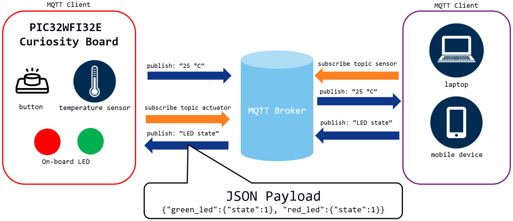
</p>

<details><summary>solution</summary>

```
if (NULL != strstr((char*) psMsg->message, "\"green_led\":{\"state\":1}"))
{
   LED_GREEN_On();
   SYS_CONSOLE_PRINT("[app_mqtt] GREEN LED ON\r\n") ;
}
else if (NULL != strstr((char*) psMsg->message, "\"green_led\":{\"state\":0}"))
{
   LED_GREEN_Off();
   SYS_CONSOLE_PRINT("[app_mqtt] GREEN LED OFF\r\n");
}
if (NULL != strstr((char*) psMsg->message, "\"red_led\":{\"state\":1}"))
{
   LED_RED_On();
   SYS_CONSOLE_PRINT("[app_mqtt] RED LED ON\r\n");
}
else if (NULL != strstr((char*) psMsg->message, "\"red_led\":{\"state\":0}"))
{
   LED_RED_Off();
   SYS_CONSOLE_PRINT("[app_mqtt] RED LED OFF\r\n");
}
```
</details>
<br><br>

You are now ready to build the code !


## Build, Program and Observe the Outputs<a name="step17"></a>

- Go to **File > Project Properties** and make sure that your debugger/programmer (on-board PKOB or external tool) is selected as the Hardware tool connected and XC32 is selected as the Compiler Toolchain.

<p align="center">
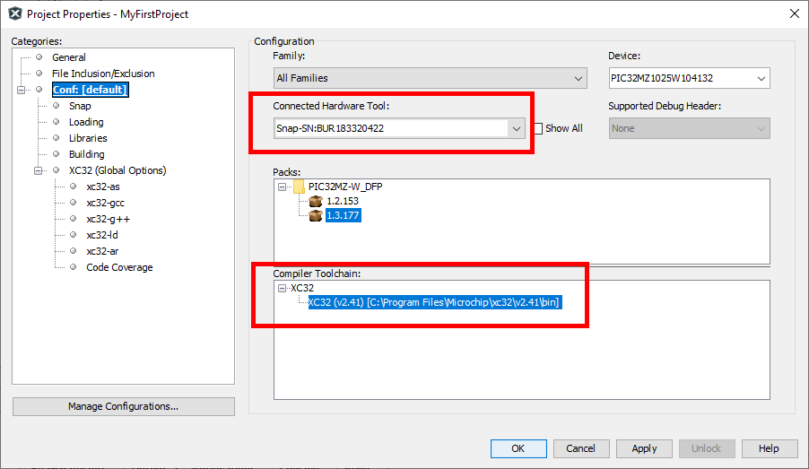
</p>

- Press **Apply** and **Ok**

- Clean and build your application by clicking on the **Clean and Build** button

<p align="center">

</p>

- Program your application to the device by clicking on the **Make and Program** button

<p align="center">

</p>

The project should build and program successfully.

- Now, open the Tera Term serial terminal application on your computer. Select the Serial Port mounted with the USB-UART converter.

<p align="center">
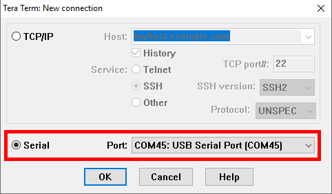
</p>

- Change the settings to 115200 8N1

<p align="center">
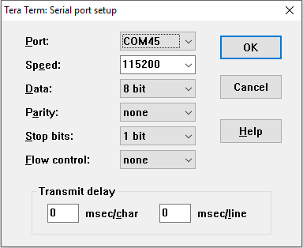
</p>

- Change the terminal setup, disable the local echo

<p align="center">
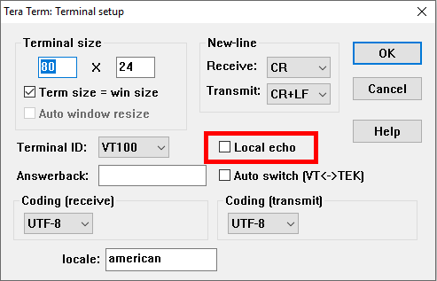
</p>


- You should see application logs including:
  - Wireless stacks initialization
  - The temperature values (in °C) being displayed on the terminal every one second

<p align="center">

</p>

## Provision the device<a name="step18"></a>

According to MHC configuration, the Application is setup to start as an Access Point and ready for provisioning over Wi-Fi.

It is required to provision the device to connect to Home Router.\
Refer to the previous [section](../05_evaluate/README.md#top) of the workshop material.

To provision the device you can use one of the following methods you have enabled thru MHC:
- Command Line Interface (CLI)
- TCP Socket mode
  - Wi-Fi provisioning with JSON format
  - [Wi-Fi provisioning with Android Mobile Application from Play store](https://play.google.com/store/apps/details?id=com.microchip.wifiapplication)
- HTTP
  - Webpage using HTTP
  - Webpage using HTTPNET

Select one of the method and use the [doc](https://microchip-mplab-harmony.github.io/wireless/system/wifiprov/docs/usage.html#using-the-library) to provision your device.

## Interact with the application<a name="step19"></a>

After provisioning, your device is going to connect to MQTT broker and start publishing data every 10 seconds.

<p align="center">

</p>

Pick one of the MQTT client tool from the list below:
- [MQTTBox](http://workswithweb.com/mqttbox.html)
- [MQTT.fx](https://mqttfx.jensd.de/index.php/download)
- [MQTTLens Chrome Plugin](https://chrome.google.com/webstore/detail/mqttlens/hemojaaeigabkbcookmlgmdigohjobjm)
- [MyMQTT app for Android](https://play.google.com/store/apps/details?id=at.tripwire.mqtt.client)
- [MQTTTool app for iOS](https://apps.apple.com/us/app/mqttool/id1085976398)
- [Mosquitto command line](https://mosquitto.org/download/)

> Note: public MQTT test servers like test.mosquitto.org often fails without notice. Please ensure that the service is up and running using third-party tools before working on this demo.

Make sure to configure the MQTT client tool with the following settings:
- Broker Host address: **test.mosquitto.org**
- Broker Port: **1883**

<p align="center">
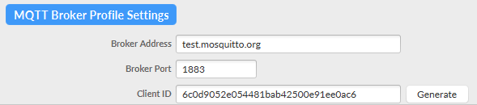
</p>

Subscribe to the topic `pic32mz_w1/sensor` and observe the result.

<p align="center">
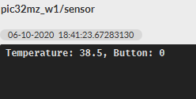
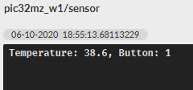
</p>

Publish JSON payload to the topic `pic32mz_w1/actuator` to control the on-board LEDs.\
JSON payload format: `{"green_led":{"state":1}, "red_led":{"state":1}}`

<p align="center">

</p>


### Results

You observed that the application published the sensor values every 10 seconds. Also, you observed that the two on-board LEDs were controlled from another MQTT client over the MQTT Broker.

### Analysis

You have successfully created your first application using MPLAB Harmony v3 on the PIC32MZ W1 Wi-Fi MCU. Your application used all the fundamental elements that go into building a real-time application. 

Now let's enhance security setup the application for secure MQTT connection ...

## Enhance security by configuring TLS for secure connection<a name="step20"></a>

### Overview

MQTT relies on the TCP transport protocol. By default, TCP connections do not use an encrypted communication. To encrypt the whole MQTT communication, many MQTT brokers allow use of TLS instead of plain TCP. Port 8883 is standardized for a secured MQTT connection and exclusively reserved for MQTT over TLS.

<p align="center">
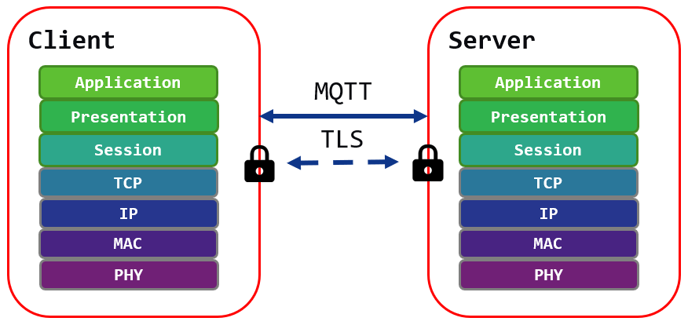
</p>

Transport Layer Security [TLS](https://www.microchip.com/design-centers/security-ics/cryptoauthentication/hardened-tls) is the security component in the familiar https protocol for security on the Internet. A TLS connection between a device and the server ensures that the data exchange between them is secured from the multiple threats possible over an untrusted medium. The TLS connection typically includes mutual authentication of the communicating parties, secure key exchange, symmetric encryption and message integrity checks. Servers provide a X509 certificate typically issued by a trusted authority that clients use to verify the identity of the server.
As a recommendation, all the communication between a device and a remote server (cloud) must use TLS.

The steps covered here will create an encrypted connection thru TLS stack (from [wolfSSL](https://www.wolfssl.com/)) between the MQTT broker hosted on the cloud - [test.mosquitto.org](https://test.mosquitto.org) and the MQTT client (PIC32MZ W1). In this case, only a trusted server certificate is required on the client.

<!-- Client Requirements:
* A CA (certificate authority) certificate of the CA that has signed the server certificate on the Mosquitto Broker.

Broker Requirements
* CA certificate of the CA that has signed the server certificate on the Mosquitto Broker.
CA certificated server certificate.
Server Private key for decryption.
-->

> Note: public MQTT test servers like [test.mosquitto.org](https://test.mosquitto.org/) often fails without notice. Please ensure that the service is up and running using third-party tools before working on this demo. test.mosquitto.org supports mutual authentication.

### Prepare server certificate

First step is to get the server certificate of [test.mosquitto.org](https://test.mosquitto.org/) to establish a HTTPs connection. OpenSSL tool will be used.

1. Download and install [git for windows](https://gitforwindows.org/)
2. Open **Gitbash** or similiar console that has access to **OpenSSL**
3. Execute the following command to connect to [test.mosquitto.org](https://test.mosquitto.org/) and display the server certificate.\
`openssl s_client -host test.mosquitto.org -port 8883 -showcerts`

<p align="center">
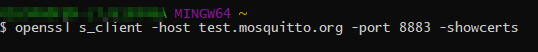
</p>

> Check out [OpenSSL manpage](https://www.openssl.org/docs/manmaster/man1/openssl-s_client.html) for more details.

<!-- 4. Copy the top-level certificate (including -----BEGIN CERTIFICATE----- to -----END CERTIFICATE-----) into a text file. Save the file in `C:\PIC32MZW1` and rename it to `mosquitto.crt`-->
4. Copy the level 1 certificate (including -----BEGIN CERTIFICATE----- to -----END CERTIFICATE-----) into a text file. Save the file in `C:\PIC32MZW1` and rename it to `mosquitto.crt`
<p align="center">
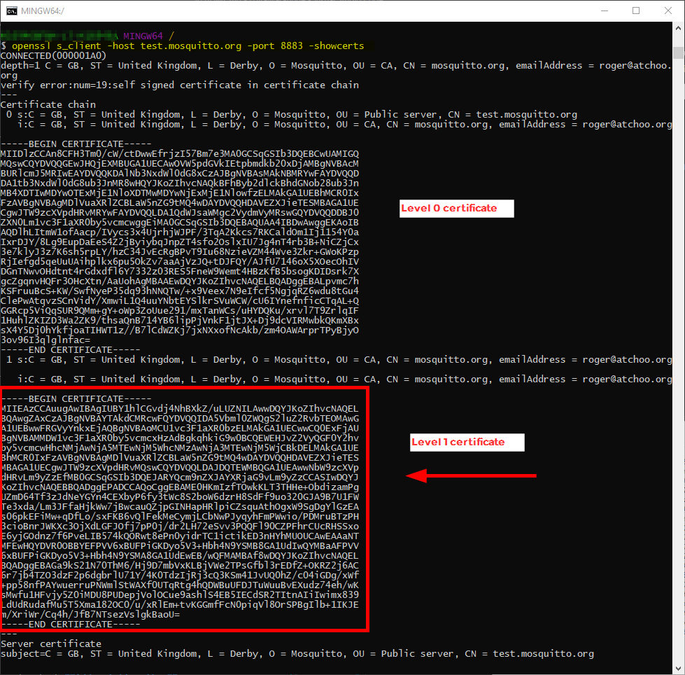
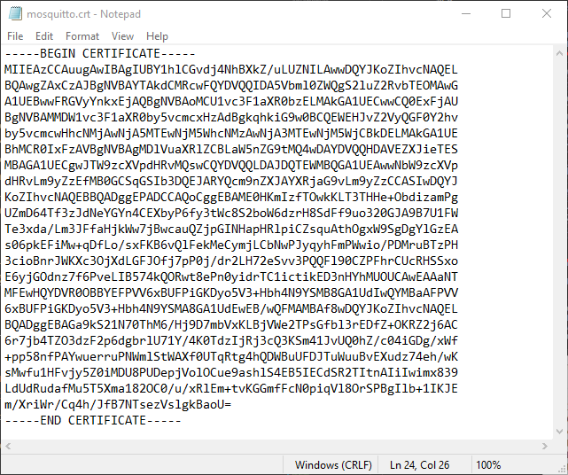
</p>

> Here, the certificate chain consists of two certificates presented. At level 0 there is the server certificate with some parsed information. s: is the subject line of the certificate and i: contains information abouth the issuing CA.\
This particular server (test.mosquitto.org) has sent an intermediate certificate as well. Subject and issuer information is provided for each certificate in the presented chain. Chains can be much longer than 2 certificates in length. The server certificates section is a duplicate of level 0 in the chain. Here we are looking for the end entity certificate.\
> Alternate solution is to download the certificate directly from [test.mosquitto.org](https://test.mosquitto.org/ssl/mosquitto.org.crt) but the command line approach is more scalable to connect to other hosts.

5. Make sure you have [python 3](https://www.python.org/downloads/) installed\
  From the Git bash console:
    - Get the version: `pip3 --version`
    - Update pip: `python3 -m pip install --upgrade pip`
    - Install required module `pip3 install cryptography`
6. Download [crypto python script](https://github.com/vppillai/cryptoScript) and extract into `C:\PIC32MZW1`
7. Run the following Python script from Git bash console\
`python3 cert2header.py mosquitto.crt`
<p align="center">
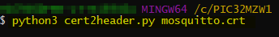
</p>

8. The previous step has created a file `cert_header.h` in folder `C:\PIC32MZW1`
<p align="center">
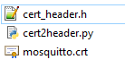
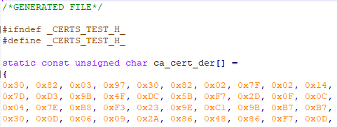
</p>

> Notice the variable name containing data for CA certificate: `ca_cert_der`. This variable name will be used in the following steps.

9. Copy the file `cert_header.h` into `<HarmonyProjects folder>/PIC32MZW1/firmware/src`
<p align="center">
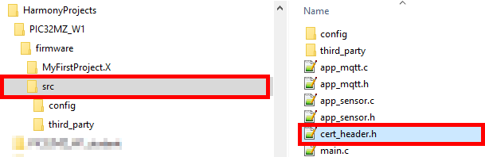
</p>

### Configure the project

From the existing project created from scratch:

- Select **Projects** tab on the left window and expand project structure
- Right click on **Header files** and select **Add existing item**
<p align="center">

</p>

- Select file `cert_header.h` from `/src` folder
<p align="center">
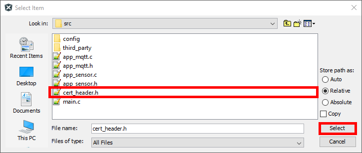
</p>

- Open MHC
- Select **MQTT Service** from Root view in Project graph 
  - Enter **Server Port = 8883**
  - Check **Enable TLS**
<p align="center">

</p>

- Activate wolfSSL library
<p align="center">
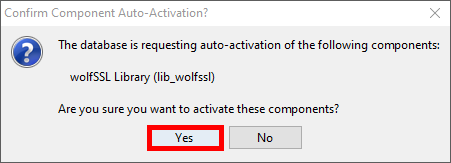
</p>

- Activate SNTP (required for certificate expiration date)
<p align="center">
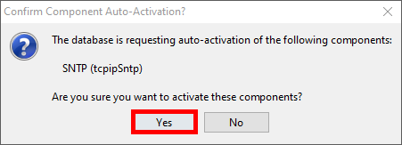
</p>

- Enable the requested connection
<p align="center">
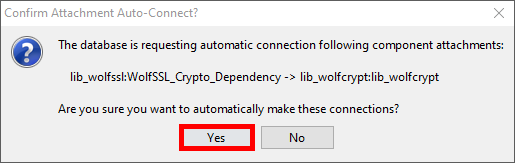
</p>

Update the Presentation Layer configuration
- Select **Presentation Layer** from **System Component** view in Project graph
<p align="center">
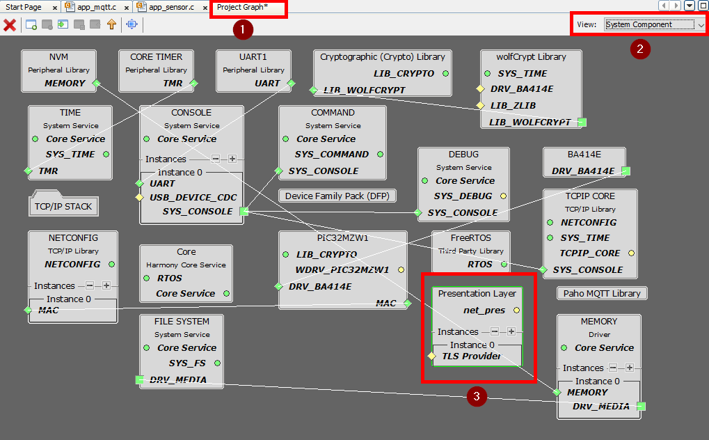
</p>

- In **Configuration Options** window, select **Fixed Flash Based Certificate Repo** as encryption certification store
<p align="center">
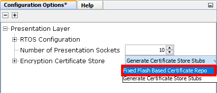
</p>

- Expand **Encryption Certification Store** settings
  - Check **Enable Peer Certificates Verification** to authenticate the server
  - Perform the following changes in **Support Client Certificates**
    - CA Certificate Format: **ASN1**
    - File name containing definitions for CA Certification: `cert_header.h`
    - Variable Name Containing Data for CA Certificate: `ca_cert_der`
    - Variable Name Containing Size of CA Certificate: `sizeof_ca_cert_der`
  - Uncheck **Support Server Certificate** because the steps here are NOT for mutual authentication
<p align="center">

</p>

<br>

- Select **PIC32MZW1** from **System Component** view in Project graph
- And **disable WPA3** in PIC32MZW1 Wi-Fi driver configuration
<p align="center">
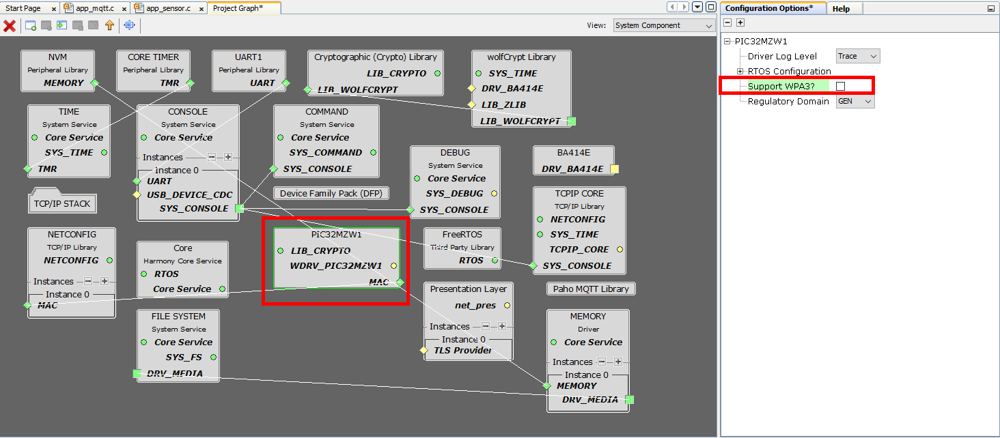
</p>

- **Generate the code** from MHC menu
- **Clean and Build** the project
- **Make and Program** the application
- Open TeraTerm console

> For the 4 steps above, refer to section: [Build, Program and Observe the Outputs](#step17)

- **Provision the device** to the Home router\
Refer to section [Provision the device](#step18)

### Interact with the secured application

After provisioning, your device is going to connect to MQTT broker over TLS and start publishing data every 10 seconds.

Make sure to configure the MQTT client tool with the following settings:
- Broker Host address: **test.mosquitto.org**
- Broker Port: **8883**

<p align="center">
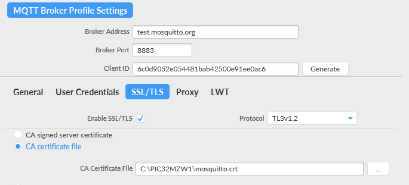
</p>

Subscribe to the topic `pic32mz_w1/sensor` and observe the result.

<p align="center">


</p>

Publish JSON payload to the topic `pic32mz_w1/actuator` to control the on-board LEDs.\
JSON payload format: `{"green_led":{"state":1}, "red_led":{"state":1}}`

<p align="center">

</p>


### Results

You observed that the application published the sensor values every 10 seconds. Also, you observed that the two on-board LEDs were controlled from another MQTT client over the MQTT Broker and a secure connection using TLS protocol.

### Analysis

You have successfully configured the basic of TLS in your first application using MPLAB Harmony v3 on the PIC32MZ W1 Wi-Fi MCU. Your application used all the fundamental elements that go into building a real-time and secured application. 

<a href="#top">Back to top</a>