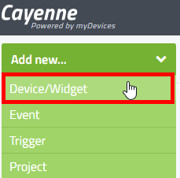
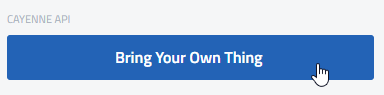
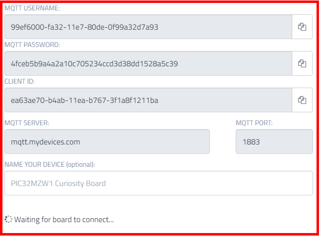
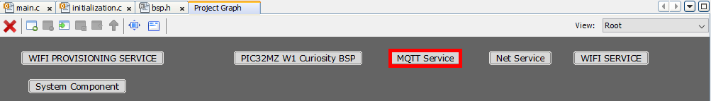
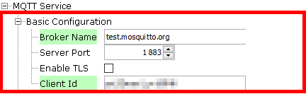
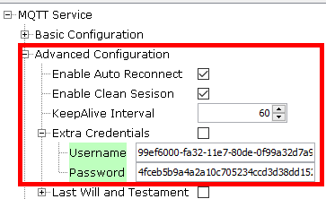
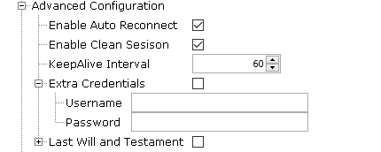
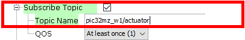
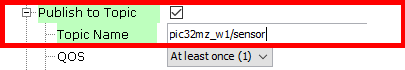

# Steps to use cayenne from myDevices as MQTT Broker

## Create the Cayenne Dashboard

- Log in to your [Cayenne](https://cayenne.mydevices.com) account or register for free if you haven't one yet
- Add new Device
<p align="center">

</p>

- From Device/Widget list, select "Bring your own thing"
<p align="center">

</p>

- Cayenne generates MQTT credentials (Username, Password and Client ID) for this new device and Cayenne exposes the MQTT server/broker address and also the supported port
- You can optionaly gives a name to your device
- Note carrefully all these details, you would need them later in the MQTT Service configuration
<p align="center">

</p>

> Note also at the bottom of the Cayenne page that it is waiting for the device to connect.\
Don't close the page.

## Configure MQTT Service Component

- From the Root view, select "MQTT Service"
<p align="center">

</p>

- In Configuration Options window, expand _Basic Configuration_
   - Populate the Broker Name and the Client Id with the details from Cayenne
   - Make sure the Server Port value match 
 <p align="center">

</p>

- Expand _Advanced Configuration > Extra Credentials_
   - Enter the Username and the Password coming from Cayenne portal
<p align="center">

</p>   

 > To share information between MQTT clients over MQTT broker, you need to provide MQTT topics which is nothing more than a form of addressing.\
The client (PIC32MZ W1) should subscribe to a topic to receive the command messages that Cayenne Dashboard sends for changing the state of the actuator (PIC32MZW1's on-board LED).\
The client (PIC32MZ W1) should publish sensor data (on-board temperature sensor value) to Cayenne over another topic.

- In Configuration Options window, expand and check both  **_Subscribe Topic_** and **_Publish Topic_**
<p align="center">

</p>

- According to [Cayenne documentation](https://developers.mydevices.com/cayenne/docs/cayenne-mqtt-api/#cayenne-mqtt-api-mqtt-messaging-topics-receive-actuator-command), the topic name to subscribe should respect the following format:
  ```v1/username/things/clientID/cmd/channel```
   - Replace _username_ with the MQTT Username generated for your device within Cayenne
   - Replace _clientID_ with the Client ID generated from Cayenne
   - Replace _channel_ with the appropriate channel that the actuator is connected to. Here, simply select Channel 1 to control the on-board LED.
   - Finally fill the Subscribe **_Topic Name_** textbox corresponding to your device\
   _e.g._ **v1/99ef6000-fa32-11e7-80de-0f99a32d7a93/things/ea63ae70-b4ab-11ea-b767-3f1a8f1211ba/cmd/1**
<p align="center">

</p>

> The payload will contain a command sequence number followed by a value. The application will be responsible for managing the value format and control the LED accordingly.

- According to [Cayenne documentation](https://developers.mydevices.com/cayenne/docs/cayenne-mqtt-api/#cayenne-mqtt-api-mqtt-messaging-topics-send-individual-sensor-data), the topic name for publishing sensor data should respect the following format:
```v1/username/things/clientID/data/channel```
  - Replace _username_ with the MQTT Username generated for your device within Cayenne
  - Replace _clientID_ with the Client ID generated from Cayenne
  - Replace _channel_ with the appropriate channel that the sensor is connected to. Here, you will assume that you have the on-board temperature sensor connected and using channel 0. 
  - Finally fill the Publish **_Topic Name_** textbox corresponding to your device\
  _e.g._ **v1/99ef6000-fa32-11e7-80de-0f99a32d7a93/things/ea63ae70-b4ab-11ea-b767-3f1a8f1211ba/data/0**
<p align="center">

</p>  

> The data type and/or unit can be added to prefix the value, allowing the backend to process and display data without the need of configuring the data channel from the dashboard.

Checkout the [Cayenne MQTT API](https://developers.mydevices.com/cayenne/docs/cayenne-mqtt-api/#cayenne-mqtt-api) documentation for more details.

