# Hub for Additional Resources
> "Wireless Made Easy!" - Full workshop experience to learn and touch PIC32MZ W1 family

[Back to Main page](../README.md)

## A la carte

**Code Examples**
1. <a href="https://github.com/search?q=topic:wfi32+org:MicrochipTech+org:Microchip-MPLAB-Harmony" target="_blank">From GitHub</a>
1. <a href="https://mplab-discover.microchip.com/v1/itemtype/com.microchip.ide.project/com.microchip.subcategories.communications.wireless-communications.wi-fi?s0=wfi32" target="_blank">From MPLAB Discover Portal</a>


**Tips 'n Tricks**
1. [ADC example and Digital Filtering](#step1)
1. [Enable CVD Touch using QT7 Xpro and WFI32 Curiosity board](#step2)
1. [Enable USB for printing message using Debug System Service](#step3)
1. [Enable Robust Wi-Fi Authentication with WPA3](#step4)
1. [How can I make my code generated smaller ?](#step5)


## Tips n1 - ADC example and Digital Filtering<a name="step1"></a>

### Purpose

The ADCHS Polled example code has been used with Digital filtering functions to enable a very accurate analog reading for application such as Battery Voltage Measurement.

In this sample code, the ADC channel AN15 has been used because it is easily available on the jumper Header(J209) of the PIC32WFI32E Curiosity Board.
<p align="center">
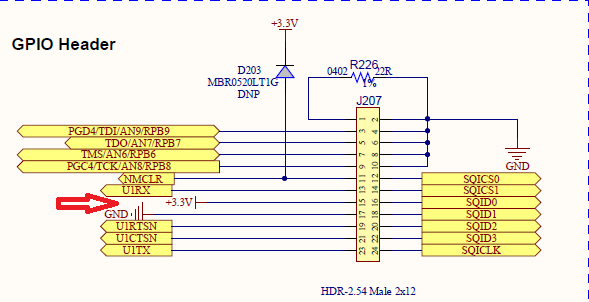
</p>
<p align="center">
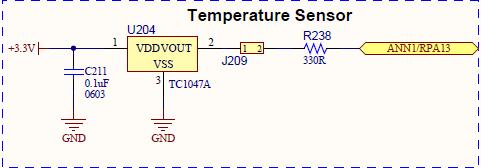
</p>
[Example avaialable here] (https://github.com/Microchip-MPLAB-Harmony/csp_apps_pic32mz_w1/tree/master/apps/adchs/adchs_polled/firmware/pic32mz_w1_curiosity.X). 

To reduce the noise of the measurement and get a stable 12-bit ADC, two digital filtering techniques have been implemented in the code.


### Try it

1. Clone/download the repo [csp_apps_pic32mz_w1](https://github.com/Microchip-MPLAB-Harmony/csp_apps_pic32mz_w1/)
1. Project will be avaiable at `<HarmonyFramework>/csp_apps_pic32mz_w1/tree/master/apps/adchs/adchs_polled/firmware/pic32mz_w1_curiosity.
1. Open the project with MPLAB X IDE
1. Build and program the code
1. Disconnect the jumper J209 connection.
1. Connect the jumper J209 pin 2 to GPIO header(J207) pin 15 to supply +3.3V.
1. Observe the result on the console

```bash
-----------------------------------------------
               ADC Sample Demo
-----------------------------------------------

ADC Count = 0xfff, ADC Input Voltage = 3.231248 V
```

<a href="#top">Back to top</a>

## Tips n2 - Touch example with CVD and QT7 Xpro<a name="step2"></a>

### Purpose
Basic CVD provides a touch interface based on selfcapacitance touch sensing. The ADC module embedded in the PIC32MZ-W1 device supports CVD feature by using the shared ADC core to perform a modified scan of all second and third class channels.

### Hardware setup

- Connect [QT7 Xplained Pro](https://www.microchip.com/developmenttools/ProductDetails/atqt7-xpro) to Xpro Header of the WFI32E Curiosity board
- **J211** jumper shorted between pin 2-3 to get IRQ line
- **J209** open that disconnect on-board temperature sensor thus one of the slider Y-line is sharing the same pin

<p align="center">

</p>

> One of the slider sensor line (Y-line2) is connected to U202 and the line is loaded with 10k (R220) resistor. You could remove R220 to not interfere the measurement of the slider sensor.
<p align="center">

</p>

### QT7 Xpro Header and WFI32E01 connections

QT7 uses one slider and two touch buttons

| QT7 Xpro Header Pin | Function | Description | WFI32E01 Module Pin |
| --- | --- | --- | --- |
| 1 | ID | - | - |
| 2 | GND | - | - |
| 3 | Y-LINE-5 | Driven shield | RB6 (X1 in MCC) |
| 4 | Y-LINE-1 | Button 1 Sensor | RA14 (button 0/Y14 in MCC) |
| 5 | LED0 | LED for Slider | RB12 (LED_SLIDER_6 in MCC) |
| 6 | LED6 | LED for Button 1 | RK6 (LED_BUTTON_1 in MCC) |
| 7 | Y-LINE-2 | Slider Sensor | RB8 (slider 0/channel 4/Y8 in MCC) |
| 8 | Y-LINE-3 | Slider Sensor | RA13 (slider 0/channel 3/Y15 in MCC), shared with Temp sensor) |
| 9 | Y-LINE-4 | Slider Sensor | RA10 (slider 0/channel 2/Y17 in MCC) |
| 10 | Y-LINE-0 | Button 2 Sensor | RB2 (button 1/Y2 in MCC) |
| 11 | LED7 | LED for Button 2 | RA5 (LED_BUTTON_2) |
| 12 | LED1 | LED for Slider | RA4 (LED_SLIDER_5) |
| 13 | NC | - | - |
| 14 | NC | - | - |
| 15 | LED2 | LED for Slider | RB7 (LED_SLIDER_4) |
| 16 | LED3 | LED for Slider | RK5 (LED_SLIDER_2) |
| 17 | LED4 | LED for Slider | RK4 (LED_SLIDER_3) |
| 18 | LED5 | LED for Slider | RA11 (LED_SLIDER_1) |
| 19 | GND | - | - |
| 20 | VCC | - | - |


### Steps to add Touch from scratch

- Create a 32-bit Harmony project for PIC32MZW1 device
- Open Harmony Configurator
- Add **PIC32MZ W1 Curiosity BSP** component to project Graph
- Add **Touch/Touch Library** component to project Graph
- Activate the requested components: **ADCHS** and **TMR2**
- Make the connection between **TMR2** and the **Touch** component
<p align="center">


</p>

- Configure ADCHS component from **MCC -> Resource Management -> Plugins -> ADCHS Configuration**
   - Enable Shared ADC7
   - Enable ADC7 Channel
   - Make ADC Clock Source = PBCLK2
<p align="center">

</p>

> ADCHS is required by the Touch Library for sampling the capacitive touch sensors.

- Open **MCC -> Resource Management -> Plugins -> Pin Configuration** and go to **Pin Settings** tab to configure the GPIOs requested to control the LEDs of the QT7 Xpro
  - Give a custom name as below to the following pins
  - Select Function: GPIO, Direction: Out, Latch: High for all pins below 

| Pin Number | Pin ID | Custom name | Function | Direction | Latch |
| --- | --- | --- | --- | --- | --- |
| A16 | RA4 | LED_SLIDER_5 | GPIO | Out | High |
| A24 | RK6 | LED_BUTTON_1 | GPIO | Out | High |
| A47 | RA11 | LED_SLIDER_1 | GPIO | Out | High |
| A51 | RB12 | LED_SLIDER_6 | GPIO | Out | High |
| A57 | RB7 | LED_SLIDER_4 | GPIO | Out | High |
| B15 | RA5 | LED_BUTTON_2 | GPIO | Out | High |
| B18 | RK4 | LED_SLIDER_3 | GPIO | Out | High |
| B19 | RK5 | LED_SLIDER_2 | GPIO | Out | High |

- Open **MCC -> Resource Management -> Plugins -> Touch Configurator**
- Drop a Button sensor type
- Add **2 buttons**
<p align="center">

</p>

- If asked, change and set CPU and Peripheral clocks appropriately for Touch application
<p align="center">

</p>

- Drop a Slider sensort type
- Add **1 slider** with **3 channels**
<p align="center">

</p>

- Sensors configuration have now 2 buttons and 1 slider
<p align="center">

</p>

- Select **Pins** and configure **Pin Selection** as below
<p align="center">

</p>

- Select **Driven Shield**
- Enable **Dedicated Pin**
- Select **X1 (RB6)** pin for the driven shield
<p align="center">

</p>

- Select **Parameters**
- Set over sampling to **32 samples** for all sensors
- Set Gain = **8** for sensor Id 4 (this step is not required if you have removed R220 resistor, check Hardware Setup section)
- Set **20** additional charge cycles
<p align="center">

</p>

- Click **Generate Code**
<p align="center">
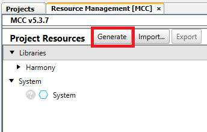
</p>

- ⚠ Make sure to use MCC version higher than v5.3.7
- Open `initialization.c` and observe that during generation, MCC added automatically the function which initialize the touch library (`touch_init()`)
- Open and modify `main.c` as below

```
#include <stddef.h>                     // Defines NULL
#include <stdbool.h>                    // Defines true
#include <stdlib.h>                     // Defines EXIT_FAILURE
#include "definitions.h"                // SYS function prototypes
#include "touch/touch.h"

extern volatile uint8_t measurement_done_touch ;
void touch_statusdisplay(void) ;

int main ( void )
{
    /* Initialize all modules */
    SYS_Initialize ( NULL );

    while ( true )
    {
        /* Maintain state machines of all polled MPLAB Harmony modules. */
        SYS_Tasks ( );

        touch_process() ;
        if (measurement_done_touch == 1)
        {
            touch_statusdisplay() ;
            measurement_done_touch = 0 ;
        }
    }
    /* Execution should not come here during normal operation */
    return ( EXIT_FAILURE );
}

void touch_statusdisplay()
{
    uint8_t key_status = 0 ;
    uint8_t  scroller_status = 0 ;
    uint16_t scroller_position = 0 ;
    key_status = get_sensor_state(0) & 0x80 ;
    if (0u != key_status)
    {
        LED_BUTTON_1_Clear() ;
    }
    else
    {
        LED_BUTTON_1_Set() ;
    }
    key_status = get_sensor_state(1) & 0x80 ;
    if (0u != key_status)
    {
        LED_BUTTON_2_Clear() ;
    }
    else
    {
        LED_BUTTON_2_Set() ;
    }
    scroller_status = get_scroller_state(0) ;
    scroller_position = get_scroller_position(0) ;
    LED_SLIDER_1_Set() ;
    LED_SLIDER_2_Set() ;
    LED_SLIDER_3_Set() ;
    LED_SLIDER_4_Set() ;
    LED_SLIDER_5_Set() ;
    LED_SLIDER_6_Set() ;
 
    if (0u != scroller_status)
    {
        LED_SLIDER_1_Clear() ;
        if (scroller_position > 43)
        {
            LED_SLIDER_2_Clear() ;
        }
        if (scroller_position > 85)
        {
            LED_SLIDER_3_Clear() ;
        }
        if (scroller_position > 120)
        {
            LED_SLIDER_4_Clear() ;
        }
        if (scroller_position > 165)
        {
            LED_SLIDER_5_Clear() ;
        }
        if (scroller_position > 213)
        {
            LED_SLIDER_6_Clear() ;
        }
    }
}

```

### Try it

1. Clone/download the repo
1. Extract the file `touch_qt7xpro.zip` located in `PIC32MZW1_Workshop/07_projects/resources/software/`
1. Open the project with MPLAB X IDE
1. Build and program the code

<p align="center">

</p>

<a href="#top">Back to top</a>

## Tips n3 - Enable USB CDC for printing message using Debug System Service<a name="step3"></a>

### Purpose

Use USB Power connector (J204) to print application logs in a console.

### Hardware setup

- Computer connected to WFI32 Curiositiy board over USB POWER (J204)
- J202 = VBUS
- J301 = open
- J211 = shorted between 1-2

<p align="center">

</p>

### MCC Setup

- Create a 32-bit Harmony project for PIC32MZW1 device
- Open Harmony Configurator
- Add **PIC32MZ W1 Curiosity BSP** component to project Graph
- Add **Harmony/System Services/DEBUG** component to project Graph
  - Reply **Yes** to add **Core**
  - Reply **No** to FreeRTOS
- Add **Harmony/System Services/Console** component to project Graph
  - Right click on **USB_DEVICE_CDC** diamond and satisfy USB_DEVICE_CDC
  - Reply **Yes** to include **USB Device Layer**
  - Reply **Yes** to include **USB Full Speed Driver**
- Make the **USB_DEVICE_CDC** connection between the **CDC Function Driver** and the **CONSOLE** blocks

<p align="center">
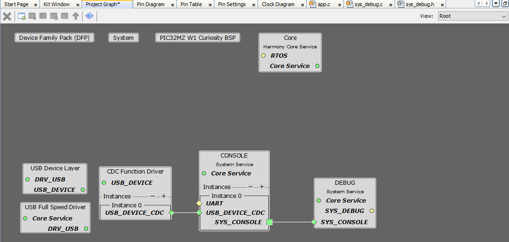
</p>

- Configure **USB Device Layer** component with Product ID Selection = **cdc_com_port_single_demo**
<p align="center">
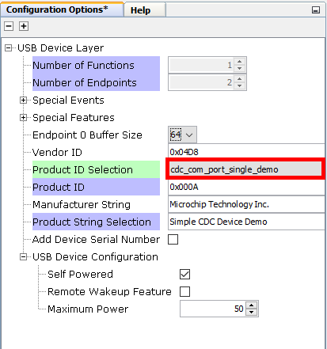
</p>

- Open **MCC -> Resource Management -> Plugins -> Clock Configurator** and enable **USB PLL** to get USBCLK = 96 MHz
<p align="center">
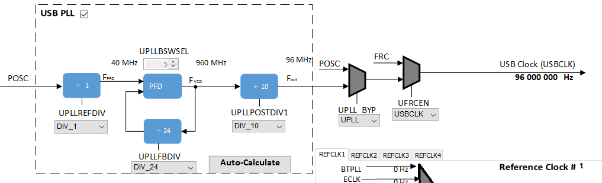
</p>

- Open **Pin Settings** in **MCC -> Resource Management -> Plugins -> Pin Configurator**
- Set **Change Notification** Interrupt for the pin RA10/SWITCH1
<p align="center">
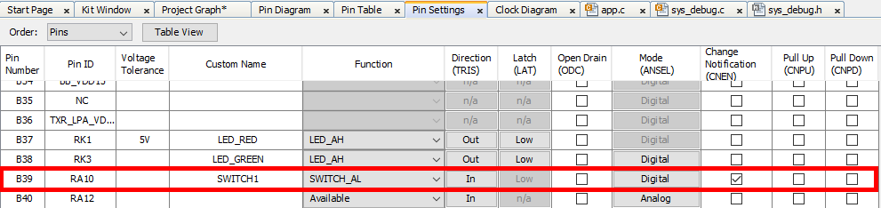
</p>

- Click **Generate Code**
- Open `app.h`
- Use the following application states:
```
typedef enum
{
    /* Application's state machine's initial state. */
    APP_STATE_INIT=0,
    APP_STATE_SERVICE_TASKS,
    APP_STATE_IDLE,
} APP_STATES;
```
- Use the following application data:
```
typedef struct
{
    /* The application's current state */
    APP_STATES state;
    SYS_CONSOLE_HANDLE consoleHandle;
} APP_DATA;
```

- Open `app.c`
- Add `#include "config/../definitions.h"`
- Declare `uint32_t counter = 0 ;` as global variable
- Add the following callback handler:
```
static void SWITCH1_Handler(GPIO_PIN pin, uintptr_t context)
{
    if (SWITCH1_Get() == SWITCH1_STATE_PRESSED)
    {
        if (appData.state == APP_STATE_IDLE)
        {
            appData.state = APP_STATE_SERVICE_TASKS ;
        }
    }
}
```
- Use the following `APP_Initialize()` function:
```
void APP_Initialize ( void )
{
    /* Register interrupt callback for Switch 1 */    
    GPIO_PinInterruptCallbackRegister(GPIO_PIN_RA10, SWITCH1_Handler, 0) ;
    GPIO_PinInterruptEnable(GPIO_PIN_RA10) ;
    /* Place the App state machine in its initial state. */
    appData.state = APP_STATE_INIT ;
}
```

- Use the following `APP_Tasks()` function:
```
void APP_Tasks ( void )
{
    switch ( appData.state )
    {
        case APP_STATE_INIT:
            if (SYS_DEBUG_Status(SYS_CONSOLE_INDEX_0) == SYS_STATUS_READY)
            {
                LED_RED_On() ;
                appData.state = APP_STATE_IDLE ;
            }
            break;
        case APP_STATE_IDLE:
            // do nothing
            break ;
        case APP_STATE_SERVICE_TASKS:
            SYS_DEBUG_MESSAGE(SYS_ERROR_DEBUG, "Test USB Console\r\n") ;
            SYS_DEBUG_PRINT(SYS_ERROR_DEBUG, "Counter value = %d\r\n", counter ++) ;
            appData.state = APP_STATE_IDLE ;
             break ;
        default:
            break;
    }
}
```
Known [issue](https://www.microchip.com/forums/m1142703.aspx)

### Try it

1. Clone/download the repo
1. Extract the file `usb_cdc.zip` located in `PIC32MZW1_Workshop/07_projects/resources/software/`
1. Open the project with MPLAB X IDE
1. Build and program the code
1. Attach the device to the host. If the host is a personal computer and this is the first time you have plugged this device into the computer, you may be prompted for a .inf file.
1. Select the “Install from a list or specific location (Advanced)” option. Specify the `<install-dir>/cdc/inf` directory
1. Verify that the enumerated USB device is seen as a virtual USB serial comport in Device Manager
1. Open USB CDC Com Port with TeraTerm
1. Press SW1 button and observe the console output

<a href="#top">Back to top</a>

## Tips n4 - Enable Robust Wi-Fi Authentication with WPA3<a name="step4"></a>

### Purpose

Guideline to enable Robust Wi-Fi Authentication with WPA3 features.

**Watch the video and see how to enable WPA3 with WFI32E Curiosity board**

<p align="center">
<a href="https://youtu.be/e73SHSPUOvo" target="_blank">
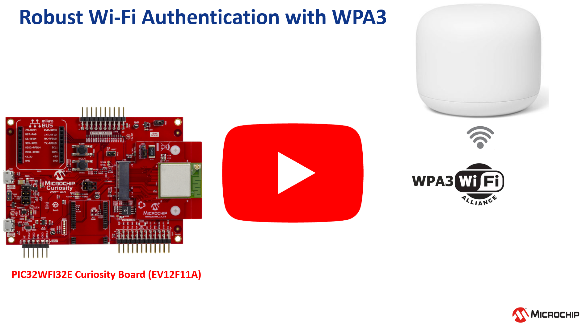</a>
</p>

### WPA3

The original Wi-Fi Protected Access (WPA) standard protocol was released in 2003 to replace the WEP. Then WPA was replaced by WPA2 in 2004.

WPA3 was released in 2020 to increase network security and introduces the use of Protected Management Frames (PMF) as well as the Simultaneous Authentication of Equals (SAE), technique to authenticate clients instead of the Pre-shared key (PKS) used in WPA2-Personal. WPA3's mission is to simplify Wi-Fi security, including better authentication, increased cryptographic strength.

WPA3-Personal allows for better password-based authentication even when using non-complex combinations. WPA3 uses Simultaneous Authentication of Equals (SAE) to provide stronger defenses against password guessing. SAE is a secure key establishment protocol.

<p align="center">
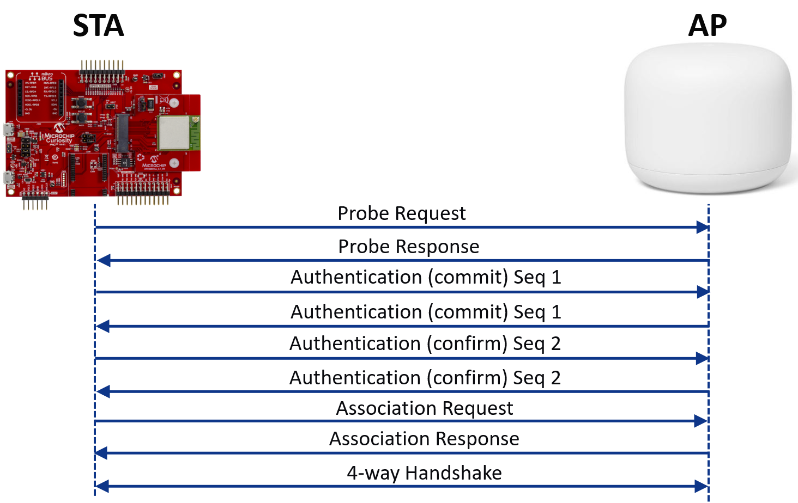
</p>

WPA3-Enterprise provides additional protections for networks transmitting sensitive data by offering the equivalent of 192-bit cryptographic strength. WPA3 networks use a suite of 192-bit cryptographic tools to ensure consistent protection across networks.

Check out [Wi-Fi Alliance](https://www.wi-fi.org/discover-wi-fi/security) for more details on WPA3.

> Currently, PIC32MZW1 does support only WPA3-Personal.

### Hardware setup

- Computer connected to [WFI32 Curiositiy board](https://www.microchip.com/DevelopmentTools/ProductDetails/PartNO/EV12F11A) over USB POWER (J204)
- J202 = VBUS
- J301 = open

USB-to-UART cable between the computer and GPIO Header UART1 pins (Rx, GND, Tx) to observe the console logs.

<p align="center">
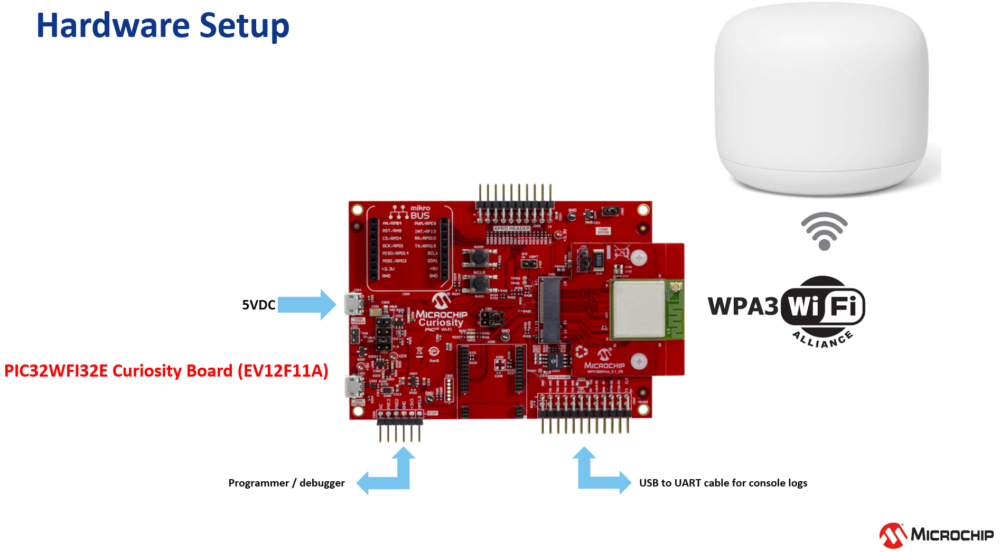
</p>

This demo is using a [Nest WiFi](https://store.google.com/product/nest_wifi) Router with WPA3 capability.

Make sure the router has WPA3 option ENABLED.


### MCC Configuration

To showcase WPA3 features with [WFI32 Curiosity Board](https://www.microchip.com/DevelopmentTools/ProductDetails/PartNO/EV12F11A), make sure the following items are correctly configured in Harmony Configurator of the project.

Project Graph - Root
* Wi-Fi Service, Wi-Fi provisioning are both required

<p align="center">
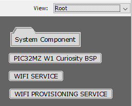
</p>

* FreeRTOS is required

Project Graph - System Component
* **Support WPA3?** is checked
* And BA414E Cryptographic Accelerator is linked to PIC32MZW1
<p align="center">
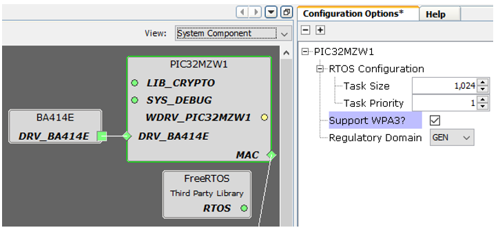
</p>

* Please verify below configuration if you are regenerating the project using MCC
   > - For FreeRTOS WPA3 project change the PIC32MZW1 (Wi-Fi driver) task size to 4096.<br>
   > - In the file  '<HarmonyFramework>/wireless_system_pic32mzw1_wfi32e01\system\wifi\templates\src\sys_wifi.c.ftl' replace the drvWifiPic32mzw1.DRV_WIFI_PIC32MZW1_SUPPORT_WPA3 with drvWifiPic32mzw1.DRV_WIFI_PIC32MZW1_SUPPORT_SAE in 
* Configure the Home AP credentials using MCC or using WiFi Provisioning System Service
<p align="center">
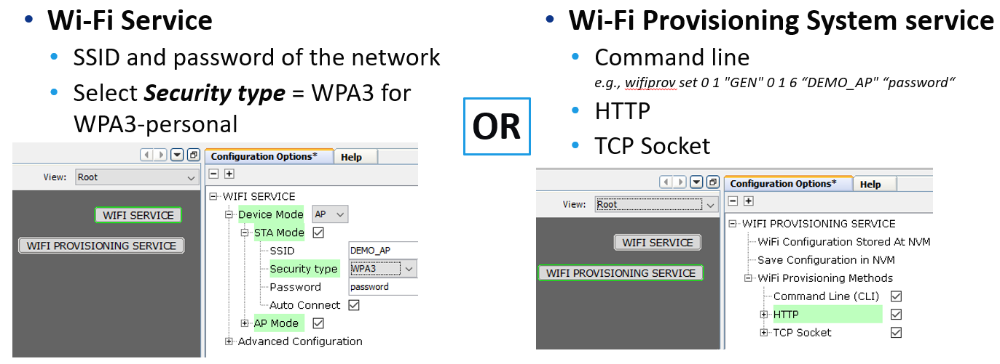
</p>

### Try it

1. Open the project [WiFi Easy Config](https://github.com/Microchip-MPLAB-Harmony/wireless_apps_pic32mzw1_wfi32e01/tree/master/apps/wifi_easy_config) located in `<HarmonyFrameworkFolder>/wireless_app_pic32mzw1_wfi32e01/wifi_easy_config` with MPLAB X IDE
1. Build and program the code
1. Provision your device as a STATION using MCC or using the [WiFi Provisioning System Service](https://microchip-mplab-harmony.github.io/wireless/system/wifiprov/docs/readme.html)
1. The [Wi-Fi service](https://microchip-mplab-harmony.github.io/wireless/system/wifi/docs/readme.html) will use the credentials along with WPA3 security to connect to the Home AP and acquire an IP address
1. 

<p align="center">

</p>

<a href="#top">Back to top</a>

## Tips n5 - How can I make my code generated smaller ?<a name="step5"></a>

### Purpose

Checkout [here](https://microchipsupport.force.com/s/article/Memory-utilization-by-software-subsystems-in-PIC32MZW1---WFI32) to understand the memory utilization by software subsystems in PIC32MZ / WFI32.

**The PRO version of the MPLAB XC32 compiler allow some compilation features to improve the code size generated.**

As a example, let's take the [PIC32MZW1 Curiosity OoB](https://github.com/MicrochipTech/PIC32MZW1_Curiosity_OOB/releases/tag/v2.0.0-RC1) code as reference, and compare the different code size generated using XC32 compiler v3.01 and different compiler options.

| Optimization level | microMIPS enabled | Additional options | Example size details |
| ------------------ | ----------------- | ------------------ | ------ |
| -O1 | No | _ | 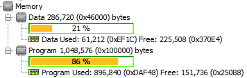 |
| -Os | No | _ | 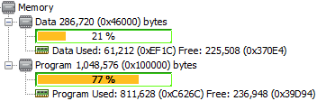 |
| -Os | Yes | -minterlink-compressed | 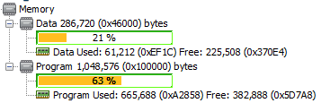 |

Set **-Os** optimization to minimize code size in **Project Properties -> xc32-gcc -> Optimization**
<p align="center">
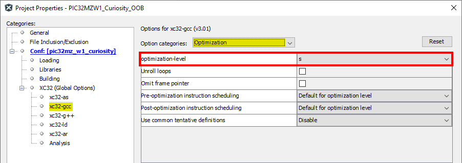
</p>

Use compressed **microMIPS** ISA mode in **Project Properties -> xc32-gcc -> General**. </br> In Additional options text box, add **-minterlink-compressed** to generate code that is link compatible with microMIPS code.
<p align="center">
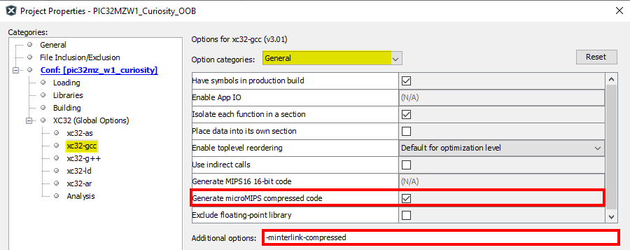
</p>

XC32 compiler offers several optimizations that must be enabled separately and could help reduce the code further - unused function removal is the key one.</br>

To remove unused functions:
* xc32-gcc Compiler: --ffunction-sections
  * "Isolate each function a section"
  * Place each function into its own section in the object
* xc32-ld Linker: --gc-sections
  * "Remove unused sections"
  * Enable garbage collection of unused input sections

> Unused function removal may create problems if the project contains bootloader and functions that are only used by other project.

Many resources are available to explain how to optimize the compilation process, checkout the links below :

* [MPLAB XC32 C/C++ User's Guide](https://www.microchip.com/en-us/development-tools-tools-and-software/mplab-xc-compilers#Documentation)
* [Microchip Developer Help - How Can I reduce memory usage](https://microchipdeveloper.com/faq:84)


<a href="#top">Back to top</a>