# Hub for Experimental Projects
> "Wireless Made Easy!" - Full workshop experience to learn and touch PIC32MZ W1 family

[Back to Main page](../README.md)

## A la carte

1. [ADC example and Digital Filtering](#step1)
1. [Touch example with CVD and QT7 Xpro](#step2)
1. [USB for printing message using Debug System Service](#step3)

## ADC example and Digital Filtering<a name="step1"></a>

### Purpose

The ADCHS Polled example code has been modified with Digital filtering functions to enable a very accurate analog reading for application such as Battery Voltage Measurement.

In this sample code, the ADC channel AN9 has been used because it is easily available on the MikroBUS Header or on the Xpro Header of the PIC32WFI32E Curiosity Board.
<p align="center">
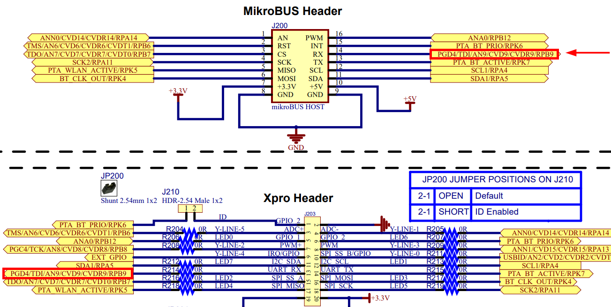
</p>

To reduce the noise of the measurement and get a stable 12-bit ADC, two digital filtering techniques have been implemented in the code.

* Introduction of a Lowpass filter for DC interpolation
  - The Lowpass filter is the easiest to implement and it is adjustable.
  - But, because the Tau is very long (to block the noise as much as possible ), it has the disadvantage of long time sampling before getting the conversion result (about 10 to 20 seconds). To avoid such delay, a +/-20mV barrier was introduced. Any change outside this barrier will lead to load the actual input into the filter taps. And only when the difference between input and output is less than 20mV, the filter is used. The filter reaches its final value much faster but still strongly lowpasses/average/interpolate the result.

* Introduction of a 3rd order polynom to compensate Gain and Offset error
  - To find the coefficients of the Polynom, the program [Scilab](https://www.scilab.org/) has been used.
  - The Scilab script that calculate the compensation polynom coefficient is part of the MPLAB X project in `adchs_polled\firmware\src\calib.sce`.
  - It is necessary to measure in parallel with a good multimeter and read the results also from the terminal. Then put these two rows of data into the script to get the coefficients for the polynom.
  - The calculation is done in emulated float and need 560 instruction cycles (14us@40MHz (Flash bandwidth)).

<p align="center">

</p>

With the two actions above, it is possible to achieve an accuracy of 1mV within less a second. 

### Try it

1. Clone/download the repo
2. Open the project located in `PIC32MZW1_Workshop/07_projects/resources/software/adchs_polled_with_filtering` with MPLAB X IDE
3. Build and program the code
4. Connect a 3.3V battery to AN9 channel
5. Observe the result on the console

```bash
ADC Count = 0xfff, ADC Input Voltage = 3.231248 V
```

## Touch example with CVD and QT7 Xpro<a name="step2"></a>

### Purpose
Basic CVD provides a touch interface based on selfcapacitance touch sensing. The ADC module embedded in the PIC32MZ-W1 device supports CVD feature by using the shared ADC core to perform a modified scan of all second and third class channels.

### Hardware setup

- Connect [QT7 Xplained Pro](https://www.microchip.com/developmenttools/ProductDetails/atqt7-xpro) to Xpro Header of the WFI32E Curiosity board
- **J211** jumper shorted between pin 2-3 to get IRQ line
- **J209** open that disconnect on-board temperature sensor thus one of the slider Y-line is sharing the same pin

<p align="center">
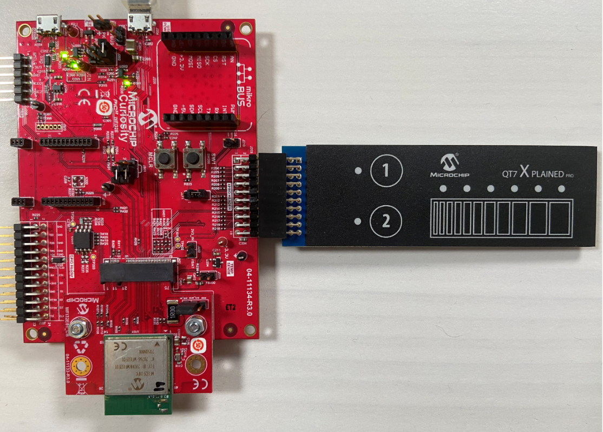
</p>

> One of the slider sensor line (Y-line2) is connected to U202 and the line is loaded with 10k (R220) resistor. You could remove R220 to not interfere the measurement of the slider sensor.
<p align="center">
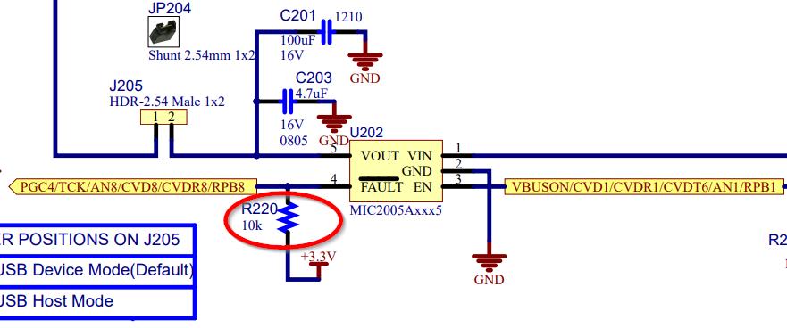
</p>

### QT7 Xpro Header and WFI32E01 connections

QT7 uses one slider and two touch buttons

| QT7 Xpro Header Pin | Function | Description | WFI32E01 Module Pin |
| --- | --- | --- | --- |
| 1 | ID | - | - |
| 2 | GND | - | - |
| 3 | Y-LINE-5 | Driven shield | RB6 (X1 in MHC) |
| 4 | Y-LINE-1 | Button 1 Sensor | RA14 (button 0/Y14 in MHC) |
| 5 | LED0 | LED for Slider | RB12 (LED_SLIDER_6 in MHC) |
| 6 | LED6 | LED for Button 1 | RK6 (LED_BUTTON_1 in MHC) |
| 7 | Y-LINE-2 | Slider Sensor | RB8 (slider 0/channel 4/Y8 in MHC) |
| 8 | Y-LINE-3 | Slider Sensor | RA13 (slider 0/channel 3/Y15 in MHC), shared with Temp sensor) |
| 9 | Y-LINE-4 | Slider Sensor | RA10 (slider 0/channel 2/Y17 in MHC) |
| 10 | Y-LINE-0 | Button 2 Sensor | RB2 (button 1/Y2 in MHC) |
| 11 | LED7 | LED for Button 2 | RA5 (LED_BUTTON_2) |
| 12 | LED1 | LED for Slider | RA4 (LED_SLIDER_5) |
| 13 | NC | - | - |
| 14 | NC | - | - |
| 15 | LED2 | LED for Slider | RB7 (LED_SLIDER_4) |
| 16 | LED3 | LED for Slider | RK5 (LED_SLIDER_2) |
| 17 | LED4 | LED for Slider | RK4 (LED_SLIDER_3) |
| 18 | LED5 | LED for Slider | RA11 (LED_SLIDER_1) |
| 19 | GND | - | - |
| 20 | VCC | - | - |


### Steps to add Touch from scratch

- Create a 32-bit Harmony project for PIC32MZW1 device
- Open Harmony Configurator
- Add **PIC32MZ W1 Curiosity BSP** component to project Graph
- Add **Touch/Touch Library** component to project Graph
- Activate the requested components: **ADCHS** and **TMR2**
- Make the connection between **TMR2** and the **Touch** component
<p align="center">
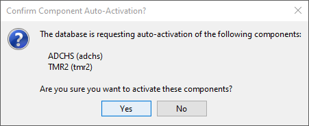

</p>

- Configure ADCHS component from **MHC -> Tools -> ADCHS Configuration**
   - Enable Shared ADC7
   - Enable ADC7 Channel
   - Make ADC Clock Source = PBCLK2
<p align="center">
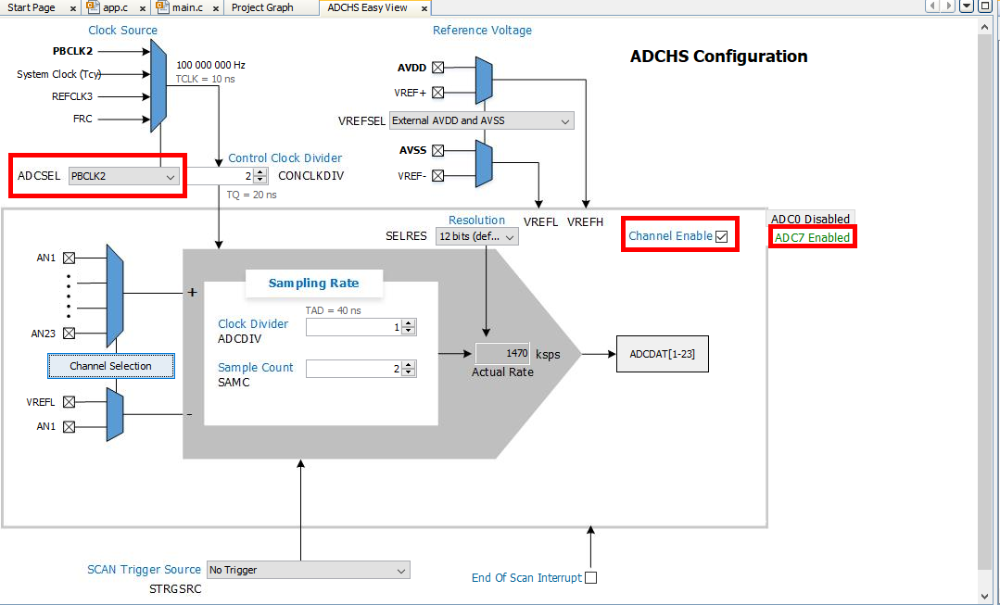
</p>

> ADCHS is required by the Touch Library for sampling the capacitive touch sensors.

- Open **MHC -> Tools -> Pin Configuration** and go to **Pin Settings** tab to configure the GPIOs requested to control the LEDs of the QT7 Xpro
  - Give a custom name as below to the following pins
  - Select Function: GPIO, Direction: Out, Latch: High for all pins below 

| Pin Number | Pin ID | Custom name | Function | Direction | Latch |
| --- | --- | --- | --- | --- | --- |
| A16 | RA4 | LED_SLIDER_5 | GPIO | Out | High |
| A24 | RK6 | LED_BUTTON_1 | GPIO | Out | High |
| A47 | RA11 | LED_SLIDER_1 | GPIO | Out | High |
| A51 | RB12 | LED_SLIDER_6 | GPIO | Out | High |
| A57 | RB7 | LED_SLIDER_4 | GPIO | Out | High |
| B15 | RA5 | LED_BUTTON_2 | GPIO | Out | High |
| B18 | RK4 | LED_SLIDER_3 | GPIO | Out | High |
| B19 | RK5 | LED_SLIDER_2 | GPIO | Out | High |

- Open **MHC -> Tools -> Touch Configurator**
- Drop a Button sensor type
- Add **2 buttons**
<p align="center">
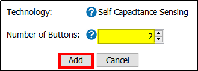
</p>

- If asked, change and set CPU and Peripheral clocks appropriately for Touch application
<p align="center">
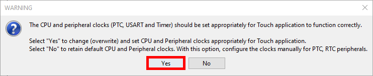
</p>

- Drop a Slider sensort type
- Add **1 slider** with **3 channels**
<p align="center">
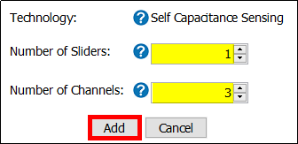
</p>

- Sensors configuration have now 2 buttons and 1 slider
<p align="center">
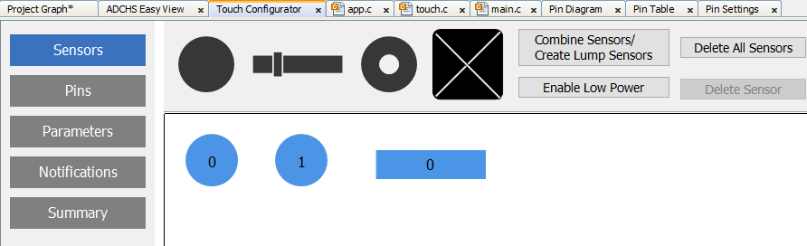
</p>

- Select **Pins** and configure **Pin Selection** as below
<p align="center">
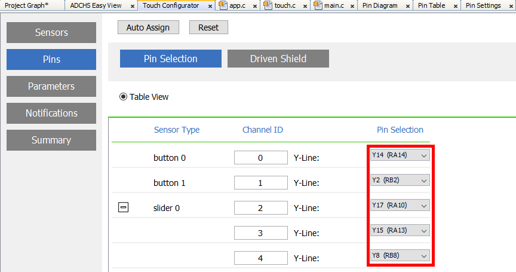
</p>

- Select **Driven Shield**
- Enable **Dedicated Pin**
- Select **X1 (RB6)** pin for the driven shield
<p align="center">
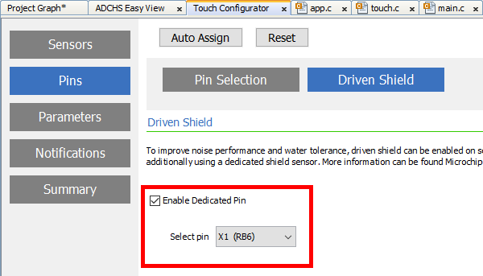
</p>

- Select **Parameters**
- Set over sampling to **32 samples** for all sensors
- Set Gain = **8** for sensor Id 4 (this step is not required if you have removed R220 resistor, check Hardware Setup section)
- Set **20** additional charge cycles
<p align="center">
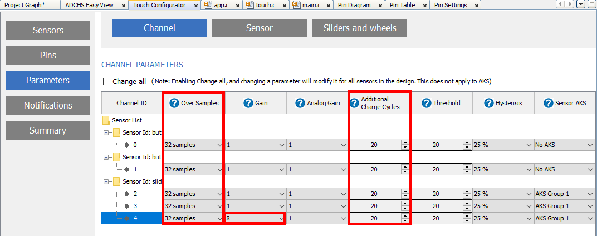
</p>

- Click **Generate Code**
<p align="center">

</p>

- ⚠ Known issue with MHC v3.6.2\
When generating the Touch code (`touch.c`), two functions are generating as `qtm_ptc...` while they should be `qtm_cvd...`
  - Open file `touch.c` located in `config/default/touch` folder and apply the following changes
  - In function `touch_sensors_config()`\
  Replace `qtm_ptc_init_acquisition_module(&qtlib_acq_set1);`\
  by `qtm_cvd_init_acquisition_module(&qtlib_acq_set1);`
  - In function `touch_process()`\
  Replace `touch_ret = qtm_ptc_start_measurement_seq(&qtlib_acq_set1, qtm_measure_complete_callback);`\
  by `touch_ret = qtm_cvd_start_measurement_seq(&qtlib_acq_set1, qtm_measure_complete_callback);`
  - With the above modifications, the compilation will success

- Open `initialization.c` and observe that during generation, MHC added automatically the function which initialize the touch library (`touch_init()`)

- Open and modify `main.c` as below

```
#include <stddef.h>                     // Defines NULL
#include <stdbool.h>                    // Defines true
#include <stdlib.h>                     // Defines EXIT_FAILURE
#include "definitions.h"                // SYS function prototypes
#include "touch/touch.h"

extern volatile uint8_t measurement_done_touch ;
void touch_status_display(void) ;

int main ( void )
{
    /* Initialize all modules */
    SYS_Initialize ( NULL );

    while ( true )
    {
        /* Maintain state machines of all polled MPLAB Harmony modules. */
        SYS_Tasks ( );

        touch_process() ;
        if (measurement_done_touch == 1)
        {
            touch_status_display() ;
            measurement_done_touch = 0 ;
        }
    }
    /* Execution should not come here during normal operation */
    return ( EXIT_FAILURE );
}

void touch_status_display()
{
    uint8_t key_status = 0 ;
    uint8_t  scroller_status = 0 ;
    uint16_t scroller_position = 0 ;
    key_status = get_sensor_state(0) & 0x80 ;
    if (0u != key_status)
    {
        LED_BUTTON_1_Clear() ;
    }
    else
    {
        LED_BUTTON_1_Set() ;
    }
    key_status = get_sensor_state(1) & 0x80 ;
    if (0u != key_status)
    {
        LED_BUTTON_2_Clear() ;
    }
    else
    {
        LED_BUTTON_2_Set() ;
    }
    scroller_status = get_scroller_state(0) ;
    scroller_position = get_scroller_position(0) ;
    LED_SLIDER_1_Set() ;
    LED_SLIDER_2_Set() ;
    LED_SLIDER_3_Set() ;
    LED_SLIDER_4_Set() ;
    LED_SLIDER_5_Set() ;
    LED_SLIDER_6_Set() ;
 
    if (0u != scroller_status)
    {
        LED_SLIDER_1_Clear() ;
        if (scroller_position > 43)
        {
            LED_SLIDER_2_Clear() ;
        }
        if (scroller_position > 85)
        {
            LED_SLIDER_3_Clear() ;
        }
        if (scroller_position > 120)
        {
            LED_SLIDER_4_Clear() ;
        }
        if (scroller_position > 165)
        {
            LED_SLIDER_5_Clear() ;
        }
        if (scroller_position > 213)
        {
            LED_SLIDER_6_Clear() ;
        }
    }
}

```

### Try it

1. Clone/download the repo
2. Open the project located in `PIC32MZW1_Workshop/07_projects/resources/software/touch_qt7xpro` with MPLAB X IDE
3. Build and program the code

<p align="center">
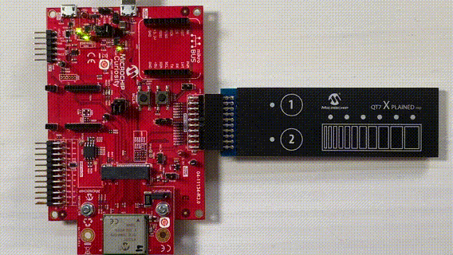
</p>

## USB CDC for printing message using Debug System Service<a name="step3"></a>

### Purpose

Use USB Power connector (J204) to print application logs in a console.

### Hardware setup

- Computer connected to WFI32 Curiositiy board over USB POWER (J204)
- J202 = VBUS
- J301 = open
- J211 = shorted between 1-2

<p align="center">
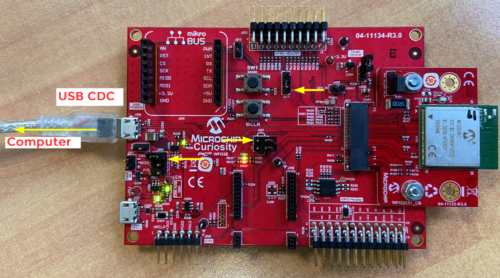
</p>

### MHC Setup

- Create a 32-bit Harmony project for PIC32MZW1 device
- Open Harmony Configurator
- Add **PIC32MZ W1 Curiosity BSP** component to project Graph
- Add **Harmony/System Services/DEBUG** component to project Graph
  - Reply **Yes** to add **Core**
  - Reply **No** to FreeRTOS
- Add **Harmony/System Services/Console** component to project Graph
  - Right click on **USB_DEVICE_CDC** diamond and satisfy USB_DEVICE_CDC
  - Reply **Yes** to include **USB Device Layer**
  - Reply **Yes** to include **USB Full Speed Driver**
- Make the **USB_DEVICE_CDC** connection between the **CDC Function Driver** and the **CONSOLE** blocks

<p align="center">
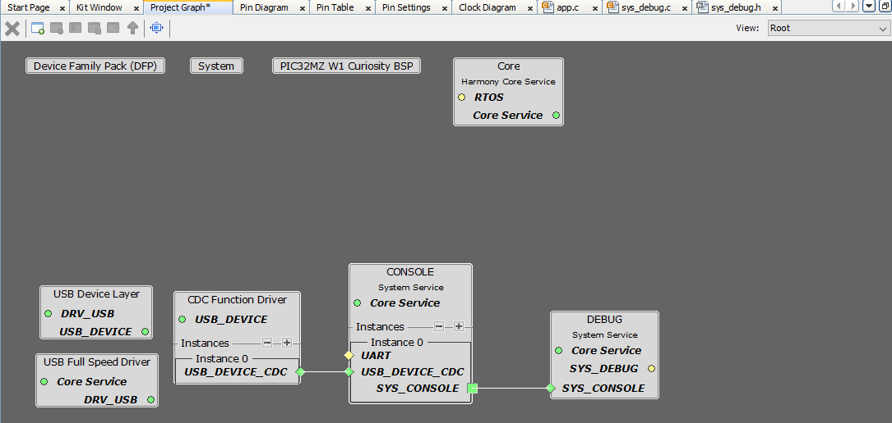
</p>

- Configure **USB Device Layer** component with Product ID Selection = **cdc_com_port_single_demo**
<p align="center">
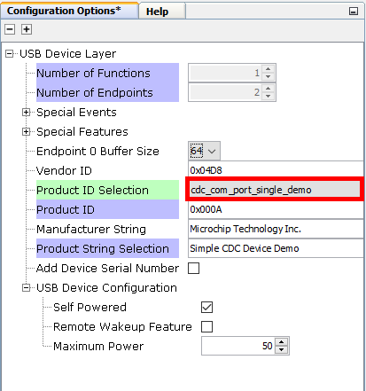
</p>

- Open **MHC/Tools/Clock Configurator** and enable **USB PLL** to get USBCLK = 96 MHz
<p align="center">
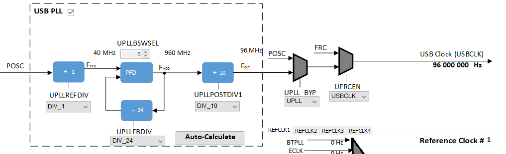
</p>

- Open **Pin Settings** in **MHC/Tools/Pin Configurator**
- Set **Change Notification** Interrupt for the pin RA10/SWITCH1
<p align="center">
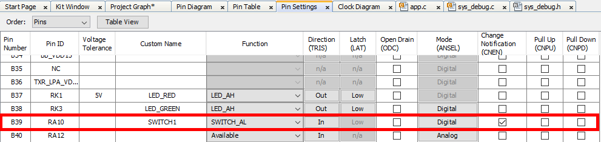
</p>

- Click **Generate Code**
- Open `app.h`
- Use the following application states:
```
typedef enum
{
    /* Application's state machine's initial state. */
    APP_STATE_INIT=0,
    APP_STATE_SERVICE_TASKS,
    APP_STATE_IDLE,
} APP_STATES;
```
- Use the following application data:
```
typedef struct
{
    /* The application's current state */
    APP_STATES state;
    SYS_CONSOLE_HANDLE consoleHandle;
} APP_DATA;
```

- Open `app.c`
- Add `#include "config/../definitions.h"`
- Declare `uint32_t counter = 0 ;` as global variable
- Add the following callback handler:
```
static void SWITCH1_Handler(GPIO_PIN pin, uintptr_t context)
{
    if (SWITCH1_Get() == SWITCH1_STATE_PRESSED)
    {
        if (appData.state == APP_STATE_IDLE)
        {
            appData.state = APP_STATE_SERVICE_TASKS ;
        }
    }
}
```
- Use the following `APP_Initialize()` function:
```
void APP_Initialize ( void )
{
    /* Register interrupt callback for Switch 1 */    
    GPIO_PinInterruptCallbackRegister(GPIO_PIN_RA10, SWITCH1_Handler, 0) ;
    GPIO_PinInterruptEnable(GPIO_PIN_RA10) ;
    /* Place the App state machine in its initial state. */
    appData.state = APP_STATE_INIT ;
}
```

- Use the following `APP_Tasks()` function:
```
void APP_Tasks ( void )
{
    switch ( appData.state )
    {
        case APP_STATE_INIT:
            if (SYS_DEBUG_Status(SYS_CONSOLE_INDEX_0) == SYS_STATUS_READY)
            {
                LED_RED_On() ;
                appData.state = APP_STATE_IDLE ;
            }
            break;
        case APP_STATE_IDLE:
            // do nothing
            break ;
        case APP_STATE_SERVICE_TASKS:
            SYS_DEBUG_MESSAGE(SYS_ERROR_DEBUG, "Test USB Console\r\n") ;
            SYS_DEBUG_PRINT(SYS_ERROR_DEBUG, "Counter value = %d\r\n", counter ++) ;
            appData.state = APP_STATE_IDLE ;
             break ;
        default:
            break;
    }
}
```
Known [issue](https://www.microchip.com/forums/m1142703.aspx)

### Try it

1. Clone/download the repo
2. Open the project located in `PIC32MZW1_Workshop/07_projects/resources/software/usb_cdc` with MPLAB X IDE
3. Build and program the code
4. Attach the device to the host. If the host is a personal computer and this is the first time you have plugged this device into the computer, you may be prompted for a .inf file.
5. Select the “Install from a list or specific location (Advanced)” option. Specify the `<install-dir>/cdc/inf` directory
6. Verify that the enumerated USB device is seen as a virtual USB serial comport in Device Manager
7. Open USB CDC Com Port with TeraTerm
8. Press SW1 button and observe the console output


<a href="#top">Back to top</a>