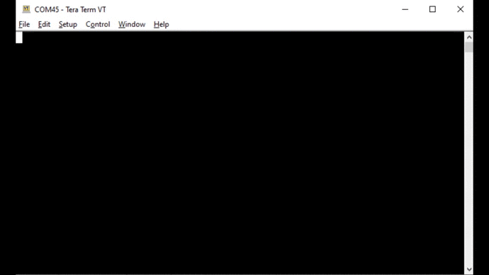

# Hub for Additional Projects
> "Wireless Made Easy!" - Full workshop experience to learn and touch PIC32MZ W1 family

[Back to Main page](../README.md)

## A la carte

1. [ADC example and Digital Filtering](#step1)
1. [Touch example with CVD and QT7 Xpro](#step2)
1. [USB for printing message using Debug System Service](#step3)
1. [Wi-Fi Provisioning over BLE](#step4)
1. [Wi-Fi Touch and OLED Display](#step5)
1. [Enable Robust Wi-Fi Authentication with WPA3](#step6)
1. [Enable L2 Bridging with WLAN & LAN on a single network](#step7)
1. [Enable CAN-WiFi Bridge](#step8)
1. [Enable a simple Webserver Application](#step9)
1. [Enable Long-range communication to Wi-Fi AP Scan](#step10)

More additional projects, checkout [here](https://github.com/MicrochipTech/PIC32MZW1_Projects)

## ADC example and Digital Filtering<a name="step1"></a>

### Purpose

The ADCHS Polled example code has been modified with Digital filtering functions to enable a very accurate analog reading for application such as Battery Voltage Measurement.

In this sample code, the ADC channel AN9 has been used because it is easily available on the MikroBUS Header or on the Xpro Header of the PIC32WFI32E Curiosity Board.
<p align="center">

</p>

To reduce the noise of the measurement and get a stable 12-bit ADC, two digital filtering techniques have been implemented in the code.

* Introduction of a Lowpass filter for DC interpolation
  - The Lowpass filter is the easiest to implement and it is adjustable.
  - But, because the Tau is very long (to block the noise as much as possible ), it has the disadvantage of long time sampling before getting the conversion result (about 10 to 20 seconds). To avoid such delay, a +/-20mV barrier was introduced. Any change outside this barrier will lead to load the actual input into the filter taps. And only when the difference between input and output is less than 20mV, the filter is used. The filter reaches its final value much faster but still strongly lowpasses/average/interpolate the result.

* Introduction of a 3rd order polynom to compensate Gain and Offset error
  - To find the coefficients of the Polynom, the program [Scilab](https://www.scilab.org/) has been used.
  - The Scilab script that calculate the compensation polynom coefficient is part of the MPLAB X project in `adchs_polled\firmware\src\calib.sce`.
  - It is necessary to measure in parallel with a good multimeter and read the results also from the terminal. Then put these two rows of data into the script to get the coefficients for the polynom.
  - The calculation is done in emulated float and need 560 instruction cycles (14us@40MHz (Flash bandwidth)).

<p align="center">

</p>

With the two actions above, it is possible to achieve an accuracy of 1mV within less a second. 

### Try it

1. Clone/download the repo
1. Extract the file `adchs_polled_with_filtering.zip` located in `PIC32MZW1_Workshop/07_projects/resources/software/`
1. Open the project with MPLAB X IDE
1. Build and program the code
1. Connect a 3.3V battery to AN9 channel
1. Observe the result on the console

```bash
ADC Count = 0xfff, ADC Input Voltage = 3.231248 V
```

## Touch example with CVD and QT7 Xpro<a name="step2"></a>

### Purpose
Basic CVD provides a touch interface based on selfcapacitance touch sensing. The ADC module embedded in the PIC32MZ-W1 device supports CVD feature by using the shared ADC core to perform a modified scan of all second and third class channels.

### Hardware setup

- Connect [QT7 Xplained Pro](https://www.microchip.com/developmenttools/ProductDetails/atqt7-xpro) to Xpro Header of the WFI32E Curiosity board
- **J211** jumper shorted between pin 2-3 to get IRQ line
- **J209** open that disconnect on-board temperature sensor thus one of the slider Y-line is sharing the same pin

<p align="center">

</p>

> One of the slider sensor line (Y-line2) is connected to U202 and the line is loaded with 10k (R220) resistor. You could remove R220 to not interfere the measurement of the slider sensor.
<p align="center">

</p>

### QT7 Xpro Header and WFI32E01 connections

QT7 uses one slider and two touch buttons

| QT7 Xpro Header Pin | Function | Description | WFI32E01 Module Pin |
| --- | --- | --- | --- |
| 1 | ID | - | - |
| 2 | GND | - | - |
| 3 | Y-LINE-5 | Driven shield | RB6 (X1 in MHC) |
| 4 | Y-LINE-1 | Button 1 Sensor | RA14 (button 0/Y14 in MHC) |
| 5 | LED0 | LED for Slider | RB12 (LED_SLIDER_6 in MHC) |
| 6 | LED6 | LED for Button 1 | RK6 (LED_BUTTON_1 in MHC) |
| 7 | Y-LINE-2 | Slider Sensor | RB8 (slider 0/channel 4/Y8 in MHC) |
| 8 | Y-LINE-3 | Slider Sensor | RA13 (slider 0/channel 3/Y15 in MHC), shared with Temp sensor) |
| 9 | Y-LINE-4 | Slider Sensor | RA10 (slider 0/channel 2/Y17 in MHC) |
| 10 | Y-LINE-0 | Button 2 Sensor | RB2 (button 1/Y2 in MHC) |
| 11 | LED7 | LED for Button 2 | RA5 (LED_BUTTON_2) |
| 12 | LED1 | LED for Slider | RA4 (LED_SLIDER_5) |
| 13 | NC | - | - |
| 14 | NC | - | - |
| 15 | LED2 | LED for Slider | RB7 (LED_SLIDER_4) |
| 16 | LED3 | LED for Slider | RK5 (LED_SLIDER_2) |
| 17 | LED4 | LED for Slider | RK4 (LED_SLIDER_3) |
| 18 | LED5 | LED for Slider | RA11 (LED_SLIDER_1) |
| 19 | GND | - | - |
| 20 | VCC | - | - |


### Steps to add Touch from scratch

- Create a 32-bit Harmony project for PIC32MZW1 device
- Open Harmony Configurator
- Add **PIC32MZ W1 Curiosity BSP** component to project Graph
- Add **Touch/Touch Library** component to project Graph
- Activate the requested components: **ADCHS** and **TMR2**
- Make the connection between **TMR2** and the **Touch** component
<p align="center">


</p>

- Configure ADCHS component from **MHC -> Tools -> ADCHS Configuration**
   - Enable Shared ADC7
   - Enable ADC7 Channel
   - Make ADC Clock Source = PBCLK2
<p align="center">

</p>

> ADCHS is required by the Touch Library for sampling the capacitive touch sensors.

- Open **MHC -> Tools -> Pin Configuration** and go to **Pin Settings** tab to configure the GPIOs requested to control the LEDs of the QT7 Xpro
  - Give a custom name as below to the following pins
  - Select Function: GPIO, Direction: Out, Latch: High for all pins below 

| Pin Number | Pin ID | Custom name | Function | Direction | Latch |
| --- | --- | --- | --- | --- | --- |
| A16 | RA4 | LED_SLIDER_5 | GPIO | Out | High |
| A24 | RK6 | LED_BUTTON_1 | GPIO | Out | High |
| A47 | RA11 | LED_SLIDER_1 | GPIO | Out | High |
| A51 | RB12 | LED_SLIDER_6 | GPIO | Out | High |
| A57 | RB7 | LED_SLIDER_4 | GPIO | Out | High |
| B15 | RA5 | LED_BUTTON_2 | GPIO | Out | High |
| B18 | RK4 | LED_SLIDER_3 | GPIO | Out | High |
| B19 | RK5 | LED_SLIDER_2 | GPIO | Out | High |

- Open **MHC -> Tools -> Touch Configurator**
- Drop a Button sensor type
- Add **2 buttons**
<p align="center">

</p>

- If asked, change and set CPU and Peripheral clocks appropriately for Touch application
<p align="center">

</p>

- Drop a Slider sensort type
- Add **1 slider** with **3 channels**
<p align="center">

</p>

- Sensors configuration have now 2 buttons and 1 slider
<p align="center">

</p>

- Select **Pins** and configure **Pin Selection** as below
<p align="center">

</p>

- Select **Driven Shield**
- Enable **Dedicated Pin**
- Select **X1 (RB6)** pin for the driven shield
<p align="center">

</p>

- Select **Parameters**
- Set over sampling to **32 samples** for all sensors
- Set Gain = **8** for sensor Id 4 (this step is not required if you have removed R220 resistor, check Hardware Setup section)
- Set **20** additional charge cycles
<p align="center">

</p>

- Click **Generate Code**
<p align="center">

</p>

- ⚠ Known issue with MHC v3.6.2\
When generating the Touch code (`touch.c`), two functions are generating as `qtm_ptc...` while they should be `qtm_cvd...`
  - Open file `touch.c` located in `config/default/touch` folder and apply the following changes
  - In function `touch_sensors_config()`\
  Replace `qtm_ptc_init_acquisition_module(&qtlib_acq_set1);`\
  by `qtm_cvd_init_acquisition_module(&qtlib_acq_set1);`
  - In function `touch_process()`\
  Replace `touch_ret = qtm_ptc_start_measurement_seq(&qtlib_acq_set1, qtm_measure_complete_callback);`\
  by `touch_ret = qtm_cvd_start_measurement_seq(&qtlib_acq_set1, qtm_measure_complete_callback);`
  - With the above modifications, the compilation will success

- Open `initialization.c` and observe that during generation, MHC added automatically the function which initialize the touch library (`touch_init()`)

- Open and modify `main.c` as below

```
#include <stddef.h>                     // Defines NULL
#include <stdbool.h>                    // Defines true
#include <stdlib.h>                     // Defines EXIT_FAILURE
#include "definitions.h"                // SYS function prototypes
#include "touch/touch.h"

extern volatile uint8_t measurement_done_touch ;
void touch_status_display(void) ;

int main ( void )
{
    /* Initialize all modules */
    SYS_Initialize ( NULL );

    while ( true )
    {
        /* Maintain state machines of all polled MPLAB Harmony modules. */
        SYS_Tasks ( );

        touch_process() ;
        if (measurement_done_touch == 1)
        {
            touch_status_display() ;
            measurement_done_touch = 0 ;
        }
    }
    /* Execution should not come here during normal operation */
    return ( EXIT_FAILURE );
}

void touch_status_display()
{
    uint8_t key_status = 0 ;
    uint8_t  scroller_status = 0 ;
    uint16_t scroller_position = 0 ;
    key_status = get_sensor_state(0) & 0x80 ;
    if (0u != key_status)
    {
        LED_BUTTON_1_Clear() ;
    }
    else
    {
        LED_BUTTON_1_Set() ;
    }
    key_status = get_sensor_state(1) & 0x80 ;
    if (0u != key_status)
    {
        LED_BUTTON_2_Clear() ;
    }
    else
    {
        LED_BUTTON_2_Set() ;
    }
    scroller_status = get_scroller_state(0) ;
    scroller_position = get_scroller_position(0) ;
    LED_SLIDER_1_Set() ;
    LED_SLIDER_2_Set() ;
    LED_SLIDER_3_Set() ;
    LED_SLIDER_4_Set() ;
    LED_SLIDER_5_Set() ;
    LED_SLIDER_6_Set() ;
 
    if (0u != scroller_status)
    {
        LED_SLIDER_1_Clear() ;
        if (scroller_position > 43)
        {
            LED_SLIDER_2_Clear() ;
        }
        if (scroller_position > 85)
        {
            LED_SLIDER_3_Clear() ;
        }
        if (scroller_position > 120)
        {
            LED_SLIDER_4_Clear() ;
        }
        if (scroller_position > 165)
        {
            LED_SLIDER_5_Clear() ;
        }
        if (scroller_position > 213)
        {
            LED_SLIDER_6_Clear() ;
        }
    }
}

```

### Try it

1. Clone/download the repo
1. Extract the file `touch_qt7xpro.zip` located in `PIC32MZW1_Workshop/07_projects/resources/software/`
1. Open the project with MPLAB X IDE
1. Build and program the code

<p align="center">

</p>

## USB CDC for printing message using Debug System Service<a name="step3"></a>

### Purpose

Use USB Power connector (J204) to print application logs in a console.

### Hardware setup

- Computer connected to WFI32 Curiositiy board over USB POWER (J204)
- J202 = VBUS
- J301 = open
- J211 = shorted between 1-2

<p align="center">

</p>

### MHC Setup

- Create a 32-bit Harmony project for PIC32MZW1 device
- Open Harmony Configurator
- Add **PIC32MZ W1 Curiosity BSP** component to project Graph
- Add **Harmony/System Services/DEBUG** component to project Graph
  - Reply **Yes** to add **Core**
  - Reply **No** to FreeRTOS
- Add **Harmony/System Services/Console** component to project Graph
  - Right click on **USB_DEVICE_CDC** diamond and satisfy USB_DEVICE_CDC
  - Reply **Yes** to include **USB Device Layer**
  - Reply **Yes** to include **USB Full Speed Driver**
- Make the **USB_DEVICE_CDC** connection between the **CDC Function Driver** and the **CONSOLE** blocks

<p align="center">

</p>

- Configure **USB Device Layer** component with Product ID Selection = **cdc_com_port_single_demo**
<p align="center">

</p>

- Open **MHC/Tools/Clock Configurator** and enable **USB PLL** to get USBCLK = 96 MHz
<p align="center">

</p>

- Open **Pin Settings** in **MHC/Tools/Pin Configurator**
- Set **Change Notification** Interrupt for the pin RA10/SWITCH1
<p align="center">

</p>

- Click **Generate Code**
- Open `app.h`
- Use the following application states:
```
typedef enum
{
    /* Application's state machine's initial state. */
    APP_STATE_INIT=0,
    APP_STATE_SERVICE_TASKS,
    APP_STATE_IDLE,
} APP_STATES;
```
- Use the following application data:
```
typedef struct
{
    /* The application's current state */
    APP_STATES state;
    SYS_CONSOLE_HANDLE consoleHandle;
} APP_DATA;
```

- Open `app.c`
- Add `#include "config/../definitions.h"`
- Declare `uint32_t counter = 0 ;` as global variable
- Add the following callback handler:
```
static void SWITCH1_Handler(GPIO_PIN pin, uintptr_t context)
{
    if (SWITCH1_Get() == SWITCH1_STATE_PRESSED)
    {
        if (appData.state == APP_STATE_IDLE)
        {
            appData.state = APP_STATE_SERVICE_TASKS ;
        }
    }
}
```
- Use the following `APP_Initialize()` function:
```
void APP_Initialize ( void )
{
    /* Register interrupt callback for Switch 1 */    
    GPIO_PinInterruptCallbackRegister(GPIO_PIN_RA10, SWITCH1_Handler, 0) ;
    GPIO_PinInterruptEnable(GPIO_PIN_RA10) ;
    /* Place the App state machine in its initial state. */
    appData.state = APP_STATE_INIT ;
}
```

- Use the following `APP_Tasks()` function:
```
void APP_Tasks ( void )
{
    switch ( appData.state )
    {
        case APP_STATE_INIT:
            if (SYS_DEBUG_Status(SYS_CONSOLE_INDEX_0) == SYS_STATUS_READY)
            {
                LED_RED_On() ;
                appData.state = APP_STATE_IDLE ;
            }
            break;
        case APP_STATE_IDLE:
            // do nothing
            break ;
        case APP_STATE_SERVICE_TASKS:
            SYS_DEBUG_MESSAGE(SYS_ERROR_DEBUG, "Test USB Console\r\n") ;
            SYS_DEBUG_PRINT(SYS_ERROR_DEBUG, "Counter value = %d\r\n", counter ++) ;
            appData.state = APP_STATE_IDLE ;
             break ;
        default:
            break;
    }
}
```
Known [issue](https://www.microchip.com/forums/m1142703.aspx)

### Try it

1. Clone/download the repo
1. Extract the file `usb_cdc.zip` located in `PIC32MZW1_Workshop/07_projects/resources/software/`
1. Open the project with MPLAB X IDE
1. Build and program the code
1. Attach the device to the host. If the host is a personal computer and this is the first time you have plugged this device into the computer, you may be prompted for a .inf file.
1. Select the “Install from a list or specific location (Advanced)” option. Specify the `<install-dir>/cdc/inf` directory
1. Verify that the enumerated USB device is seen as a virtual USB serial comport in Device Manager
1. Open USB CDC Com Port with TeraTerm
1. Press SW1 button and observe the console output


## Wi-Fi Provisioning over BLE<a name="step4"></a>

### Purpose

Attach external BLE device to WFI32E Curiosity board and enable Wi-Fi communication and configuration over BLE.

**Watch the video and see how to enable Wi-Fi provisioning over BLE with WFI32E Curiosity board**

<p align="center">
<a href="https://youtu.be/HWui3HDnw80" target="_blank">
</a>
</p>

### Hardware setup

- Computer connected to WFI32 Curiositiy board over USB POWER (J204)
- J202 = VBUS
- J301 = open

USB-to-UART cable between the computer and GPIO Header UART1 pins (Rx, GND, Tx) to observe the console logs.

Attach a [RN4871 click](https://www.mikroe.com/rn4871-click) or [RN4870 click](https://www.mikroe.com/rn4870-click) to mikro BUS Header.

<p align="center">

</p>

### Generate QR code for Wi-Fi provisioning

A QR code is used in the demo to provision the Wi-Fi configuration over BLE.

To be recognized by the `BLE_PROVISIONING` sample application, the QR code must contains a string of characters which respect the following format:

**Frame Format:** `&wifiprov|<ssid>|<authtype>|<password>&`

Where `&` is used to indicate the start and the end of the frame.

`wifiprov` is required and used as a command keyword.

`|` is required and used as a separator.

`<ssid>` is the name of the router / network.

`authtype` represents the security type:
- 1: OPEN mode
- 3: WPAWPA2 (Mixed) mode
- 4: WPA2 mode
- 5: WPA2WPA3 (Mixed) mode
- 6: WPA3 mode

`password` is not required in Open mode

**e.g.:** `&wifiprov|DEMO_AP|3|password&`

Create your own QR code from: [https://www.the-qrcode-generator.com/](https://www.the-qrcode-generator.com/)

<p align="center">

</p>

### Try Wi-Fi over BLE

- Clone/download the repo
- Extract the file `ble_provisioning.zip` located in `PIC32MZW1_Workshop/07_projects/resources/software/`
- Open the project with MPLAB X IDE
- Build and program the code
- Open Tera Term to observe console logs
- Application starts in AP mode
```
TCP/IP Stack: Initialization Started
TCP/IP Stack: Initialization Ended - success

 mode=1 (0-STA,1-AP) saveConfig=1

 AP Configuration :
 channel=1
 ssidVisibility=1
 ssid=DEMO_AP_SOFTAP
 passphase=password
 authentication type=4 (1-Open,2-WEP,3-Mixed mode(WPA/WPA2),4-WPA2,5-Mixed mode(WPA2/WPA3),6-WPA3)
PIC32MZW1 AP Mode IP Address: 192.168.1.1
[APP_BLE] Init.
[APP_BLE] Configuration done.
Open Microchip Bluetooth Data App
- Select BLE UART and BM70
- Connect to your device WFI32_xxxx
- Select Transparent
- Frame format for Wi-Fi provisioning over BLE:
&wifiprov|<ssid>|<authtype>|<password>&
1: Open, 3: WPAWPA2, 4: WPA2, 5: WPA2WPA3, 6: WPA3
e.g. &wifiprov|DEMO_AP|3|password&
```
- Scan the QR code from the smartphone
- Copy your own Wi-Fi provisioning frame
- Open Microchip Bluetooth Data App
- Select BLE UART then BM70
<p align="center">


</p>

- Connect and select your WFI32_xxxx device
```
[APP_BLE] Connected
```
- Select Transparent option
```
[APP_BLE] Transparent stream opened
```

<p align="center">


</p>

- Paste (or enter the data manually) and send the Wi-Fi provisioning frame

<p align="center">

</p>

- Application restarts in STA mode using the new Wi-Fi configuration
- Application gets and IP address from the network

```
[APP_BLE] Frame received
SSID: DEMO_AP - AUTH: 3 - PASS: password
Wi-Fi Configuration done.ðTCP/IP Stack: Initialization Started
TCP/IP Stack: Initialization Ended - success

 mode=0 (0-STA,1-AP) saveConfig=1

 STA Configuration :
 channel=0
 autoConnect=1
 ssid=DEMO_AP
 passphase=password
 authentication type=3 (1-Open,2-WEP,3-Mixed mode(WPA/WPA2),4-WPA2,5-Mixed mode(WPA2/WPA3),6-WPA3)
[APP_BLE] Init.
[APP_BLE] Configuration done.
Open Microchip Bluetooth Data App
- Select BLE UART and BM70
- Connect to your device WFI32_xxxx
- Select Transparent
- Frame format for Wi-Fi provisioning over BLE:
&wifiprov|<ssid>|<authtype>|<password>&
1: Open, 3: WPAWPA2, 4: WPA2, 5: WPA2WPA3, 6: WPA3
e.g. &wifiprov|DEMO_AP|3|password&
 Trying to connect to SSID : DEMO_AP
 STA Connection failed.

 Trying to connect to SSID : DEMO_AP
 STA Connection failed.

IP address obtained = 192.168.1.149
Gateway IP address = 192.168.1.1
```

### Try BLE Serial Bridge

1. Clone/download the repo
1. Extract the file `ble_serialbridge.zip` located in `PIC32MZW1_Workshop/07_projects/resources/software/`
1. Open the project with MPLAB X IDE
1. Build and program the code
1. Communicate with the BLE module from the UART console using ASCII commands described in [RN4870-71 User Guide](https://ww1.microchip.com/downloads/en/DeviceDoc/RN4870-71-Bluetooth-Low-Energy-Module-User-Guide-DS50002466C.pdf)

<p align="center">

</p>

## Wi-Fi Touch and OLED Display<a name="step5"></a>

### Purpose

Sample application showcasing Wi-Fi connectivity, Capacitive Touch and OLED Display control.

The application acts as a TCP Server to which a TCP Client can connect and visualize QT7 Touch Xpro data. 

The Touch data are also printed on an OLED Display.

**Watch the video and see in action this All-in-one application with WFI32E Curiosity board**

<p align="center">
<a href="https://youtu.be/swsQUucujnM" target="_blank">
</a>
</p>

### Hardware setup

- **J211** jumper shorted between pin 2-3 to get IRQ line
- **J209** open that disconnect on-board temperature sensor thus one of the slider Y-line is sharing the same pin

- Follow the instructions described [in a previous section](#step2) to setup the [WFI32 Curiosity Board](https://www.microchip.com/DevelopmentTools/ProductDetails/PartNO/EV12F11A) and enable Touch functionality with [QT7 Xplained Pro](https://www.microchip.com/developmenttools/ProductDetails/atqt7-xpro)
- Connect [QT7 Xplained Pro](https://www.microchip.com/developmenttools/ProductDetails/atqt7-xpro) to Xpro Header of the WFI32E Curiosity board

- Order the [OLED W click board](https://www.mikroe.com/oled-w-click)
- Make sure the **RST** pin of the [OLED W click](https://www.mikroe.com/oled-w-click) is not connected to the WFI32 Curiosity board (RB6 signal) but connected to a permanent 3.3V (here connected to J402 3V3_IN).\
The RB6 signal is already connected to the QT7 Xplained Pro board and used for the Capacitive Touch Driven Shield.

With this modification, the WFI32 does not control the RESET line of the OLED W click and the display is ON all the time.

<p align="center">


</p>

- Then attach the [OLED W click](https://www.mikroe.com/rn4871-click) to mikro BUS Header.

<p align="center">


</p>

<p align="center">

</p>

### OLED W click

The [OLED W click](https://www.mikroe.com/oled-w-click) carries a 96 x 39px white monochrome passive matrix OLED display. The display is bright, has a wide viewing angle and low power consumption. To drive the display, [OLED W click](https://www.mikroe.com/oled-w-click) features an [SSD1306](https://www.solomon-systech.com/en/product/display-ic/oled-driver-controller/ssd1306/) controller. Check out the [SSD1306 datasheet](https://cdn-shop.adafruit.com/datasheets/SSD1306.pdf) for more details.

In this demo, the [OLED W click](https://www.mikroe.com/oled-w-click) communicates with the WFI32 MCU through SPI lines.

### MHC Configuration

Project Graph - Root view
* Touch Library using ADCHS and TMR2 components
* Wi-Fi Service, Wi-Fi provisioning and Net services
<p align="center">

</p>

Project Graph - System component view
* SPI2 for OLED W click interface
<p align="center">

</p>

Project Graph - Net service configuration
<p align="center">

</p>

ADCHS Easy View - Enable ADC7
<p align="center">

</p>

Pin Configuration
<p align="center">

</p>

Touch Configuration
<p align="center">


</p>

### Try it

1. Clone/download the repo
1. Extract the file `wifi_touch_oled.zip` located in `PIC32MZW1_Workshop/07_projects/resources/software/`
1. Open the project with MPLAB X IDE
1. Build and program the code
1. Follow the [instructions](https://github.com/Microchip-MPLAB-Harmony/wireless/tree/master/apps/wifi_touch_demo) of the original [Wi-Fi Touch Demo](https://github.com/Microchip-MPLAB-Harmony/wireless/tree/master/apps/wifi_touch_demo) to setup the interaction between TCP Client and TCP Server.

<p align="center">

</p>

> In this sample application, the QT7 Xplained Pro LEDs are not driven. Replacing the LEDs, the OLED Display is used to visualize the Capacitive Touch data from the buttons and the slider.

## Enable Robust Wi-Fi Authentication with WPA3<a name="step6"></a>

### Purpose

Guideline to enable Robust Wi-Fi Authentication with WPA3 features.

**Watch the video and see how to enable WPA3 with WFI32E Curiosity board**

<p align="center">
<a href="https://youtu.be/e73SHSPUOvo" target="_blank">
</a>
</p>

### WPA3

The original Wi-Fi Protected Access (WPA) standard protocol was released in 2003 to replace the WEP. Then WPA was replaced by WPA2 in 2004.

WPA3 was released in 2020 to increase network security and introduces the use of Protected Management Frames (PMF) as well as the Simultaneous Authentication of Equals (SAE), technique to authenticate clients instead of the Pre-shared key (PKS) used in WPA2-Personal. WPA3's mission is to simplify Wi-Fi security, including better authentication, increased cryptographic strength.

WPA3-Personal allows for better password-based authentication even when using non-complex combinations. WPA3 uses Simultaneous Authentication of Equals (SAE) to provide stronger defenses against password guessing. SAE is a secure key establishment protocol.

<p align="center">

</p>

WPA3-Enterprise provides additional protections for networks transmitting sensitive data by offering the equivalent of 192-bit cryptographic strength. WPA3 networks use a suite of 192-bit cryptographic tools to ensure consistent protection across networks.

Check out [Wi-Fi Alliance](https://www.wi-fi.org/discover-wi-fi/security) for more details on WPA3.

> Currently, PIC32MZW1 does support only WPA3-Personal.

### Hardware setup

- Computer connected to [WFI32 Curiositiy board](https://www.microchip.com/DevelopmentTools/ProductDetails/PartNO/EV12F11A) over USB POWER (J204)
- J202 = VBUS
- J301 = open

USB-to-UART cable between the computer and GPIO Header UART1 pins (Rx, GND, Tx) to observe the console logs.

<p align="center">

</p>

This demo is using a [Nest WiFi](https://store.google.com/product/nest_wifi) Router with WPA3 capability.

Make sure the router has WPA3 option ENABLED.


### MHC Configuration

To showcase WPA3 features with [WFI32 Curiosity Board](https://www.microchip.com/DevelopmentTools/ProductDetails/PartNO/EV12F11A), make sure the following items are correctly configured in Harmony Configurator of the project.

Project Graph - Root
* Wi-Fi Service, Wi-Fi provisioning are both required

<p align="center">

</p>

* FreeRTOS is required

Project Graph - System Component
* **Support WPA3?** is checked
* And BA414E Cryptographic Accelerator is linked to PIC32MZW1
<p align="center">

</p>

* Configure the Home AP credentials using MHC or using WiFi Provisioning System Service
<p align="center">

</p>

### Try it

1. Open the project [WiFi Easy Config](https://microchip-mplab-harmony.github.io/wireless/apps/wifi_easy_config/readme.html) located in `<HarmonyFrameworkFolder>/wireless/app/wifi_easy_config` with MPLAB X IDE
1. Build and program the code
1. Provision your device as a STATION using MHC or using the [WiFi Provisioning System Service](https://microchip-mplab-harmony.github.io/wireless/system/wifiprov/docs/readme.html)
1. Follow the [instructions](https://github.com/Microchip-MPLAB-Harmony/wireless/tree/master/apps/wifi_touch_demo) of the original [Wi-Fi Touch Demo](https://github.com/Microchip-MPLAB-Harmony/wireless/tree/master/apps/wifi_touch_demo) to setup the interaction between TCP Client and TCP Server.
1. The [Wi-Fi service](https://microchip-mplab-harmony.github.io/wireless/system/wifi/docs/readme.html) will use the credentials along with WPA3 security to connect to the Home AP and acquire an IP address

<p align="center">

</p>


## Enable L2 Bridging with WLAN & LAN on a single network<a name="step7"></a>

### Purpose

Guideline to configure the WLAN Interface in L2 Bridge Mode (WLAN and LAN on the same Subnet).


**Watch the video and see how to enable L2 Bridging function with WFI32E Curiosity board**

<p align="center">
<a href="https://youtu.be/W9FOUlL607k" target="_blank">
</a>
</p>

### L2 Bridging

From [wikipedia](https://en.wikipedia.org/wiki/Bridging_(networking)), the network bridging is a function that creates a single, aggregate network from more than two communication networks.

Routing and bridging are often misinterpreted as the same function. Routing function allows more than two networks to communicate while remaining as separate/independent networks. Whereas, bridging function connects two separate networks as if they were a single network. 

In the OSI model, bridging is performed in the data link layer (layer 2).

<p align="center">

</p>


Bridging is independent of IP addresses. With one or more wireless segments in the bridged network, the device can be called a wireless bridge. 

Below are the key points to consider while creating a bridging project:
* The bridge knows only MAC addresses and doesn't know anything else
* The bridge nver forwards a packet back to the interface the packet came from to avoid loops
* If the packet destination (MAC) address is multicast or broadcast, the packet will be forwarded on all the other interfaces
   * It will be passed internally to the stack running on top of the bridge too for internal processing
* If the packet destination is unicast:
   * If it is an address of one of the interfaces on the bridge host, the packet will be passed for internal processing
   * If it is the address of a host that the MAC bridge knows about, then the packet will be forwarded only on that interface
      * The bridge knows where various hosts are by looking at the source MAC address of the incoming packets
   * Otherwise it will be forwarded on all interfaces


### Software requirement

PIC32MZW1 can be used as a Wireless Bridge connecting multiple wireless and wired networks to form a single network.

**The bridging functionality can be enabled or disabled using MPLAB Harmony Configurator (MHC) with the NET repo (3.7.1 or above) and Wireless repo (3.4.0 or above).**

### Hardware setup

- Computer connected to [WFI32 Curiositiy board](https://www.microchip.com/DevelopmentTools/ProductDetails/PartNO/EV12F11A) over USB POWER (J204)
- J202 = VBUS
- J301 = open

USB-to-UART cable between the computer and GPIO Header UART1 pins (Rx, GND, Tx) to observe the console logs.

- PIC32 LAN8720 PHY Daughter Board [AC3200043-3](https://www.microchip.com/DevelopmentTools/ProductDetails/AC320004-3) plugged in WFI32 Cursiotiy Board thru J208

<p align="center">

</p>

- An Ethernet cable between PHY Daughter board and the Home Router
<p align="center">

</p>

### MHC Configuration

* Open the project [WiFi-ethernet dual interface](https://microchip-mplab-harmony.github.io/wireless/apps/wifi_eth_dual_interface/readme.html) located in `<HarmonyFrameworkFolder>/wireless/apps/wifi_eth_dual_interface` with MPLAB X IDE

* Open Harmony Configurator

* Under **Project Graph > Root**, set the AP parameters required for a station device to connect to the Bridge in **WiFi Service**

<p align="center">

</p>

* Under **Project Graph > APPLICATION LAYER**:
   * Select **DHCP Server**
   * Untick **DHCP Server Instance 0** box

<p align="center">

</p>

* Under **Project Graph > APPLICATION LAYER**:
   * Select **TCP/IP Application Layer Configuration**
   * Add **DHCP CLIENT** and **DNS CLIENT** components
   * Remove **DHCP Server** 

<p align="center">

</p>

* Under **Project Graph > System Configuration**, make sure the Ethernet and the WiFi MAC instances are enabled in the **NETCONFIG** component

<p align="center">

</p>

* Select the **ETHMAC** component, expand **Ethernet Rx Filters Selection** and check **Accept Not Me Unicast Packets** to enable the promiscuous mode

<p align="center">


</p>

* Select the **MAC Instance 0** from the **NETCONFIG** component 
   * Make sure **IPv4 Static Address** = 0.0.0.0
   * Disable **DHCP Flag**, **DNS Flag** and **Multicast** under **Network Configuration Start-up Flags**
   * Enable **Add Interface to MAC Bridge** under **Advanced Settings**

<p align="center">

</p>

* Select the **MAC Instance 1** from the **NETCONFIG** component
   * Make sure **IPv4 Static Address** = 0.0.0.0
   * Enable **DHCP Flag** and **DNS Flag** under **Network Configuration Start-up Flags**
   * Enable **Add Interface to MAC Bridge** under **Advanced Settings**

<p align="center">

</p>

* Select the **NETCONFIG** component and check **Enable the MAC Bridge Commands**

<p align="center">

</p>

* Generate the code

<p align="center">

</p>

> With the above settings, the WFI32 is now ready to work as a Wi-Fi Network bridge


### Try it

1. Build and program the code
2. Plug the Ethernet cable from the PHY Daughter board to your own Home Router
3. Reset the WFI32E Curiosity board
<p align="center">

</p>

4. Connect a station in Wireless to the WLAN network created by the WFI32 device in SoftAP mode
<p align="center">

</p>

5. To evaluate performance, open iPerf server on a station connected to the Home router thru Ethernet cable

Get the IP address of the server
`> ipconfg`

Run iperf server
`> iperf3 -s`

6. On client side, open iPerf apps or execute `> iperf3 -c <ipaddress of the server>` command from a console

<p align="center">

.............................................

</p>


## Enable CAN-WiFi Bridge<a name="step8"></a>

### Purpose

This example application bridge the CAN Bus and Wi-Fi peripherals to enable data transfer between CAN nodes and Wi-Fi peripherals.

<p align="center">
<a href="https://www.microchip.com/en-us/products/wireless-connectivity/embedded-wi-fi/pic32mz-w1-wi-fi-soc-and-module-family" target="_blank">
</a>
</p>

### Description

This sample application demonstrates how to bridge up the CAN Bus and Wi-Fi peripherals on the WFI32E device which is running in SoftAP Mode. This concentrator device allows to connect the physical CAN-bus to WLAN network. A third-party STA will connect to the WFI32E SoftAP device and a third-party CAN Bus node ([Microchip CAN Bus Analyzer](http://www.microchip.com/Developmenttools/ProductDetails/APGDT002)) will connect to the CAN Bus of the WFI32E device.

<p align="center">

</p>

A TCP Client on the third-party STA will then connect to the TCP Server running on the WFI32E Bridge device. Once connected, the WFI32E device will be able to transmit or receive the network data from the TCP Client. The WFI32E device can also transmit or receive CAN Bus messages from the third-party CAN Bus node.

In this example, the CAN messages are sent from the [Microchip CAN Bus Analyzer](http://www.microchip.com/Developmenttools/ProductDetails/APGDT002). The WFI32E Bridge device forward the CAN Bus messages to the TCP Client (python script) running on a third party STA (computer). The TCP Client (python script) echoes the same message back to the SoftAP device and the WFI32E forward the message back to the CAN Node ([Microchip CAN Bus Analyzer](http://www.microchip.com/Developmenttools/ProductDetails/APGDT002)).

<p align="center">

</p>

### Software requirement

- [CAN Bus Analyzer Software v2.3](https://www.microchip.com/Developmenttools/ProductDetails/APGDT002)
(The tool requires .NET Framework 3.5, if you are facing an issue while installing it on a Windows 10 computer, checkout [here](https://answers.microsoft.com/en-us/windows/forum/all/error-code-0x80240438-while-downloading-net/32e2ab95-526a-4b90-88a8-a118788ecaa7)).

The sample project has been created and tested with the following Software Development Tools:
- MPLAB X IDE v5.50
- MPLAB XC32 v2.50
- MPLAB Harmony v3.6.4
   - mhc v3.7.1
   - csp v3.9.1
   - core v3.9.1
   - wireless_wifi v3.4.1
   - dev_packs v3.9.0
   - wireless_system_pic32mzw1_wfi32e01 v3.4.1
   - wolfssl v4.7.0
   - net v3.7.2
   - crypto v3.7.1
   - CMSIS-FreeRTOS v10.3.1

- Python to run the TCP Client Script

### Hardware setup

* To run the demo, the following additional hardware are required:

   - [Microchip CAN Bus Analyzer Hardware](https://www.microchip.com/Developmenttools/ProductDetails/APGDT002)
   - [ATA6563 click board](https://www.mikroe.com/ata6563-click)
   - USB-to-UART cable

- Computer connected to [WFI32 Curiositiy board](https://www.microchip.com/DevelopmentTools/ProductDetails/PartNO/EV12F11A) over USB POWER (J204)
- J202 = VBUS
- J301 = open

- USB-to-UART cable between the computer and GPIO Header UART1 pins (Rx, GND, Tx) to observe the console logs.

- Connect thru wiring the [ATA6563 click board](https://www.mikroe.com/ata6563-click) to the PIC32MZ W1 Curiosity Board as per the Pi connection below:

| PIC32MZ W1 Curiosity Board | ATA6563 click board |
| ---------------------------| ------------------- |
| AN (RPA14), mikroBUS connector | TX (pin 14) |
| PWM (RPB12), mikroBUS connector | RX (pin 13) |
| +3.3V, mikroBUS connector | 3V3 (pin 7) |
| +5V, mikroBUS connector | 5V (pin 10) |
| GND, mikroBUS connector | GND (pin 9) |

<p align="center">

</p>

- Connect [Microchip CAN Bus Analyzer Hardware](https://www.microchip.com/Developmenttools/ProductDetails/APGDT002) to [ATA6563 click board](https://www.mikroe.com/ata6563-click) using female to female DB9 serial cable.
On both end, the wiring must be direct between the relevant signals:

<p align="center">

</p>

| Pin no | Signal |
| ------ | ------ |
| 1 | - |
| 2 | CAN-Low |
| 3 | GND |
| 4 | - |
| 5 | - |
| 6 | - |
| 7 | CAN-High |
| 8 | - |
| 9 | - |

- Connect [Microchip CAN Bus Analyzer Hardware](https://www.microchip.com/Developmenttools/ProductDetails/APGDT002) to PC using USB Male-A to Male Mini-B cable

- A laptop / mobile device is needed to run the TCP Client script


### ATA6553 click

The [ATA6563 click board](https://www.mikroe.com/ata6563-click) carries the [AT6563](https://www.microchip.com/wwwproducts/en/ata6563) high-speed CAN transceiver. The transceiver is designed for high-speed (up to 5 Mbps) CAN applications in the automotive industry, providing differential transmit and receive capability to (a microcontroller with) a CAN protocol controller. It offers improved electromagnetic compatibility (EMC) and electrostatic discharge (ESD) performance. The transceiver is CAN FD (Flexible data-rate) ready, meaning it has increased data rates in comparison with classic CAN. Check out the [AT6563 datasheet](https://www.microchip.com/wwwproducts/en/ata6563) for more details.

In this demo application, the [ATA6563 click board](https://www.mikroe.com/ata6563-click) communicates with the WFI32 MCU through **CAN1 Bus Lines**.

<p align="center">

</p>

With PPS, the CAN1 RX Line (C1RX) is routed to pin RPA14.

<p align="center">

</p>

And the CAN1 TX Line (C1TX) is routed to pin RPB12.

<p align="center">

</p>

### Try it

1. Clone/download the repo
2. Extract the file `can_wifi_bridge.zip` located in `PIC32MZW1_Workshop/07_projects/resources/software/`
3. Open the project with MPLAB X IDE
4. Open Harmony Configurator

<p align="center">

</p>

5. Under **Project Graph > Root**, set the AP parameters required for a station device to connect to the Bridge in **WIFI SERVICE**

<p align="center">

</p>

6. Under **Project Graph > Root**:
   * Select **Net Service**
   * Currently, **NetService** is configured to run a **TCP Server** which awaits connection from a TCP Client on port **5555**.

7. (if required) Save configurations and generate code via MHC
8. Build and program the code
9. Open a serial terminal (e.g. Tera Term) on the computer
10. Connect to the USB-to-UART COM port and configure the serial settings as follows:
    * Baud: 115200
    * Data: 8 Bits
    * Parity: None
    * Stop: 1 Bit
    * Flow Control: None
11. Reset WFI32E Curiosity Board by pressing MLCR button
12. The bridge device shall come up as SoftAP and then as per the default Net Service configuration, the TCP Server shall come up, awaiting a connection from a TCP Client.
<p align="center">

</p>

13. Connect a Station (Laptop) to the SoftAP (with ssid DEMO_AP_SOFTAP) running on the WFI32E device
<p align="center">

</p>

14. Observe the Station connected to SoftAP device
<p align="center">

</p>

15. Start a TCP Client using Python Script on laptop, giving the server IP as the PIC32MZW1 AP Mode IP Address, and the TCP port as 5555
```
tcp_client <SoftAP Ip Address> <Port No>
```

<p align="center">

</p>

16. TCP Server received a connection
<p align="center">

</p>

17. TCP Client is ready to receive data
<p align="center">

</p>

18. Open [CAN Bus Analyzer](https://www.microchip.com/Developmenttools/ProductDetails/APGDT002) software and make the following configurations:

| Description | Settings |
| ----------- | -------- |
| CAN Bitrate Control | 500 Kbps |
| CAN Mode Control | Normal |
| Bus Termination Control | ON |

<p align="center">

</p>

19. Under **Tools -> Transmit**, send following CAN message from [CAN Bus Analyzer](https://www.microchip.com/Developmenttools/ProductDetails/APGDT002) software

    * ID: 0x469, DLC: 8, DATA: 1, 2, 3, 4, 5, 6, 7, 8

<p align="center">

</p>

20. WFI32E Bridge display the message received on the console
<p align="center">

</p>

21. The Server transfer the CAN message received to the TCP Client. You can observe the CAN message on laptop command prompt.
<p align="center">

</p>

22. The TCP Client echo the same message back to the WFI32E (TCP Server).
<p align="center">

</p>

22. The WFI32E Bridge transfer the TCP Client message to the CAN Bus.\
[CAN Bus Analyzer](https://www.microchip.com/Developmenttools/ProductDetails/APGDT002) software receives the message under **Tools -> Rolling Trace**.

<p align="center">

</p>

### Demo

<p align="center">

</p>


## Enable a simple Webserver Application<a name="step9"></a>

### Purpose

This tutorial shows you how to use MHC to create a simple Webserver Application and will help you get started on developing Wi-Fi-based applications for PIC32 WFI32E MCU using the MPLAB Harmony v3 software framework.

Checkout the content on [Microchip Developer Help](https://microchip.wikidot.com/harmony3:pic32wfi32e-iot-getting-started-training-module)


<a href="#top">Back to top</a>