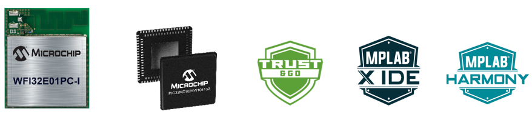
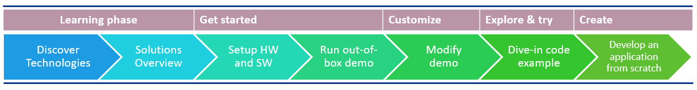

# PIC32MZW1_Workshop

> "Wireless Made Easy!" - Full workshop experience to learn and touch PIC32MZ W1 family

Devices: | **PIC32MZ W1 | WFI32E01** | **Trust\&Go (ECC608)** |

<!--

-->

## Abstract

Start from navigating in the resources available then discover the strengths of PIC32MZ W1 family and learn the ecosystem. Get the evaluation board and enjoy the out-of-box demo capable of publishing temperature sensor data directly to AWS Cloud with minimal setup. Then learn how to modify Microchip sample code to customize to your needs by adding your own sensor or connecting to your own cloud instance. The demo allows to easily control the board with a smart speaker by adding voice control commands in your AWS account.

Then dive-in the collection of code example available and evaluate an existing application from different levels, on a scale from beginner up to advanced users.

Continue the PIC32MZ W1 journey by developing a Secured Smart Home application from scratch with detailed step by step instructions.

## Resources

<!--- [PIC32MZ W1 Family Landing page](https://www.microchip.com/PIC32MZW1)-->
- [WFI32E01 Module Product page, Datasheet, Software User Guide, Family Reference Manual](http://www.microchip.com/wwwproducts/en/WFI32E01PC)
- [WFI32E Curiosity Board](http://www.microchip.com/EV12F11A)
- [WFI32 IoT Board](https://www.microchipdirect.com/dev-tools/EV36W50A?allDevTools=true)
- [MPLAB® Harmony Wireless Wi-Fi](https://github.com/Microchip-MPLAB-Harmony/wireless_wifi)
- [PIC32MZ W1 Wireless API Guide](https://microchip-mplab-harmony.github.io/wireless/driver/pic32mzw1/readme.html)

## A la carte

1. [Discover our Technologies](01_discover/README.md#top)
   1. [Introduction to PIC32MZ W1](01_discover/README.md#step1)
   1. [Smart MCU](01_discover/README.md#step2)
   1. [Radio Performance](01_discover/README.md#step3)
   1. [High Level of Security](01_discover/README.md#step4)
   1. [Block Diagram](01_discover/README.md#step5)
1. [Overview of our Solutions](02_overview/README.md#top)
   1. [Learn about the Curiosity board](02_overview/README.md#step1)
   1. [MPLAB® Harmony 3](02_overview/README.md#step2)
   1. [Trust&GO Integration](02_overview/README.md#step3)
   1. [Learn about Wireless Software](02_overview/README.md#step4)
1. [Setup the tools](03_setup/README.md#top)
   1. [Material Required](03_setup/README.md#step1)
   1. [Hardware Setup](03_setup/README.md#step2)
   1. [Software Requirements](03_setup/README.md#step3)
   1. [Setup your development environment](03_setup/README.md#step4)
1. [Out-of-box experience](04_demo/README.md#top)
   1. [Introduction](04_demo/README.md#step1)
   1. [Resources](04_demo/README.md#step2)
   1. [System architecture](04_demo/README.md#step3)
   1. [Run the demo](04_demo/README.md#step4)
   1. [Customize the demo](04_demo/README.md#step5)
   1. [Smart Garage door demo](04_demo/README.md#step6)
1. [Explore and try](05_evaluate/README.md#top)
   1. [Collection of code examples](05_evaluate/README.md#step1)
   1. [Evaluation flow](05_evaluate/README.md#step2)
   1. [Prerequisites](05_evaluate/README.md#step3)
   1. [TCP Client Application example](05_evaluate/README.md#step4)
   1. [Lab 0 - Wi-Fi feature evaluation with CLI](05_evaluate/README.md#step5)
   1. [Lab 1 - Use MPLAB X IDE to compile and flash the project](05_evaluate/README.md#step6)
   1. [Lab 2 - Configure the Wi-Fi network using MHC](05_evaluate/README.md#step7)
   1. [Lab 3 - Enable Wi-Fi Provisioning with HTML webpage](05_evaluate/README.md#step8)
   1. [Lab 4 - Enable Wi-Fi Provisioning with Mobile Application](#step9)
   1. [Lab 5 - Merging TCP Client example application and Paho MQTT Client example application](05_evaluate/README.md#step10)
   1. [Lab 6 - Enable WLAN MAC Debug Log](05_evaluate/README.md#step11)
1. [Develop a Secured Smart Home Application from scratch](06_develop/README.md#top)
1. [Hub for Additional Resources](07_projects/README.md#top)

